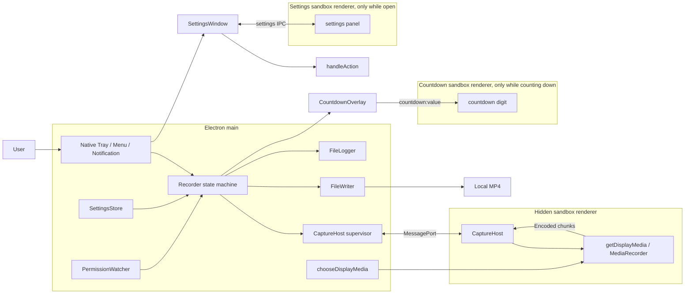

# Architecture

[English](architecture.md) | [繁體中文](../zh-TW/system-design/architecture.md)

For the roles of Electron, Chromium, browser media APIs, and internal WebRTC audio processing, see [Electron, Chromium, and WebRTC](webrtc.md).

## Processes and responsibilities

The application has a main layer, a hidden capture renderer, a settings renderer that exists only while the user has the settings window open, and a countdown overlay renderer that exists only while a countdown runs. Electron also creates GPU/helper processes; this is not a claim about the number of operating-system processes.

The tray, menu and notifications are native Electron APIs in main. The settings panel is the one HTML page a user interacts with; it has no framework and no state of its own, rendering a view main sends and returning the id of the option the user picked. The countdown overlay is a click-through page that only draws the digit main sends and cannot reply. The capture renderer obtains streams, applies quality, and encodes. Main selects the source, owns recording state, decides every action, and writes files.

| Module | Owns | Does not own |
| --- | --- | --- |
| `main/index.ts` | App lifecycle, composition, source handler, quit coordination | Encoding or media append logic |
| `main/recorder.ts` | Authoritative RecordingState, session IDs, ordering, deadlines, the countdown's timing and cancel | Electron or DOM APIs |
| `main/countdown-overlay.ts` | The countdown window's lifetime, placement on the recorded display and the values it is sent | When to count, record or cancel |
| `renderer/countdown.ts` / `preload/countdown.ts` | Drawing the digit and its fades / the one value subscription | Timing, state or any reply to main |
| `main/capture-host.ts` | Hidden BrowserWindow, main port, readiness and heartbeat | File-success decisions |
| `renderer/capture-host.ts` | MediaStream, MediaRecorder, sequence numbers, Blob chain | Settings files, output paths, disk writes |
| `preload/index.ts` | Port handoff | Exposing Node APIs to the page |
| `main/file-writer.ts` | A recording's media handle and I/O queue | UI state |
| `main/settings.ts` | Committed settings and serialized saves | A running session's quality snapshot |
| `main/tray-model.ts` / `tray.ts` | Pure projection of the tray's flat command menu / native presentation | Preferences, or a separate recording state machine |
| `main/ui-model.ts` | The action union, the context snapshot and the preference-lock rule both interfaces share | Any projection of its own |
| `main/settings-model.ts` | Every preference, its stable ids, and the authorization of a panel request | Electron, IPC or persistence |
| `main/settings-window.ts` | The panel window, sender validation and serialized saves | What a preference means |
| `renderer/settings.ts` / `preload/settings.ts` | Rendering a view and echoing an id / the read-choose-subscribe bridge | Preference state, actions or Node APIs |
| `main/permission.ts` | Screen-permission cache and polling | Proof of system-audio permission |
| `main/log.ts` | Synchronous text logging and rotation | Media content |
| `main/session-log.ts` | The per-launch run id and the versioned session record beside each capture and outcome line | Pairing recordings with sessions (a development analyzer's job) |
| `shared/i18n.ts` | English message keys, Traditional Chinese templates, language validation | OS dialog language or diagnostic translation |
| `shared/*` | State, protocol, quality and countdown contracts and pure functions | Electron or DOM dependencies |

## Trust boundaries and IPC

Every renderer enables sandboxing, context isolation, and web security, disables Node integration, and blocks navigation and new windows. The hidden capture window and the countdown overlay additionally disable background throttling. The overlay's preload exposes only `countdown.onValue`; main sends `countdown:value` with a digit or `null`, and the preload accepts only positive integers or `null`. Packaged builds load local HTML. Development builds may load the electron-vite URL.

The settings panel has its own preload exposing exactly three calls. `settings:read` and `settings:choose` are refused unless the sender is the panel window's main frame. A choose request carries a group id and a choice id — never an action — and main resolves the pair against a freshly built model, so a request can only perform work the app is offering at that moment, and only while the recording state allows it. Saves are serialized in request order and the answer reports the committed value.

| Direction | Message | Meaning |
| --- | --- | --- |
| Panel → main | `settings:read` | The current view |
| Panel → main | `settings:choose { group, choice }` | Apply an offered option; answers with the view and whether it committed |
| Main → panel | `settings:changed` | State or context moved; re-render |

Main creates a MessageChannelMain and sends one port to preload over `capture-host-port`. Preload transfers it to the page with window.postMessage. The page checks that the message comes from its own window with the expected marker, then sends ready. The port is transferred; media ArrayBuffers are copied with structured clone.

Both receivers run handwritten type guards. These validate required shapes, not strict rejection of extra fields or comprehensive resource quotas. There is no protocol-version negotiation because both ends ship together.

| Direction | Message | Meaning |
| --- | --- | --- |
| Main → host | `start { sessionId, quality }` | Prepare capture with the session quality snapshot |
| Main → host | `record { sessionId }` | Start encoding the prepared session (plan 040); refused for any other session |
| Main → host | `stop { sessionId }` | Stop capture, release a prepared stream or cancel a pending start |
| Main → host | `ping` | Check renderer responsiveness |
| Host → main | `ready` / `pong` | Channel ready / heartbeat response |
| Host → main | `prepared { sessionId, mimeType, capture }` | Stream checked, quality applied, MediaRecorder built but inactive |
| Host → main | `started { sessionId }` | MediaRecorder started; main keeps the report from `prepared`; does not mean a chunk is on disk |
| Host → main | `chunk { sessionId, seq, bytes }` | Encoded bytes with consecutive sequence numbers starting at zero |
| Host → main | `stopped { sessionId }` | Final chunk has been posted; main may finalize the file |
| Host → main | `error { sessionId?, code, detail }` | Failure; an absent ID may apply to main's current session |

There is no per-chunk ACK or bounded backpressure. Blob conversion and disk writes are serialized separately, but slow storage can grow the queue. Heartbeats detect renderer responsiveness, not continuing media delivery. There is a first-chunk deadline, but no ongoing inter-chunk watchdog.

## Data and persistence

| Data | Location | Lifetime |
| --- | --- | --- |
| RecordingState | Main memory | Reset on restart; lastSavedPath is not persisted |
| Main Session | Recorder memory | Quality and countdown snapshots, capture report, countdown timers, writer, nextSeq, timer, and pending writes until success, failure or cancel |
| Renderer prepared session | Capture-host memory | Live stream and inactive recorder until `record`, `stop` or a track end |
| Renderer Session | Capture-host memory | Stream, recorder, seq, chain, stopRequested, finished |
| settings.json | Electron userData | Across restarts; current internal app name is lowercase recordstuff |
| `.recording.mp4` | User-selected folder | Active recording or preserved partial file |
| `.mp4` | Same folder | Successfully finalized recording |
| recordstuff.log | Electron logs directory | Rotation above 5 MiB, three archives |
| Measurement Markdown/JSON | docs/verification/measurements | Local development evidence; gitignored and excluded from the packaged app |

The single media writer rule does not prohibit settings and logging modules from opening their own files.

## Startup and shutdown

Main initializes logging/error handlers and obtains a single-instance lock. After ready it hides the Dock icon, loads settings, registers the display-media handler, composes Recorder/host/permissions/Tray, subscribes to events, and starts permission polling. Each recording attempt creates a fresh capture window, and with a countdown an overlay window, and main destroys both when the attempt settles: no capture or overlay renderer or heartbeat timer remains between recordings.

Closing all windows does not quit the app. During a busy recording state, before-quit waits for Recorder.shutdown before retrying quit. Will-quit stops permission polling and destroys host, overlay and Tray. An already-idle quit does not separately wait for failure cleanup. Power loss, forced main-process termination, and blocked storage do not carry a complete-durability guarantee.
