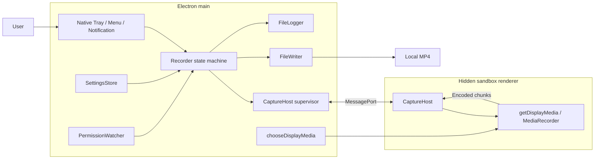

# Architecture

[English](architecture.md) | [繁體中文](../zh-TW/system-design/architecture.md)

For the roles of Electron, Chromium, browser media APIs, and internal WebRTC audio processing, see [Electron, Chromium, and WebRTC](webrtc.md).

## Processes and responsibilities

The application has a main layer and a hidden capture renderer. Electron also creates GPU/helper processes; this is not a claim that only two operating-system processes exist.

All visible UI uses native Electron APIs in main. The only HTML page hosts capture; there is no React or UI renderer. The capture renderer obtains streams, applies quality, and encodes. Main selects the source, owns recording state, handles user actions, and writes files.

| Module | Owns | Does not own |
| --- | --- | --- |
| `main/index.ts` | App lifecycle, composition, source handler, quit coordination | Encoding or media append logic |
| `main/recorder.ts` | Authoritative RecordingState, session IDs, ordering, deadlines | Electron or DOM APIs |
| `main/capture-host.ts` | Hidden BrowserWindow, main port, readiness and heartbeat | File-success decisions |
| `renderer/capture-host.ts` | MediaStream, MediaRecorder, sequence numbers, Blob chain | Settings files, output paths, disk writes |
| `preload/index.ts` | Port handoff | Exposing Node APIs to the page |
| `main/file-writer.ts` | A recording's media handle and I/O queue | UI state |
| `main/settings.ts` | Committed settings and serialized saves | A running session's quality snapshot |
| `main/tray-model.ts` / `tray.ts` | Pure presentation model / native presentation | A separate recording state machine |
| `main/permission.ts` | Screen-permission cache and polling | Proof of system-audio permission |
| `main/log.ts` | Synchronous text logging and rotation | Media content |
| `shared/i18n.ts` | English message keys, Traditional Chinese templates, language validation | OS dialog language or diagnostic translation |
| `shared/*` | State, protocol, quality contracts and pure functions | Electron or DOM dependencies |

## Trust boundaries and IPC

The hidden window enables sandboxing, context isolation, and web security; disables Node integration and background throttling; and blocks navigation and new windows. Packaged builds load local HTML. Development builds may load the electron-vite URL.

Main creates a MessageChannelMain and sends one port to preload over `capture-host-port`. Preload transfers it to the page with window.postMessage. The page checks that the message comes from its own window with the expected marker, then sends ready. The port is transferred; media ArrayBuffers are copied with structured clone.

Both receivers run handwritten type guards. These validate required shapes, not strict rejection of extra fields or comprehensive resource quotas. There is no protocol-version negotiation because both ends ship together.

| Direction | Message | Meaning |
| --- | --- | --- |
| Main → host | `start { sessionId, quality }` | Session quality snapshot |
| Main → host | `stop { sessionId }` | Stop capture or cancel a pending start |
| Main → host | `ping` | Check renderer responsiveness |
| Host → main | `ready` / `pong` | Channel ready / heartbeat response |
| Host → main | `started { sessionId, mimeType, capture }` | MediaRecorder started; does not mean a chunk is on disk |
| Host → main | `chunk { sessionId, seq, bytes }` | Encoded bytes with consecutive sequence numbers starting at zero |
| Host → main | `stopped { sessionId }` | Final chunk has been posted; main may finalize the file |
| Host → main | `error { sessionId?, code, detail }` | Failure; an absent ID may apply to main's current session |

There is no per-chunk ACK or bounded backpressure. Blob conversion and disk writes are serialized separately, but slow storage can grow the queue. Heartbeats detect renderer responsiveness, not continuing media delivery. There is a first-chunk deadline, but no ongoing inter-chunk watchdog.

## Data and persistence

| Data | Location | Lifetime |
| --- | --- | --- |
| RecordingState | Main memory | Reset on restart; lastSavedPath is not persisted |
| Main Session | Recorder memory | Quality, writer, nextSeq, timer, and pending writes until success/failure |
| Renderer Session | Capture-host memory | Stream, recorder, seq, chain, stopRequested, finished |
| settings.json | Electron userData | Across restarts; current internal app name is lowercase recordstuff |
| `.recording.mp4` | User-selected folder | Active recording or preserved partial file |
| `.mp4` | Same folder | Successfully finalized recording |
| recordstuff.log | Electron logs directory | Rotation above 5 MiB, three archives |
| Measurement Markdown/JSON | docs/verification/measurements | Local development evidence; gitignored and excluded from the packaged app |

The single media writer rule does not prohibit settings and logging modules from opening their own files.

## Startup and shutdown

Main initializes logging/error handlers and obtains a single-instance lock. After ready it hides the Dock icon, loads settings, registers the display-media handler, composes Recorder/host/permissions/Tray, subscribes to events, and starts permission polling. The capture window is created lazily on the first recording, reused after stop, and recreated after failure.

Closing all windows does not quit the app. During a busy recording state, before-quit waits for Recorder.shutdown before retrying quit. Will-quit stops permission polling and destroys host and Tray. An already-idle quit does not separately wait for failure cleanup. Power loss, forced main-process termination, and blocked storage do not carry a complete-durability guarantee.
