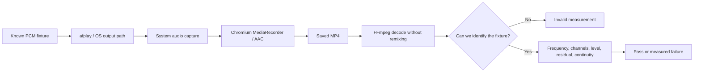

# Audio Quality: What We Measure and Why

[English](audio-quality.md) | [繁體中文](../zh-TW/system-design/audio-quality.md)

This chapter explains the development-only audio diagnostic system, fixture/report version 2. It is a guide to reasoning about audio failures, not a claim that every recording now sounds correct. Commands are in [tooling](tooling.md#audio-fidelity-regression); actual outcomes belong in the [verification record](../verification/README.md). The production recording path is described in [recording](recording.md).

## 1. The question behind the test

A user reported that recordings sounded muffled. "The MP4 has an audio track" cannot answer that complaint. We need to ask whether the recording preserves the parts of the source that matter: frequency balance, independent left/right information, level, waveform shape, and continuity over time.

The test is an experiment with a known input. We generate a reproducible signal, play it through the system, record with the real app, decode the saved file, and compare measurements with the signal's known properties. A controlled input makes an unexpected output falsifiable. Listening remains useful: synthetic signals expose specific mechanisms, while speech and music reveal whether those mechanisms matter in context.

This experiment measures the complete playback → capture → encode path. A failure does not by itself identify the responsible stage. To isolate a cause, retain this test and change one stage at a time, or add a PCM observation point before encoding. A passing FFmpeg AAC control only proves that the control encoder preserves this fixture; it does not prove Chromium's AAC encoder behaves identically.

## 2. Why metadata and bitrate are insufficient

| Observation | What it establishes | What it cannot establish |
| --- | --- | --- |
| 48 kHz sample rate | The sample time grid in the file | That 12 or 16 kHz survived capture/filtering |
| Two channels | Two sample values per frame | That left and right contain independent information |
| High AAC bitrate | Encoded storage budget/output rate | Original signal quality, absence of earlier low-pass filtering |
| Nonzero RMS | There is energy | Whether that energy is the intended sound, noise, or distortion |
| Decoder exits successfully | The stream is decodable | Whether samples were lost or modified before encoding |

At 48 kHz, the Nyquist limit is 24 kHz, but this is a theoretical representable upper limit. A filter earlier in the pipeline can still remove everything above 10 kHz. Similarly, duplicating mono into two channels creates a file labelled stereo without recovering stereo information. Increasing bitrate cannot recreate information lost before the encoder.

## 3. Three different claims of success

1. **Detector correctness:** clean controls pass and deliberately damaged controls fail for the intended reason. This belongs in automated tests.
2. **Local path quality:** the actual app/OS/device combination meets the gates for this fixture. This requires real capture, not mocked media APIs.
3. **Product-wide confidence:** repeated, representative environments and content behave well. This requires a wider evidence set and listening; one machine or one pass is insufficient.

`pnpm check` establishes the first claim for covered cases. `audio:quality record` investigates the second. Neither alone establishes the third. A large repository-wide test count is not an audio-quality coverage measure.

## 4. How fixture v2 is constructed

The file is 48 kHz, stereo, PCM16 WAV, 12.1 seconds long. Synthesis uses floating-point samples before WAV quantization. Normal probe peaks have headroom; the tool does not change system volume.

| Source time | Content | Purpose |
| --- | --- | --- |
| 0–0.5 s | Silence | Allow capture/playback startup |
| 0.5–1.0 s | 1 kHz marker in both channels | Find the signal and estimate its frequency scale |
| 1.0–1.5 s | Silence | Reject unrelated continuous tones and validate alignment |
| From 1.5 s, twelve 0.8 s slots | 0.6 s sound + 0.2 s gap in each slot | Six frequencies in left only, then six in right only |
| 11.1–11.6 s | 2 kHz marker in both channels | Confirm the terminal signal and check end timing |
| 11.6–12.1 s | Silence | Preserve a trailing margin |

Probe frequencies are 250 Hz and 1, 4, 8, 12, 16 kHz. These sample bass, midrange, and increasingly high frequencies. They are diagnostic points, not a full spectrum; a narrow notch between them can escape detection.

Every probe includes a simultaneous 1 kHz pilot in the active channel. Pilot and target each have peak amplitude 0.125. For the 1 kHz slot there is only one sinusoid, not two copies. The start/end markers have amplitude 0.25. All tones have 10 ms linear fades to avoid an artificial click at their boundaries.

### Why a simultaneous pilot matters

Suppose a 1 kHz tone is played first, then 12 kHz later. If automatic gain drops between them, a sequential comparison could call that drop "high-frequency loss" even when the path is spectrally flat.

V2 compares the target with a 1 kHz pilot present at the **same time**. A common gain applied to both cancels in their ratio. We still measure pilot gain separately, so normalization does not hide a recording that became very quiet. This helps with gain changes between probes; it does not eliminate frequency-selective processing or gain that varies within a probe. Two-tone stimulation may itself interact with nonlinear/adaptive processing. The result describes this controlled stimulus.

## 5. Alignment, clocks, and the original false positive

Capture latency shifts a waveform in time. Clock mismatch also changes the apparent frequency and accumulated duration. These are different effects.

V1 projected samples onto an exactly nominal sinusoid. A clean 16 kHz tone shifted by 10 ppm is at 16000.16 Hz. Its phase gradually departs from the nominal reference. V1 classified the resulting mismatch as residual distortion, despite the input being a clean sinusoid. This false positive was reproduced, not merely hypothesized.

V2 does the following:

1. Search for at least 300 ms of coherent 1 kHz in 10 ms blocks, ignoring unrelated startup sounds.
2. Estimate the marker frequency in a bounded interval by coarse search and local refinement. The objective minimizes fitted residual.
3. Compute `speed = measured_marker_frequency / 1000` and `clock_ppm = (speed - 1) × 1,000,000`.
4. Map source time to decoded samples using `observed_onset + (source_time - 0.5) / speed`.
5. Require the expected duration, quiet marker gap, and distinct 2 kHz terminal marker. Compare observed end time with predicted end time.
6. Estimate the local 1 kHz pilot for each probe and fit the target with the same local frequency scale. Report the estimated offset separately.

Frequency search is bounded to ±0.1% of the nominal frequency, with a minimum half-width of 0.5 Hz. The 1 kHz pilot searches ±1 Hz. The acceptance gate is tighter: ±200 ppm. Searching beyond the gate lets us report excessive clock error without labelling it distortion. This is not unrestricted time warping or an attempt to make damaged audio pass.

The onset grid is 10 ms. The end-timing tolerance is 20 ms and edge guards accommodate this grid. V2 checks short-recording timing; it does not establish long-duration drift stability. The separate [recording verification tools](tooling.md#measurement-pipeline-and-thresholds) handle A/V timing; container timestamp gaps are not measured by this PCM-only analyzer.

## 6. Sinusoid fitting and residual energy

A finite analysis window need not contain an integer number of cycles after clock correction. Simply reading one FFT bin or assuming sine/cosine orthogonality can leak real signal energy into the residual.

We fit this model by least squares:

`sample[n] ≈ DC + Σ(a[k] × sin(2πf[k]n/Fs) + b[k] × cos(2πf[k]n/Fs))`

The Gram matrix accounts for overlap among the basis functions. The sine/cosine coefficients support arbitrary phase. Each component's power is `(a² + b²) / 2`. The fitted DC component is included in reported residual energy rather than silently ignored. Tiny negative round-off in residual subtraction is clamped to zero.

For a normal probe the model contains the pilot and target; the 1 kHz-only slot has one component. Spectral measurements use the central 300 ms to avoid fades and codec boundary effects. The residual contains energy the fitted model cannot explain: noise, harmonics, gain modulation, or nonuniform timing. It is an engineering residual metric, **not a standardized THD+N instrument reading or a perceptual score**.

Power ratios use `10 × log10(Pout / Pref)`. Amplitude ratios would use `20 × log10(Aout / Aref)`. Mixing the two would report an incorrect dB value. A −3 dB power ratio is about half the power; a −20 dB ratio is one hundredth. Internal floors keep JSON values finite, so near-floor values should be interpreted as "very little detected energy", not exact acoustic sensitivity.

## 7. What each gate protects

All thresholds below are initial project engineering gates, not industry certification limits. They are serialized with every report.

| Gate | Initial threshold | Why it exists / failure interpretation |
| --- | --- | --- |
| Format | 48 kHz, exactly 2 channels | Reject wrong format before processing can hide it |
| Fixture validity | Start marker + quiet gap + distinct end marker | Prevent measurement of the wrong sound or wrong time interval |
| Marker/local pilot clock offset | ±200 ppm | Distinguish clock error from waveform damage |
| End timing | ±20 ms after frequency-scale compensation | Detect larger insertions, deletions, or incorrect alignment |
| Target/pilot response | ±3 dB | Detect spectral imbalance, including the high-frequency loss associated with muffled sound |
| Pilot gain | ±6 dB relative to the generated pilot | Detect broad attenuation/amplification that response normalization intentionally cancels |
| Channel separation | ≥30 dB | Detect cross-channel leakage and duplicated mono; uses combined fitted signal power versus the inactive channel's total power |
| Residual/signal | ≤−25 dB | Detect unexplained noise/distortion in the central window after frequency fitting |
| Minimum component level | ≥−15 dB relative to that component's central-window power | Detect short missing/attenuated pieces across most of the audible probe |
| Maximum clipped block fraction | ≤0.1% at absolute decoded amplitude ≥0.999 | Catch short digital full-scale clipping without diluting it in a long file |
| Following gap | ≤−35 dB relative to the preceding probe's total power | Detect contamination or signal spilling into expected silence |

The separation gate cannot reconstruct stereo; it only detects its loss. The clipping gate does not prove absence of upstream analog clipping or limiting below full scale; the residual may catch some of those effects. Gap failure may be another application's sound, so investigate the environment before blaming the recorder.

## 8. Fixing the original dropout blind spot

V1 examined only the central 300 ms of each 600 ms tone. Removing the first and last 100 ms of every tone still passed. That deleted one third of the audible probe while leaving the measured center intact.

V2 uses overlapping 10 ms blocks, advanced by 5 ms, across **20–580 ms** of each probe. The outer 20 ms guards accommodate fades, onset quantization, and codec boundaries. Every block fits pilot and target separately and compares each component with its corresponding central-window power. A surviving pilot therefore cannot hide a missing high-frequency target. Using fitted component powers also avoids treating the normal two-tone beat envelope as a dropout.

The same blocks detect short clipping. Silence is checked in the central 80 ms of each following gap. These are explicit coverage choices:

- Very short damage below the window's sensitivity may escape detection.
- The guarded first/last 20 ms are not covered by the dropout gate.
- Frequency response, residual, and channel separation remain central-window measurements.
- The suite is not a claim that every sample in arbitrary content was verified.

## 9. Pass, fail, invalid, and execution error

| Outcome | Meaning | CLI status |
| --- | --- | --- |
| `pass` | All available required checks passed for a recognized fixture | 0 |
| `fail` | A measured requirement failed, including format or recognizable truncated duration | 1 |
| `invalid` | The PCM/markers/gap do not support trustworthy analysis; spectral rows are suppressed | 2 |
| Execution error | Tool, input, permission, playback, timeout, or filesystem failure | 2 |

Missing markers can themselves result from a broken capture path. `invalid` means "cannot support the frequency measurements", not "the app is innocent". Both invalid and fail must prevent a claimed passing verification. A raw report preserves the preceding checks; a process/input error uses `error.json`.

## 10. Testing the test

The analyzer's tests must establish both sensitivity and tolerance. Only testing damaged examples encourages an analyzer that fails everything. Only testing clean examples encourages one that always passes.

| Control family | Required behavior | Reason |
| --- | --- | --- |
| Clean PCM, independently synthesized phase/clock controls | Pass, including ±10/20/100 ppm | Correct for harmless measurement mismatch |
| Excessive clock offset | Fail clock gate, not residual on otherwise clean tones | Preserve diagnostic separation |
| Real FFmpeg AAC control | Pass | Include real quantization/codec behavior beyond ideal arithmetic |
| Real low-pass, mono, 44.1 kHz files | Fail appropriate gates | Exercise decoding and avoid automatic "repair" of invalid format |
| Selective target attenuation | Fail response | A pilot must not conceal spectral loss |
| Different constant gains between probes | Pass response when still within gain limits | Demonstrate the simultaneous reference rationale |
| Whole-probe and target-only edge dropouts | Fail component continuity | Reproduce and close the earlier blind spot |
| Dual-mono, swapped/missing channels | Non-pass | Channel count alone is insufficient |
| Harmonics, short clipping, gap contamination | Fail corresponding gates | Cover different failure mechanisms |
| Missing end marker, malformed/empty PCM | Non-pass; suppress unsupported spectral claims | Duration alone can be padded with silence |
| Repeat summaries | Keep any failure; count missing/invalid measurements | A median must not hide failed runs |
| CLI errors and existing paths | Correct exit code; preserve existing evidence | Automation must not report success or overwrite earlier results |

FFmpeg/ffprobe integration tests are explicitly skipped when the tools are absent. A release verification environment should install them and check the skip count. The remaining unit tests do not replace that integration coverage.

## 11. Repeatability and evidence

`record <new-directory> --repeat 3` runs three independent captures. Each gets its own reference, log, report, and retained MP4 path. `summary.json` records pass/fail/invalid counts and per-metric minimum, median, maximum, measured count, and missing count. Invalid runs are excluded from metric statistics and explicitly counted. Any valid failure keeps the batch failed; any invalid measurement makes the batch invalid. While recording or finalizing environment evidence, the summary stays `incomplete`. If execution stops early, its requested/completed counts and `error.json` expose incompleteness; a partial batch cannot claim pass.

The runner saves before/after environment snapshots: OS/architecture, Node/Electron/FFmpeg versions, source/fixture hashes, macOS audio-device inventory and volume settings when available. Read failures are recorded as unknown. An observed device/volume change makes the final batch invalid. Identical endpoint snapshots do not prove the setting stayed fixed between them, and they do not describe every driver/processing option.

Three runs are a repeatability check, not statistical calibration. To promote a dataset to a baseline:

1. Fix and record the device, volume, application/OS versions, and processing options. Pause other system audio.
2. Verify the reference and decoder controls pass.
3. Collect several runs; inspect both the worst case and spread. Keep failures.
4. Confirm subjective playback with representative speech/music on the same route.
5. Review any threshold change independently of the failing run. Version it and retain old results unchanged.

We do not automatically learn thresholds from the current app: doing so would normalize its existing defects into "good" audio. Per-metric ranges are observations, not confidence intervals or an automatic regression-to-baseline comparison. A known-bad dataset is evidence for a fix, never a passing baseline.

## 12. How to investigate a failure

- **Invalid fixture:** inspect playback completion, other audio, format, start/end markers, and duration first. Do not interpret missing response rows as success.
- **Response failure with stable pilot gain:** investigate frequency-dependent loss along the path. Repeat to distinguish adaptive processing from a stable filter.
- **Gain failure with flat response:** inspect level controls and gain processing. Increasing bitrate is not an evidence-based response.
- **Separation near 0 dB:** inspect channel mixing before and during capture. Raising a channel-count constraint alone may still yield duplicated mono.
- **Residual with small frequency error:** inspect noise, modulation, distortion, and codec behavior. The metric does not identify one cause by itself.
- **Continuity/end timing failure:** inspect sample loss, delivery gaps, and the existing container/A/V verification output.

Change one variable, retain both reports, and require the clean and damaged detector controls to keep behaving correctly. Do not add equalization merely to make probe numbers look better: it may amplify noise and does not restore information that disappeared.

## 13. What we learned from Cap

We inspected Cap commit `17e17902691ca499de9e44b0dd7a19d8c4b630a8`; we did not run its test suite. Its [intelligibility benchmark](https://github.com/CapSoftware/Cap/blob/17e17902691ca499de9e44b0dd7a19d8c4b630a8/scripts/benchmark-audio-intelligibility.py) aligns signals before STOI/SI-SDR evaluation. Its [alignment tests](https://github.com/CapSoftware/Cap/blob/17e17902691ca499de9e44b0dd7a19d8c4b630a8/scripts/test-audio-intelligibility.py) check that delay/advance does not unfairly change the overlapping-speech score. This reinforces the need to test the measurement itself.

Cap's [audio integration tests](https://github.com/CapSoftware/Cap/blob/17e17902691ca499de9e44b0dd7a19d8c4b630a8/apps/media-server/src/__tests__/lib/audio-quality.integration.test.ts) check level/peak behavior, timing and boundary preservation. Its [sync workflow](https://github.com/CapSoftware/Cap/blob/17e17902691ca499de9e44b0dd7a19d8c4b630a8/.github/workflows/sync-tests.yml) defines cross-platform synthetic timing scenarios. We adopt the principles of layered controls, alignment validation, and explicit evidence, rather than treating another project's test count as proof of quality.

Their speech benchmark decodes to mono at 16 kHz, so it cannot replace our stereo/high-frequency checks. STOI/SI-SDR, speech/music corpora, full-band sweeps, long-duration clock tracking, and broader device coverage are possible extensions, **not implemented or claimed by v2**. They should be added for a concrete question and validated with independent good/bad controls.

## 14. Implementation map and invariants

| Module | Responsibility |
| --- | --- |
| [audio-quality.mts](../../scripts/lib/audio-quality.mts) | Pure fixture generation, WAV serialization, bounded frequency estimation, fitting, gates |
| [audio-quality-tools.mts](../../scripts/lib/audio-quality-tools.mts) | Bounded FFprobe/FFmpeg calls; run the actual development app and owned audio player |
| [audio-quality-summary.mts](../../scripts/lib/audio-quality-summary.mts) | Aggregate repeated measurements without hiding failures or missing values |
| [CLI](../../scripts/audio-quality.mts) | Validate arguments, new output directory, environment snapshots, repeat loop, JSON and exit status |
| [Tests](../../scripts/lib/audio-quality.test.ts) | Clean/damaged controls, real codecs, CLI contracts, summary behavior |

Invariants: no upmixing/resampling to hide format faults; decode only the first 60 seconds with bounded buffers/timeouts; do not change production audio processing or user settings; do not overwrite an existing evidence directory; terminate only owned child processes; preserve prior raw measurements. Fixture v1 recordings must not be evaluated as v2. Generate and record v2 material, and keep the original v1 report as historical evidence.

## 15. System capture correction — 2026-09-14

The production capture request now explicitly sets `echoCancellation: false`, `noiseSuppression: false`, and `autoGainControl: false`. It retains `restrictOwnAudio: true`, ideal two channels, and the 256 kbps AAC target. No equalizer, post-recording transcode, or new capture engine was introduced.

Why these settings matter: echo cancellation, noise suppression, and automatic gain are useful for interactive voice capture, but a recorder should preserve the digital system mix, including music's spectral detail and dynamics. Processing designed for speech can change that signal. Chromium's [audio processing layout](https://chromium.googlesource.com/chromium/src/+/refs/heads/main/third_party/blink/renderer/modules/mediastream/media_stream_audio_processing_layout.cc) has a processed-display-capture path conditional on echo cancellation. This supports a plausible mechanism; our experiment establishes the effect of disabling the three constraints **together**, not the isolated contribution of each effect or every Chromium revision.

| Effect | Useful voice-call goal | Why a system recorder disables it |
| --- | --- | --- |
| Echo cancellation | Remove loudspeaker playback recaptured by a microphone, preventing the remote speaker from hearing themselves | This recorder captures a digital mix, not microphone feedback; extra cancellation is unnecessary for that goal |
| Noise suppression | Make speech easier to hear in noisy microphone input | Music detail, ambience, or reverberation can be treated as unwanted content; preservation is the recorder's goal |
| Automatic gain | Keep changing speech levels intelligible | Changes intended loud/quiet dynamics; existing source processing should not be applied again by the recorder |

These features optimize a different objective: intelligible conversation rather than faithful reproduction. If a meeting application already processes its microphone, its resulting playback is what RecordStuff records; disabling processing here does not disable processing inside that application. The [WebRTC Audio Processing API](https://webrtc.googlesource.com/src/+/refs/heads/main/api/audio/audio_processing.h) describes its voice enhancement role and capture/reverse-stream model.

The same v2 fixture and analyzer thresholds were used for the comparison. The earlier valid baseline runs had approximately 0 dB separation and 16 kHz response around −44 to −47 dB. After the change, two valid repeated runs passed every diagnostic gate: 16 kHz response was within 0.004 dB of the simultaneous pilot, and separation exceeded the 30 dB gate. Very large separation numbers approach the analyzer's numerical floor and should not be interpreted as calibrated analog dynamic range.

The final three-run batch contains **2 pass, 0 fail, 1 invalid**; it remains invalid overall. The first run's marker gap was contaminated (−18.81 dB versus the −30 dB identity gate), so its spectral measurements were suppressed. An earlier single trial also retained some early noise/gap failures despite restored high frequencies. All are preserved in the [evidence](../verification/README.md). We did not relax thresholds, filter the reference, delete failed trials, or turn the invalid batch into a passing claim.

The capture host warns when `getSettings()` explicitly reports one of the disabled effects as true. An absent property is unknown, not proof that processing is off. Regression tests assert the explicit constraints and the warning behavior. Real probes remain necessary because a mocked constraint assertion cannot establish what an OS actually captured. Own-audio exclusion stays enabled because the experiment restored fidelity without removing it.

This correction applies to **new recordings made with the rebuilt app**. It does not restore information missing from old files. The local spectral/stereo result is improved; subjective comparisons using the user's original content and broader device/platform coverage remain separate evidence.
