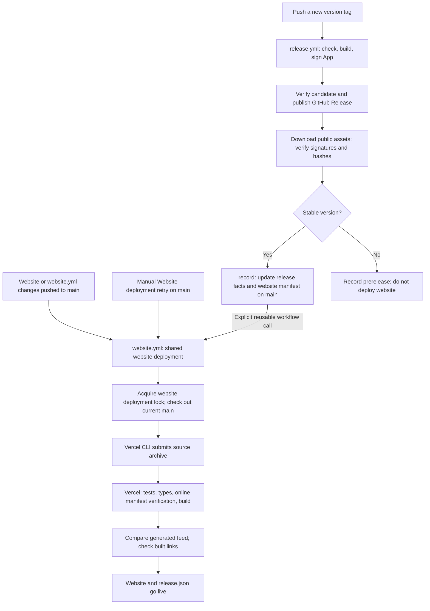
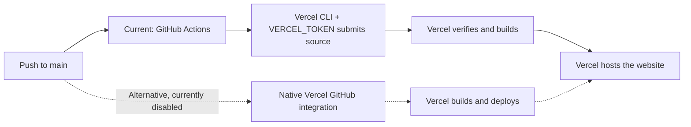
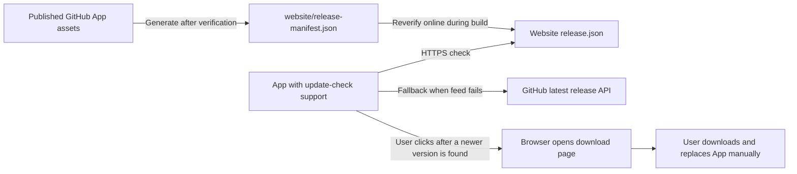

# Website, App, and update-feed delivery

[English](delivery.md) | [繁體中文](../zh-TW/system-design/delivery.md)

Updated: 2026-09-20. These diagrams describe the implemented CI/CD design, not proof that every hosted path has passed acceptance. See [release automation](releases.md) for operations and the [verification record](../verification/README.md) for evidence and limits.

## Two entry points, one website deployment

Website changes pushed to main deploy without a version bump. Only a version tag publishes the App; a website deployment cannot distribute unreleased App changes from main. There is no scheduled release.

The standalone website trigger watches main pushes affecting `website/**` or `.github/workflows/website.yml`. Other documentation or App-only commits do not trigger it. The release record job pushes with `GITHUB_TOKEN`, which does not trigger another push workflow, so the release explicitly calls the reusable website workflow.

All website entry points share a deployment lock without cancelling active deployments. Each checks out main after acquiring the lock so an older queued trigger cannot deploy an older checkout. Deployment first checks the secrets; missing configuration skips with a notice. Failed website checks prevent deployment and leave the previous site serving. An App already published is not withdrawn if subsequent website delivery fails.

## The same push can have different deployment owners

A push is an event, not the deployment owner. Actions currently owns deployment and requires repository Actions secrets `VERCEL_TOKEN`, `VERCEL_ORG_ID`, and `VERCEL_PROJECT_ID`. The token authorizes Vercel access; the IDs select the team and project. Local CLI login is not transferred to the GitHub runner.

Actions provides shared verification, explicit ordering after public App verification, and a shared remote build that verifies its output before publishing. The cost is maintaining the workflow and token. Native Vercel Git integration is a viable alternative without a deployment token stored in GitHub, but migration must preserve all remote build checks, verify bot manifest updates trigger delivery, and remove duplicate deployment entry points. Only one mechanism should own production website deployment.

## The feed describes published versions only

For example, main can contain unreleased update-check functionality while the public release remains 0.1.2. A website-only deployment still advertises 0.1.2. The website advertises a new version only after a new stable App release, public asset verification, and manifest update. Website changes cannot add functionality to the already-published 0.1.2 App.

## Maintenance and verification boundaries

- Website deployment failure: fix configuration or source and push; for configuration-only fixes, retry Website deployment on main without an App tag.
- App release: complete local acceptance before pushing a new version tag; never overwrite published artifacts.
- Deployment token: authorize the correct team and manage expiry. Investigate permissions and configuration after a 403; a retry alone does not establish a fix.
- Local website checks do not prove hosted delivery. Verify public feed content, caching, and actual App transport. CI does not prove screen or system-audio capture.

Implementation: [website workflow](../../.github/workflows/website.yml), [App release workflow](../../.github/workflows/release.yml), [Vercel configuration](../../website/vercel.json), [feed endpoint](../../website/src/pages/release.json.ts).
