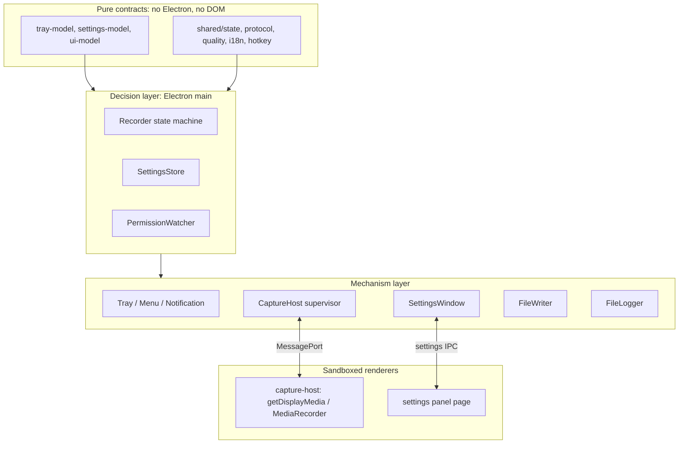

# Design Overview

[English](design-overview.md) | [繁體中文](../zh-TW/system-design/design-overview.md)

This document is the mental model the rest of the design set assumes. [Product overview](overview.md) states what the application does for a user and what it refuses to do; [Architecture](architecture.md) is the structural reference for processes, modules, IPC and persistence; [Design decisions](decisions.md) records each accepted tradeoff on its own line. None of them explains why all three describe the same shape, which is what this document is for. Where a detail already has an owner, this document names it rather than restating it.

## The constraint everything derives from

RecordStuff is one menu-bar button with no main window. The user cannot open the app to look at it: there is no session list, no progress panel, no place where a wrong internal state would be visible and correctable. What reaches the user is a tray icon and title, a notification, a file in the output folder, and a log they have to be told to open.

Two consequences run through every module.

**Visible state must be truthful, because it is the only state the user has.** A recorder that shows `REC` while nothing is being written is worse than one that refuses to start, so no surface is allowed to report success before the fact that would justify it exists. This is the first design priority in [overview.md](overview.md#design-priorities), and most of what looks like extra work elsewhere in the codebase — measuring actual frames instead of trusting `getSettings`, validating audio tracks instead of assuming the request succeeded, renaming the file before emitting `saved` — is that priority being paid for.

**Every surface is a projection of one state, never a second copy of it.** The tray, the settings panel, the notifications and the log all read from the same authoritative state and context. This is why [`tray-model.ts`](../../src/main/tray-model.ts) is a pure function to a flat command list, why [`settings-model.ts`](../../src/main/settings-model.ts) declares each preference exactly once, and why [`ui-model.ts`](../../src/main/ui-model.ts) holds the action union and the preference-lock rule that both interfaces share instead of each interface having its own.

## The spine

### Main decides; everything else is a mechanism

[`main/recorder.ts`](../../src/main/recorder.ts) owns the authoritative `RecordingState`, the session IDs, the ordering and the deadlines, and it touches no Electron or DOM API. The renderers acquire and encode media, the writer moves bytes, the tray draws — none of them may conclude that a recording succeeded. The hidden capture renderer exists only because DOM media APIs require a renderer, not because capture is a peer authority; it reports `started`, `chunk` and `stopped` as facts about itself, and main interprets them.

This is what makes the two entry points safe: a tray left click and the global shortcut both call `Recorder.toggle()`, so there is one decision point that starts when idle, stops when recording, re-issues permission guidance in `needsPermission`, and ignores presses while starting or stopping. Adding a third entry point means calling the same function, not adding a branch.

### A claim requires an observable fact

Each user-visible assertion is tied to something the app actually observed. `saved` is emitted only after the temporary file has been drained, synced, closed and renamed. Recording quality is reported from a measured frame size, falling back to track settings only when frames cannot be read, because `getSettings` once reported an incorrect height on a multi-monitor setup. Audio is validated through returned tracks, which proves a track exists and is live — not that sound is playing. A `CaptureReport` omits fields it does not know instead of filling them in.

The inverse rule matters as much: a request is not a guarantee. Bitrate coefficients, the 256 kbps AAC target, the unprocessed-audio constraints and every deadline in [recording.md](recording.md#deadlines-and-supervision) are what the app asks for, and the documentation says so wherever a number appears.

### Failure is an event, and the folder is the record

The recorder has no persistent failed capture state. A failure detaches the session, clears deadlines and stops the host. It returns capture state to idle before failure subscribers persist metadata, then reports pending cleanup, abandons the writer and reports the file outcome. Main persists individual failures and acknowledgements across restarts, displayed through the tray badge/count and Settings failure history. Partial files may remain as `<stamp>.recording.mp4`; the result distinguishes confirmed nonempty content from empty or unknown preservation and warns that partial files may not play. Unread failures are retained independently; reviewed history keeps the 20 most recently reviewed records. Removing a history entry never repairs or deletes media. The output folder and log remain the detailed diagnostics: [`log.ts`](../../src/main/log.ts) writes synchronously to retain diagnostic events at exit, and Show log is offered from every tray state. See [recording failure results](desktop.md#recording-failure-results) for acknowledgement and recovery behavior.

## Layers

The direction is the point: the decision layer reads pure functions and drives mechanisms, and nothing below decides anything. Both renderers are sandboxed, context-isolated and Node-free, so the capture page holds a stream and the settings page holds a rendered view — neither holds state the app depends on. Testability follows from the same direction: the state machine and every model are unit-testable without Electron, which is why `*.test.ts` sits beside them.

## One recording, end to end

Each stage of a recording belongs to a different document. These are the layer crossings in the order they happen, not the procedure: [recording.md](recording.md#start) owns the steps, the constraints and the deadlines.

1. **Intent to decision.** A tray left click ([`tray.ts`](../../src/main/tray.ts)) or the global shortcut ([`hotkey.ts`](../../src/main/hotkey.ts)) calls `Recorder.toggle()`; nothing else in the app starts a recording.
2. **Decision to durable slot.** The writer opens the `.recording.mp4` temporary file *before* capture is requested, so a folder problem is reported as a folder problem and anything captured later already has somewhere to land.
3. **Decision to mechanism.** The host receives `start { sessionId, quality }` over the MessagePort carrying the quality snapshot, while main selects the display through its own `chooseDisplayMedia` handler — source selection never moves into the sandbox.
4. **Mechanism acquires.** The renderer checks support, rejects absent or ended audio tracks and measures actual frames before reporting `started`, which is a report about itself rather than a verdict that recording succeeded.
5. **Mechanism back to decision, repeatedly.** Every chunk is gated on the session ID and a consecutive sequence number before its bytes reach the single writer queue.
6. **Commitment.** After stop, the file is drained, synced, closed and renamed; `saved` exists only after the rename.
7. **Decision to projections.** Returning to idle carrying `lastSavedPath` is what makes the tray offer to reveal the file and the notification schedule itself — the surfaces react to state instead of being told separately.

Failure at any point takes one path: detach the session, clear deadlines, stop the host, return to idle, preserve whatever bytes exist ([recording.md](recording.md#file-completion-and-failure)). Permission changes apply only while idle or `needsPermission`, so polling never interrupts a running session.

## Cross-cutting invariants

Each of these holds across modules, and each already has a place where it is enforced and a document that details it.

| Invariant | Enforced in | Detail |
| --- | --- | --- |
| One authoritative recording state; failure is an event, not a state | `main/recorder.ts` | [recording.md](recording.md#state-and-user-actions) |
| One decision point per user intent (`Recorder.toggle()`) | `main/tray.ts`, `main/hotkey.ts` | [desktop.md](desktop.md#recording-shortcut) |
| One media writer per recording; tmp file, then rename | `main/file-writer.ts` | [recording.md](recording.md#file-completion-and-failure) |
| Session ID and consecutive `seq` gate every host message | `main/recorder.ts` | [recording.md](recording.md#chunk-and-stop-ordering) |
| Quality is snapshotted per session, never re-read mid-recording | `main/recorder.ts`, `shared/quality.ts` | [recording.md](recording.md#quality-and-encoding) |
| Each preference is declared once, with stable ids | `main/settings-model.ts` | [desktop.md](desktop.md#settings-window) |
| Starting, recording and saving lock every preference but language | `main/ui-model.ts`, re-checked at the action handler | [desktop.md](desktop.md#settings-window) |
| A renderer sends ids, never actions; ids resolve against a freshly built model | `main/settings-window.ts` | [architecture.md](architecture.md#trust-boundaries-and-ipc) |
| Settings saves are serialized and derived from the last committed value | `main/settings.ts` | [desktop.md](desktop.md#settings-and-output-folder) |
| Pure modules depend on no Electron or DOM API | `shared/*`, `*-model.ts` | [architecture.md](architecture.md#processes-and-responsibilities) |
| A request is not a guarantee, and documentation says which is which | quality, audio constraints, deadlines | [recording.md](recording.md#quality-and-encoding) |

## Where to go next

The design set has a spine, a set of specialist topics, and a delivery track. Reading it in that order is faster than reading the index top to bottom.

| Purpose | Documents |
| --- | --- |
| The spine — read these to work on the app | [Product overview](overview.md) → this document → [Architecture](architecture.md) → [Recording pipeline](recording.md) → [Desktop features](desktop.md) |
| Specialist topics — read when the change touches media | [Electron, Chromium and WebRTC](webrtc.md), [Audio quality testing](audio-quality.md) |
| Delivery — read when the change ships something | [Delivery](delivery.md), [Release automation](releases.md), [Signing](signing.md), [Tooling](tooling.md) |
| Reference — look up rather than read through | [Function reference](functions.md), [Design decisions](decisions.md), [Verification record](../verification/README.md) |

Scope boundaries — what is not implemented, what is unverified, and what is out of the delivery target — belong to [overview.md](overview.md#platform-and-delivery-scope), and unfinished work belongs to [plans](../../plans/README.md). Neither is restated here.
