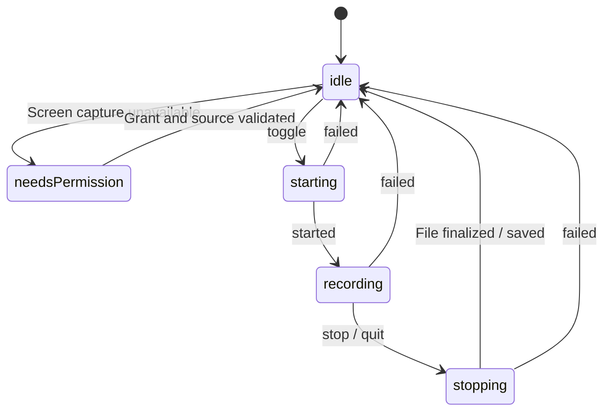
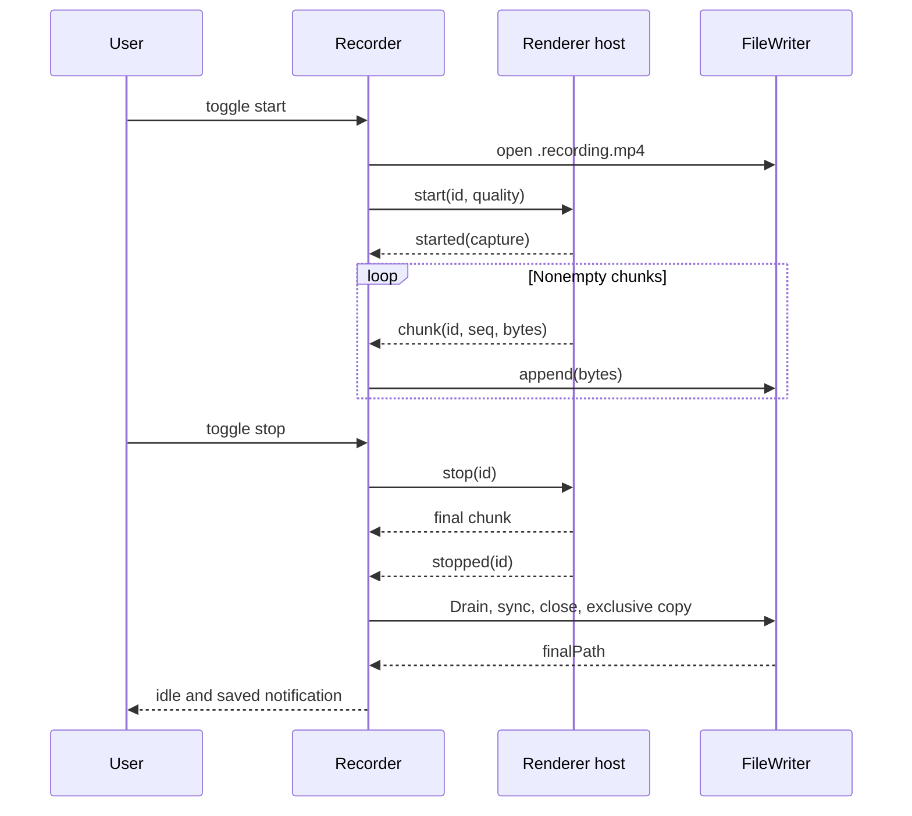

# Recording Pipeline and Storage

[English](recording.md) | [繁體中文](../zh-TW/system-design/recording.md)

Sources: [Recorder](../../src/main/recorder.ts), [renderer CaptureHost](../../src/renderer/capture-host.ts), [FileWriter](../../src/main/file-writer.ts), [quality](../../src/shared/quality.ts).

## State and user actions

NeedsPermission carries needsRelaunch. Idle may carry lastSavedPath or outputDirUnavailable. Recording carries an ISO startedAt. Failure is an event, not a persistent failed state. Clicking without permission emits permissionRequested; clicks during starting/stopping are ignored.

## Start

1. Recorder checks idle/no existing session and OS preflight, captures quality, creates a session ID, and enters starting.
2. ensureWritableDir creates the folder and writes/removes a probe. Failure never silently selects a different folder.
3. Open `YYYY-MM-DD HH-mm-ss.recording.mp4` using local time and exclusive `wx`. A temporary-file collision retries suffixes `-2` through `-10`.
4. Wait for host readiness and send start. Main resolves the saved screen preference: Primary display keeps the primary-id/first-source policy; an explicit display requires one exact id match. Request system loopback audio unchanged.
5. Renderer checks MP4 support, requests the stream, and rejects absent/ended audio tracks after cleaning up.
6. Measure actual frames, apply quality, recheck that all tracks are live, create MediaRecorder, register callbacks, and send started.
7. Main enters recording. A first chunk must still arrive before its deadline.

## Deadlines and supervision

| Protection | Default | Outcome |
| --- | --- | --- |
| Folder/open phase | 8 s | output_open_failed; a late writer is abandoned |
| Host ready | 8 s | Start rejects; host can be recreated |
| Capture/interactive permission request | 120 s | capture_start_failed and stop session |
| First chunk after started | 8 s | capture_start_failed; preserve any written data |
| Stop response | 10 s | stop_timeout |
| Renderer terminal drain | 5 s after termination begins | Error if stop/final Blob handoff is missing; discard subsequent handoff |
| Quit wait | 13 s per attempt (stop timeout + 3 s) | Defer quit with localized feedback while any owned work remains; never truncate finalization |
| Heartbeat | Check/send every 5 s while a session is in flight | Tear down when the check finds two unanswered pings |

These are project waiting limits, not OS standards or exact end-to-end timing guarantees. A timed-out disk operation is not actually canceled.

## Terminal ownership and normal exit

CaptureHost latches the first termination cause before awaiting Blob conversion. A later user stop cannot hide track loss or an encoder error; cleanup track events do not turn an earlier normal stop into failure. Encoder error waits for final `dataavailable` and `stop`, then drains the handoff chain before one terminal message. The 5-second fallback reports failure and stops further handoff; it cannot recover bytes lost in a hard crash or a stuck conversion.

Once Recorder accepts `stopped`, its finalizer owns the attempt. Late host crashes/errors, duplicate stop messages and display removal cannot abandon a publishing file; disk errors still enter failure cleanup. All opening/finalizing/cleanup operations are registered before synchronous subscribers run. An opening timeout returns UI to idle immediately, but its result stays pending until the late open and close settle. Multiple failed attempts retain independent cleanup ownership.

Every `before-quit`, including idle, uses `installQuitCoordinator`. Repeated requests join one attempt and new recordings are blocked during admission. Capture is stopped automatically. A starting session retains stop intent even after quit is deferred, so capture stops and saves as soon as it starts. Success requires no session and no outstanding work, including late opens, earlier failed attempts and failure-result verification/publication. The quit deadline only defers exit; the existing capture-request and stop-response timers retain authority over capture failures. Pending disk/result-publication work stays owned, the app stays open and the user can retry quitting. The app never destroys the host or exposes an unconfirmed retained path merely to meet a quit deadline. Force-quit, process kill and power loss bypass these guarantees; no crash recovery or destructive exit option is provided.

## Quality and encoding

| Setting | Rule |
| --- | --- |
| Video quality | Economy 0.07, Standard 0.13, High 0.24 bits/pixel/frame |
| Video bitrate | Width × height × requested fps × coefficient, rounded to 100 kbps, clamped to 1.5–60 Mbps |
| Resolution | Source unchanged; 1080p/1440p/4K caps preserve aspect/orientation, never upscale, and use even dimensions when downscaling |
| Frame rate | 30/60; only darwin enables 60; other platforms use 30 without rewriting stored settings |
| Audio | 256,000 bps target; ideal 2 channels, restrictOwnAudio true; echoCancellation/noiseSuppression/autoGainControl false |
| Format | `video/mp4;codecs=avc1,mp4a.40.2`; reject unsupported encoding rather than switch format |
| Chunking | Timeslice and videoKeyFrameIntervalDuration are both 1000 ms; actual delivery may be delayed |

MeasureFrameSize uses a muted video's intrinsic size with a default 3-second limit. Actual frames take priority because getSettings once reported an incorrect multi-monitor height. Only when frames cannot be read does it fall back to track settings. Applying a cap repeats frame-rate constraints and remeasures for up to 1.5 seconds. Rejected constraints preserve source size with warnings. If remeasurement fails, report target dimensions with a warning. With no size information, calculate the target bitrate from 1920×1080 without claiming those dimensions were measured.

System audio uses explicit unprocessed capture constraints: speech-oriented processing changed high-frequency balance and collapsed stereo in the local baseline. Disabling EC/NS/AGC together restored the v2 probes; own-audio exclusion remains enabled. These are requests, not universal platform guarantees. A track explicitly reporting one of these effects as true adds a warning; absent settings stay unknown. See the [audio design comparison](audio-quality.md#15-system-capture-correction--2026-09-14).

CaptureReport includes known dimensions/fps/sample rate/channel count, requested encoder bitrates, and warnings. Unknown fields are omitted. Output still needs ffprobe measurement. A downgrade notification requires requested 60 fps and a reported track rate ≤30; static-content frame reduction alone does not trigger it.

## Chunk and stop ordering

Renderer serializes Blob-to-ArrayBuffer conversion through a Promise chain and skips empty Blobs. Main validates session ID and consecutive seq; a gap fails the session. Stale started/chunk messages trigger stop so an abandoned request cannot keep capturing unseen.

Stopping a pending start moves its ID from pending to cancelled. When the OS request settles, the returned stream is released. A normal stop flushes the final dataavailable; finish waits for the send chain before posting stopped. Unexpected track termination or recorder errors produce failure, not a successful stop.

## File completion and failure

Append, periodic sync, and finish use one FileWriter queue. Each append writes only the remaining buffer until it is complete, counting each confirmed byte immediately; later chunks and sync cannot interleave with its pieces. Empty chunks make no write call. Zero, negative, fractional, non-finite or oversized progress fails with output_write_failed; thrown errors are not retried. Fsync is scheduled every five seconds. The first I/O failure is retained, and later queued operations reject with the same error. ENOSPC maps to disk_full; other write failures map to output_write_failed.

Finish drains prior writes, syncs, closes, and copies the temporary file to `.mp4` with `COPYFILE_EXCL`, trying suffixes `-2`, `-3`, … on a final-name collision. `COPYFILE_FICLONE` requests a copy-on-write clone where supported; other filesystems may require extra time and space for a full copy. The completed copy is synced before best-effort removal of the temporary file; only then does Recorder emit saved with the actual destination. A cleanup failure leaves the temporary copy but does not invalidate the saved file. Failure first detaches the session, clears deadlines, stops the host, and returns the UI to idle; it then abandons the writer and reports a partial path when byte accounting is nonzero. Empty files are removed on a best-effort basis. Partial files are not automatically repaired or remuxed; a playable crash sample does not guarantee recovery from every interruption.

Exclusive creation protects both temporary and final filenames, including final names created during recording. A failure after short-write progress preserves the confirmed byte count and nonempty partial file; later appends and finish reject without publishing, and abandon closes the handle and stops syncing. Background sync rejections are consumed while retaining the first failure. Complete writes are distinct from fsync durability and do not guarantee recovery after every crash, power loss or filesystem failure. There is no disk reservation, bounded backpressure, or unlimited-recording guarantee. Stronger durability requirements need targeted tests before implementation changes.

## Errors

| Category | Codes | User outcome |
| --- | --- | --- |
| Permission/environment | permission_denied, permission_needs_relaunch, unsupported_os_version | Settings/relaunch guidance or version explanation |
| Source/codec | no_display, display_unavailable, no_audio_track, mp4_unsupported | Refuse start and explain missing capability |
| Capture | capture_start_failed, capture_failed, capture_host_crashed, capture_host_unresponsive | Return idle and reveal any preserved partial file |
| Storage | output_open_failed, output_write_failed, disk_full | Explain location/disk failure and preserve bytes where possible |
| Stop | stop_timeout | Stop waiting for capture and attempt partial-file cleanup |

Main may replace a generic renderer failure with the concrete source-denial reason, but only for errors that source denial can explain. Permission_needs_relaunch is a supported protocol code; routine relaunch guidance primarily follows PermissionWatcher state.

## Screen selection

`display-source.ts` separates live Screen API resolution from capture-source matching. Explicit choices store `{ kind: "display", id, label }`; labels are presentation only. Missing/duplicate targets fail immediately. Missing/duplicate capture sources or topology changes retry at 150 ms intervals, at most three enumerations. Enumeration exceptions preserve permission-denied on macOS / no-display elsewhere. The recorder timeout remains the outer bound for a hung enumeration. Settling or superseding an attempt cancels callbacks and retry timers; delayed completions cannot grant capture or replace diagnostics. `display-media.ts` owns this state across attempts: the preference snapshot, the refusal reason that explains the next host error, the active display watched for removal, and the display diagnostic.

`display_unavailable` means the exact target could not safely resolve, with separate `target_missing`, `source_missing` or `topology_changed` detail. No matching by name, size or position occurs, and stored ids are never rewritten automatically. Id reuse is not proof of physical hardware identity. Display removal invokes the recorder's idempotent `capture_failed` path and preserves recoverable partial content without switching targets. Screen metadata is logical DIP size and scale; output dimensions still come from the actual track and resolution cap.

Main destroys the capture host when an attempt settles; the next attempt has a new frame. A media request must match both the current frame and session, so delayed handler arrival cannot inherit a newer attempt. Unexpected video-track termination carries structured `displayFailure: "track_ended"`; Recorder retains this diagnostic before idle. Audio-track termination is not mislabeled as display loss. Removal after normal track shutdown during file finalization does not create a failure diagnostic.

Failure presentation is independent of the terminal event: failureStatus reports pending immediately and partial/empty/unknown after cleanup, while saved/failed remains the terminal contract. A close failure sets preservationUncertain and cannot be presented as confirmed preservation. See [recording failure results](desktop.md#recording-failure-results).

Failure IDs are UUIDs across recorder instances. Pending status includes the writer candidate path when known; settled events remove that candidate for empty results, retain it as a lookup hint for unknown results, and expose a partial path only for confirmed preservation. Each persisted result restores interrupted cleanup as unknown, never as ongoing processing or a successful save.
