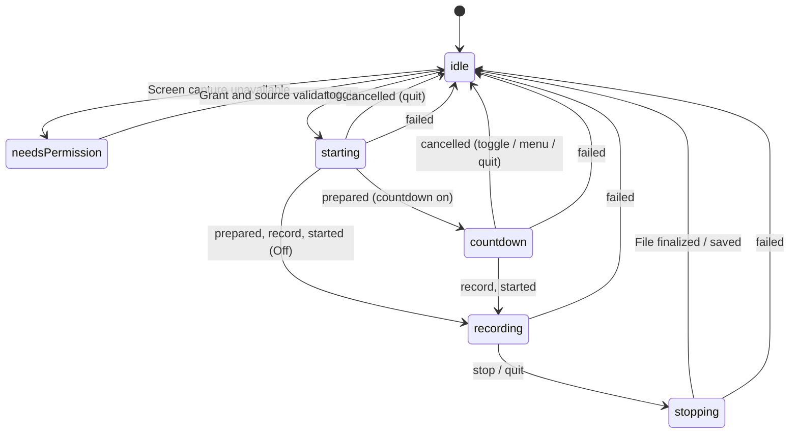
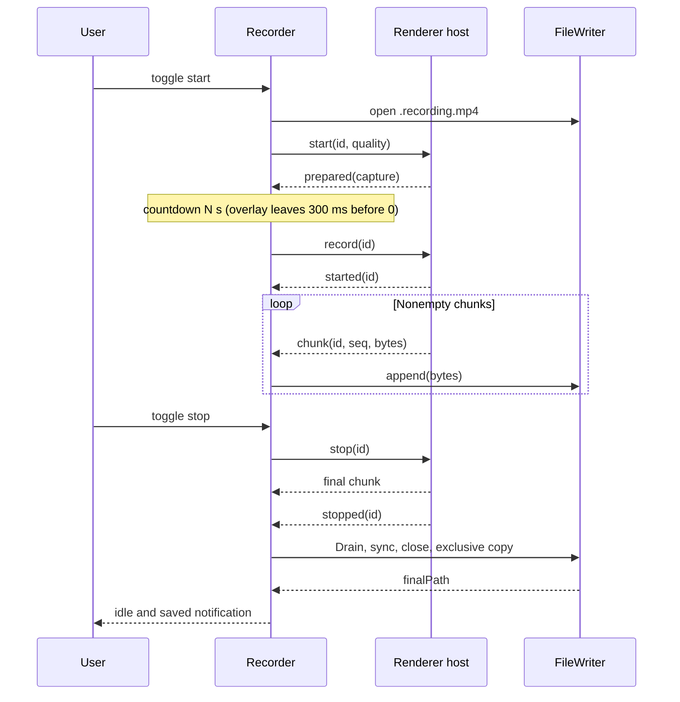

# Recording Pipeline and Storage

[English](recording.md) | [繁體中文](../zh-TW/system-design/recording.md)

Sources: [Recorder](../../src/main/recorder.ts), [renderer CaptureHost](../../src/renderer/capture-host.ts), [FileWriter](../../src/main/file-writer.ts), [health thresholds](../../src/main/recording-health.ts), [countdown values](../../src/shared/countdown.ts), [session sentinels](../../src/main/session-sentinel.ts), [quality](../../src/shared/quality.ts).

## State and user actions

NeedsPermission carries needsRelaunch, and lastSavedPath when a recording was saved while permission was missing. Idle may carry lastSavedPath or outputDirUnavailable. Countdown carries `remaining`, whole seconds, at least 1 and kept at 1 while `record` waits for `started`. A session's end (saved or failed) settles into needsPermission instead of idle when the latest permission status is not granted ([screen permission](desktop.md#screen-permission)). Recording carries an ISO startedAt. Failure is an event, not a persistent failed state; a cancel is neither a failure nor a state. Clicking without permission emits permissionRequested; clicks during starting/stopping are ignored. During the countdown a click or the shortcut cancels (see [countdown](#countdown)).

## Start

1. Recorder checks idle/no existing session and OS preflight, captures the quality and countdown snapshots, creates a session ID, and enters starting (the tray shows the hourglass).
2. ensureWritableDir creates the folder and writes/removes a probe. Failure never silently selects a different folder.
3. Write the session's interruption sentinel naming the temporary path, then open `YYYY-MM-DD HH-mm-ss.recording.mp4` using local time and exclusive `wx`. A temporary-file collision rewrites the sentinel and retries suffixes `-2` through `-10`. The name is the local time of the start request, so with a countdown it precedes the first frame by preparation plus the countdown.
4. Wait for host readiness and send start. With a countdown, the overlay window is built now so the first digit appears on time. Main resolves the saved screen preference: Primary display keeps the primary-id/first-source policy; an explicit display requires one exact id match. Request system loopback audio unchanged.
5. Renderer checks MP4 support, requests the stream, and rejects absent/ended audio tracks after cleaning up.
6. Measure actual frames, apply quality, recheck that all tracks are live, construct an inactive MediaRecorder and reply `prepared` with the CaptureReport. Permission prompts, missing audio, unsupported MP4 and display errors therefore all surface before any countdown.
7. With the countdown Off, main sends `record` at once. Otherwise it counts down ([countdown](#countdown)) and sends `record` at the end.
8. Renderer registers the callbacks, calls `recorder.start(1000)` and replies `started`. Main enters recording, emits captureStarted with the report from `prepared`, and arms the first-media deadline and stall guard. REC appears only after capture began, so the first frames may show the stopwatch in the menu bar, as they showed `…` before; the digit never appears in them. A first nonempty chunk must still arrive before its deadline; an empty chunk does not satisfy it.

## Countdown

Settings → Recording chooses Off, 3, 5 or 10 seconds; the default is 3, also for a settings file written before the field existed. Recording measured 318 ms from click to capture in the 2026-09-25 hotkey round ([plan 040 closure](../verification/history-2026-09.md#plan-040-closure--2026-09-26)), so the first frames showed the pointer leaving the menu bar and RecordStuff has no editor to trim them. Capture is prepared before the count and started at zero, as Cap does ([decision](decisions.md)).

- Recorder enters `countdown` with N and ticks once per second from one monotonic anchor taken at `prepared`; every tick is scheduled from that anchor, so timer lateness never accumulates. Each tick re-emits the state; the app logs `state → countdown (n)`.
- 300 ms before N seconds it asks the overlay to leave: the digit fades out over 120 ms and main destroys the window after one more settle interval (34 ms). Recorder waits for that confirmation at most 500 ms; past it the window is destroyed, the timeout is logged and capture proceeds. `record` goes out at N seconds, or when the dismissal settles if that is later.
- The overlay ([desktop](desktop.md#countdown-overlay)) is injected as a presenter with `show`, `update`, `dismiss` and `close`, so Recorder stays free of Electron. Presenter errors are logged and never fail a recording; the tray still shows the countdown.
- A toggle, the tray menu's Cancel countdown or the shortcut before `record` cancels the attempt: timers cleared, host stopped, overlay closed, writer abandoned so the empty temporary file is removed, and the idle state from before the attempt returns with its lastSavedPath. A `cancelled` event names the reason (`toggle`, `menu` or `quit`) and the log says `cancelled: session … (reason); no media was recorded`. No failure status, history entry, notification or display diagnostic is produced.
- After `record` was sent, a toggle becomes the existing stop-on-start request applied once `started` arrives, so a race of a few milliseconds cannot leave capture running. Clicks during starting and stopping stay ignored. A tray menu opened during the countdown is not updated while it stays open ([desktop](desktop.md#tray-and-notifications)), so its Cancel countdown chosen after capture began stops the recording, which is saved.
- Every timing and appearance value lives in [countdown.ts](../../src/shared/countdown.ts) as an initial target; tune them only with written evidence.

## Deadlines and supervision

| Protection | Default | Outcome |
| --- | --- | --- |
| Folder/open phase | 8 s | output_open_failed; a late writer is abandoned |
| Host ready | 8 s | Start rejects; host can be recreated |
| Capture/interactive permission request (`start → prepared`) | 120 s | capture_start_failed and stop session |
| Countdown overlay dismissal | 500 ms from the dismiss request, which comes 300 ms before N | Destroy the overlay, log it, record anyway |
| `record → started` | 8 s | capture_start_failed (while starting capture) |
| First nonempty chunk after started | 8 s | capture_start_failed; preserve any written data |
| Next nonempty chunk after media began | Warn once at 10 s, fail at 30 s; reset by every nonempty chunk, disarmed by stopped or failure | capture_failed with a stall detail; preserve the partial file |
| Output-folder free space | Poll every 5 s from started until stop; log once below 1 GiB | Below 200 MiB request the normal stop once; saved with a disk-almost-full reason, not a failure |
| Writer backlog (accepted, unwritten bytes) | 64 MiB | output_write_failed with a backlog detail; preserve the written prefix |
| Writer drain before classifying a generic start failure | 2 s | A retained disk error keeps its own code; otherwise capture_start_failed |
| Stop response | 10 s | stop_timeout |
| Renderer terminal drain | 5 s after termination begins | Error if stop/final Blob handoff is missing; discard subsequent handoff |
| Quit wait | 13 s per attempt (stop timeout + 3 s) | Defer quit with localized feedback while any owned work remains; never truncate finalization |

Before `record` nothing was captured, so track end, display removal, a crashed or unresponsive host and a refused or timed-out `record` during preparation or countdown are start failures: `capture_start_failed` with a detail naming the phase (`while preparing capture`, `while counting down`, `while starting capture`), the display diagnostic still emitted and an empty outcome. A disk error the writer already retained keeps its own code. A stale `prepared` or `started` for a detached session triggers a host stop.
| Heartbeat | Check/send every 5 s while a session is in flight | Tear down when the check finds two unanswered pings |

These are project waiting limits, not OS standards or exact end-to-end timing guarantees. A timed-out disk operation is not actually canceled. The health rows (stall, free space, backlog, start drain) are initial targets kept in one place, [recording-health.ts](../../src/main/recording-health.ts); tune them only with written evidence. Heartbeats only prove the renderer answers; the stall guard proves media still arrives. A failed free-space poll is logged once and never stops a recording. `powerMonitor` suspend and resume are logged with the in-flight session ID so a later failure can be read against sleep; sleep does not stop a recording.

## Terminal ownership and normal exit

CaptureHost latches the first termination cause before awaiting Blob conversion. A later user stop cannot hide track loss or an encoder error; cleanup track events do not turn an earlier normal stop into failure. Encoder error waits for final `dataavailable` and `stop`, then drains the handoff chain before one terminal message. The 5-second fallback reports failure and stops further handoff; it cannot recover bytes lost in a hard crash or a stuck conversion.

Once Recorder accepts `stopped`, its finalizer owns the attempt. Late host crashes/errors, duplicate stop messages and display removal cannot abandon a publishing file; disk errors still enter failure cleanup. All opening/finalizing/cleanup operations are registered before synchronous subscribers run. An opening timeout returns UI to idle immediately, but its result stays pending until the late open and close settle. Multiple failed attempts retain independent cleanup ownership.

Every `before-quit`, including idle, uses `installQuitCoordinator`. Repeated requests join one attempt and new recordings are blocked during admission. Capture is stopped automatically. No media exists before `record`, so quit never records a session that has not started (plan 040, for every countdown setting): quit during the countdown cancels it at once; quit while the folder opens cancels before any capture request; quit during preparation marks the attempt, and its `prepared` cancels it instead of counting down or recording, even after quit was deferred. Only a session whose `record` was already sent keeps stop intent, so capture stops and saves as soon as it starts. Success requires no session and no outstanding work, including late opens, earlier failed attempts and failure-result verification/publication. The quit deadline only defers exit; the existing capture-request and stop-response timers retain authority over capture failures. Pending disk/result-publication work stays owned, the app stays open and the user can retry quitting. The app never destroys the host or exposes an unconfirmed retained path merely to meet a quit deadline. Force-quit, process kill and power loss bypass these guarantees; no crash recovery or destructive media exit option is provided. The next launch reports such a session through its interruption sentinel (see [file completion](#file-completion-and-failure)). Only after this media phase does quit attempt the failure-history save; its explicit metadata-only exit can never abandon media work (see [desktop](desktop.md#deferred-quit)).

## Quality and encoding

| Setting | Rule |
| --- | --- |
| Video quality | Economy 0.07, Standard 0.13, High 0.24 bits/pixel/frame |
| Video bitrate | Width × height × requested fps × coefficient, rounded to 100 kbps, clamped to 1.5–60 Mbps |
| Resolution | Source unchanged; 1080p/1440p/4K caps preserve aspect/orientation, never upscale, and use even dimensions when downscaling |
| Frame rate | 30/60; only darwin enables 60; other platforms use 30 without rewriting stored settings. The capture asks for 30.3/62.5 to record the setting ([frame-rate request](#frame-rate-request)) |
| Audio | 256,000 bps target; ideal 2 channels, restrictOwnAudio true; echoCancellation/noiseSuppression/autoGainControl false |
| Format | `video/mp4;codecs=avc1,mp4a.40.2`; reject unsupported encoding rather than switch format |
| Chunking | Timeslice and videoKeyFrameIntervalDuration are both 1000 ms; actual delivery may be delayed |

MeasureFrameSize uses a muted video's intrinsic size with a default 3-second limit. Actual frames take priority because getSettings once reported an incorrect multi-monitor height. Only when frames cannot be read does it fall back to track settings. Applying a cap repeats frame-rate constraints and remeasures for up to 1.5 seconds. Rejected constraints preserve source size with warnings. If remeasurement fails, report target dimensions with a warning. With no size information, calculate the target bitrate from 1920×1080 without claiming those dimensions were measured.

System audio uses explicit unprocessed capture constraints: speech-oriented processing changed high-frequency balance and collapsed stereo in the local baseline. Disabling EC/NS/AGC together restored the v2 probes; own-audio exclusion remains enabled. These are requests, not universal platform guarantees. A track explicitly reporting one of these effects as true adds a warning; absent settings stay unknown. See the [audio design comparison](audio-quality.md#15-system-capture-correction--2026-09-14).

CaptureReport includes known dimensions/fps/sample rate/channel count, requested encoder bitrates, and warnings. Unknown fields are omitted. Output still needs ffprobe measurement. A downgrade notification requires requested 60 fps and a reported track rate ≤30; static-content frame reduction alone does not trigger it.

### Frame-rate request

The capture asks for slightly more than the setting: 30.3 for 30 fps and 62.5 for 60 fps (`CAPTURE_FRAME_RATE` in `src/shared/quality.ts`), as `{ ideal, max }` in `getDisplayMedia` and again in the cap's `applyConstraints`. In Chromium 152 (Electron 44.3) a screen is captured through ScreenCaptureKit, and the request becomes its [minimum frame interval](https://chromium.googlesource.com/chromium/src/+/refs/tags/152.0.7977.78/content/browser/media/capture/screen_capture_kit_device_mac.mm#239), a floor rather than a period. Plan 041's diagnostic (`pnpm diagnose:cadence`, see [tooling](tooling.md#frame-cadence-diagnostic)) located the deficit there: frames already reached the video track late, each interval the floor plus delivery latency, the track discarded at most 0.45% of them and the file's timestamps matched the delivered ones. Asking for exactly the setting therefore recorded about 29.4 and 57.5 fps without drops, and CPU load did not enlarge the excess. `ideal` alone changes nothing, because Chromium derives both the device rate and the track's limiter from it. The period rounded down to whole milliseconds, 33 and 16 ms, recorded 29.9 and 59.8 fps with median intervals within 1% of the period, no repeated frames and no additional drops; a 32.7 ms floor (30.6) reached the rate as well but left the 30 fps median at the 1% edge.

- Only the request moves. Bitrate targets, the log's requested fps, verification (nominal period and tolerance) and the downgrade rule use the setting. The track reports the request (`getSettings().frameRate` 30.3 or 62.5), which the log shows as the track fps: a 60 fps recording whose track reports 62.5 or 60 is not a downgrade, one reporting 30 or less still is.
- The track's own rate limiter follows the same value and drops only frames far faster than it, so it keeps every delivered frame. A 60 fps recording cannot exceed the display's refresh rate: on the 60 Hz display it measured 59.8 fps with no repeated frames. On a faster display the 16 ms floor could deliver slightly above 60; that, other Macs and the cap's `applyConstraints` path (only a source larger than the cap runs it) were not measured.
- Results for the earlier exact request remain in the [verification history](../verification/history-2026-09.md#plan-041-closure--2026-09-26).

## Chunk and stop ordering

Renderer serializes Blob-to-ArrayBuffer conversion through a Promise chain and skips empty Blobs. Main validates session ID and consecutive seq; a gap fails the session. Stale prepared/started/chunk messages trigger stop so an abandoned request cannot keep capturing unseen.

A prepared session holds a live stream and an inactive recorder. `stop` releases its tracks and replies `stopped`; a track `ended` replies a start error (with `displayFailure: "track_ended"` for video); `record` for any other session is refused. Stopping a pending start moves its ID from pending to cancelled. When the OS request settles, the returned stream is released. A normal stop flushes the final dataavailable; finish waits for the send chain before posting stopped. Unexpected track termination or recorder errors produce failure, not a successful stop.

## File completion and failure

Append, periodic sync, and finish use one FileWriter queue. Each append writes only the remaining buffer until it is complete, counting each confirmed byte immediately; later chunks and sync cannot interleave with its pieces. Empty chunks make no write call. Zero, negative, fractional, non-finite or oversized progress fails with output_write_failed; thrown errors are not retried. Fsync is scheduled every five seconds. The first I/O failure is retained, and later queued operations reject with the same error. ENOSPC maps to disk_full; other write failures map to output_write_failed.

Finish drains prior writes, syncs, closes, and copies the temporary file to `.mp4` with `COPYFILE_EXCL`, trying suffixes `-2`, `-3`, … on a final-name collision. `COPYFILE_FICLONE` requests a copy-on-write clone where supported; other filesystems may require extra time and space for a full copy. The completed copy is synced before best-effort removal of the temporary file; only then does Recorder emit saved with the actual destination. A cleanup failure leaves the temporary copy but does not invalidate the saved file. Failure first detaches the session, clears deadlines, stops the host, and returns the UI to idle; it then abandons the writer and reports a partial path when byte accounting is nonzero. Empty files are removed on a best-effort basis. Partial files are not automatically repaired or remuxed; a playable crash sample does not guarantee recovery from every interruption.

Success requires nonempty media. FileWriter.finish, the only publication step, is the gate: after draining its queue it checks the confirmed byte count, never requested chunk lengths. A retained append or background-sync error is reported first with its own code, such as disk_full, even when no byte was written. Otherwise zero bytes, whether the stop came before any chunk or after only empty chunks, makes finish release the handle and sync timer, remove the empty temporary file and reject with `capture_start_failed` and the detail `capture ended without media; no bytes were written`, the code the first-media deadline already uses. Recorder routes that rejection through its single failure path, so no saved event, lastSavedPath or `.mp4` is produced, the result is empty and an immediate retry starts cleanly. Abandon is idempotent, so the failure path's later cleanup cannot delete a same-second retry that has reused the freed name. Recorder does not pre-check the count itself: before the queue drains it cannot see a queued or in-flight sync failure and would mislabel a disk error as missing media. There is no minimum duration; a very short nonempty recording is saved.

Nonempty is a necessary minimum, not proof of a playable file. Cap's AVFoundation writer [rejects a finish without a last frame](https://github.com/CapSoftware/Cap/blob/ce785e705e79652adba4b8bf752669c4093499e0/crates/enc-avfoundation/src/mp4.rs#L961-L990) (static review at that revision), but RecordStuff receives encoded chunks rather than frame timestamps and does not parse MP4 or confirm a decodable frame. Playability is established only by media verification such as ffprobe and full decoding during acceptance, not at runtime.

Exclusive creation protects both temporary and final filenames, including final names created during recording. A failure after short-write progress preserves the confirmed byte count and nonempty partial file; later appends and finish reject without publishing, and abandon closes the handle and stops syncing. Background sync rejections are consumed while retaining the first failure. Complete writes are distinct from fsync durability and do not guarantee recovery after every crash, power loss or filesystem failure. Stronger durability requirements need targeted tests before implementation changes.

FileWriter bounds the bytes it accepted but has not confirmed written (`backlogBytes`, also logged by the stall and low-disk warnings and reserved for Plan 037's admission measurement). An append that would exceed 64 MiB is rejected at once without being queued, and so is every later append, so the file never has a gap; bytes accepted before the refusal are still written, finish rejects, and Recorder fails the session with output_write_failed and a backlog detail that keeps an earlier disk error if one was retained. There is no pause, drop or retry: MediaRecorder cannot be throttled, and the bound makes slow or offline storage end the recording with a preserved partial instead of unbounded memory. Sustained disk throughput below the bitrate therefore still ends the recording. There is no disk reservation, folder switch, quality downgrade or unlimited-recording guarantee.

The free-space guard reads `fs.statfs` of the output folder. Below the stop threshold it requests the normal stop, so the file is drained, synced and published while space remains; the saved event carries `stoppedEarly: "lowDisk"`, the log says so, and the saved notification reads "Saved {file}. Recording stopped early because the disk is almost full." Such a recording is a success and never enters failure history. If publication still fails, the ordinary failure path and partial preservation apply.

The writer opens before the capture request, which can wait up to 120 seconds for a permission prompt, and syncs every 5 seconds. When an attempt then ends through a generic `capture_start_failed` (first-media deadline, capture-request timeout, host start rejection or a host-reported capture_start_failed), the failure path first drains the writer for at most 2 seconds and, if it retained a write or sync error, reports that code (disk_full or output_write_failed) with the existing folder/disk guidance and a detail naming both causes. The status is classified before the pending result is published, so the notification and history agree. Specific host causes such as permission or missing audio keep their codes; a clean writer keeps `capture_start_failed`. A drain that does not settle within the bound keeps `capture_start_failed`.

Interruption evidence is one sentinel file per session in `userData/recording-sessions/`, named by the session ID and holding the session ID, start time and temporary path. It is written with the atomic writer before the temporary file is created, so a crash cannot leave a temporary file that no sentinel names; a failed write is logged once and does not block the recording. Every terminal outcome removes the session's own sentinel after its result is published, and a normal quit waits for that removal. At launch, before the history restore, each sentinel left by an earlier process becomes one `app_terminated` failure entry ("RecordStuff did not exit normally while recording.") whose path is a lookup hint rechecked like a restored partial: partial only while a nonempty file exists there, otherwise unknown. Its time is the session's start. The sentinel is removed only once the entry has been saved, including by a later automatic history retry, so the history owns the evidence first and a reviewed, removed entry cannot return; its ID is derived from the session, so a history that stays unsaved retries at the next launch without a duplicate. The single-instance lock and the process's own session list guarantee that reported sentinels belong to dead processes. An interrupted sentinel write or invalid content names no media and is discarded; a sentinel that cannot be read at launch is kept for a later launch. No other file in the output folder is scanned, and nothing is recovered, remuxed or repaired.

## Errors

| Category | Codes | User outcome |
| --- | --- | --- |
| Permission/environment | permission_denied, permission_needs_relaunch, unsupported_os_version | Settings/relaunch guidance or version explanation |
| Source/codec | no_display, display_unavailable, no_audio_track, mp4_unsupported | Refuse start and explain missing capability |
| Capture | capture_start_failed, capture_failed, capture_host_crashed, capture_host_unresponsive | Return idle and reveal any preserved partial file; before `record` every capture loss is capture_start_failed with an empty outcome |
| Storage | output_open_failed, output_write_failed, disk_full | Explain location/disk failure and preserve bytes where possible |
| Stop | stop_timeout | Stop waiting for capture and attempt partial-file cleanup |
| Previous process | app_terminated | Reported only at launch from an interruption sentinel; says the app did not exit normally and the file may be incomplete; never sent by the capture host |

Main may replace a generic renderer failure with the concrete source-denial reason, but only for errors that source denial can explain. Permission_needs_relaunch is a supported protocol code; routine relaunch guidance primarily follows PermissionWatcher state.

## Screen selection

`display-source.ts` separates live Screen API resolution from capture-source matching. Explicit choices store `{ kind: "display", id, label }`; labels are presentation only. Missing/duplicate targets fail immediately. Missing/duplicate capture sources or topology changes retry at 150 ms intervals, at most three enumerations. Enumeration exceptions preserve permission-denied on macOS / no-display elsewhere. The recorder timeout remains the outer bound for a hung enumeration. Settling or superseding an attempt cancels callbacks and retry timers; delayed completions cannot grant capture or replace diagnostics. `display-media.ts` owns this state across attempts: the preference snapshot, the refusal reason that explains the next host error, the active display watched for removal, and the display diagnostic.

`display_unavailable` means the exact target could not safely resolve, with separate `target_missing`, `source_missing` or `topology_changed` detail. No matching by name, size or position occurs, and stored ids are never rewritten automatically. Id reuse is not proof of physical hardware identity. Display removal invokes the recorder's idempotent `capture_failed` path and preserves recoverable partial content without switching targets. Screen metadata is logical DIP size and scale; output dimensions still come from the actual track and resolution cap.

Main destroys the capture host when an attempt settles; the next attempt has a new frame. A media request must match both the current frame and session, so delayed handler arrival cannot inherit a newer attempt. Unexpected video-track termination carries structured `displayFailure: "track_ended"`; Recorder retains this diagnostic before idle. Audio-track termination is not mislabeled as display loss. Removal after normal track shutdown during file finalization does not create a failure diagnostic.

Failure presentation is independent of the terminal event: failureStatus reports pending immediately and partial/empty/unknown after cleanup, while saved/failed remains the terminal contract. A close failure sets preservationUncertain and cannot be presented as confirmed preservation. See [recording failure results](desktop.md#recording-failure-results).

Failure IDs are UUIDs across recorder instances. Pending status includes the writer candidate path when known; settled events remove that candidate for empty results, retain it as a lookup hint for unknown results, and expose a partial path only for confirmed preservation. Each persisted result restores interrupted cleanup as unknown, never as ongoing processing or a successful save.
