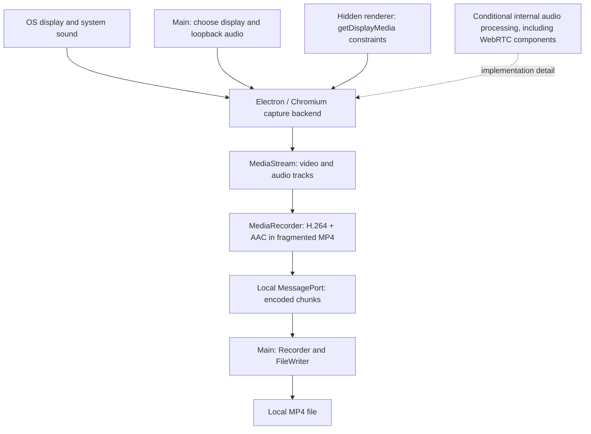

# Electron, Chromium, and WebRTC in RecordStuff

[English](webrtc.md) | [繁體中文](../zh-TW/system-design/webrtc.md)

Updated: 2026-09-14.

## What role does WebRTC have?

RecordStuff records locally through the media APIs provided by Electron's Chromium engine. It does not create a WebRTC peer connection. WebRTC is relevant because Chromium can reuse its native audio processing components in capture paths, including paths that do not send audio over a network.

Three meanings must be distinguished:

| Term | Meaning in this design |
| --- | --- |
| Browser media APIs | `getDisplayMedia` obtains screen/system-audio tracks; `MediaStream` carries tracks; `MediaRecorder` encodes them for a file. These APIs can also be used by a calling app. |
| WebRTC communication | `RTCPeerConnection`, peer negotiation, ICE/STUN/TURN, and network media transport. None is implemented in RecordStuff's recording flow. |
| Native WebRTC components | Implementation code inside Chromium, notably the Audio Processing Module (APM). Its use depends on the capture path and configuration; the app does not directly import or configure the C++ module. |

`getDisplayMedia` belongs to the [Screen Capture specification](https://www.w3.org/TR/screen-capture/). `MediaRecorder` belongs to [MediaStream Recording](https://www.w3.org/TR/mediastream-recording/). Calling either API does not itself create a peer connection or upload the recording.

## Actual media flow and ownership

| Layer | Owns | Why the boundary matters |
| --- | --- | --- |
| Operating system | Screen/audio sources and capture permission | Missing permission or a different audio route cannot be fixed by increasing encoder bitrate. |
| Electron main | Selects the primary display and requests `audio: "loopback"`; owns lifecycle and file writing | Source selection and filesystem access stay outside the sandboxed capture renderer. |
| Chromium media engine | Implements capture, track settings, internal processing, and recording support | Electron/Chromium upgrades can change behavior without an application-code change. |
| Hidden capture renderer | Requests constraints, inspects track settings, runs `MediaRecorder`, emits chunks | This is where the app expresses its fidelity policy and gathers runtime evidence. |
| Local IPC and writer | Move encoded bytes between processes and persist them | MessagePort is local IPC, not `RTCDataChannel`; file failures are distinct from capture distortion. |

The renderer requests `video/mp4;codecs=avc1,mp4a.40.2` and checks support. AAC is the selected recording codec, not evidence of a WebRTC network session. FFmpeg is used by developer verification tools, not as the production recording subprocess. See [recording lifecycle](recording.md) and [process architecture](architecture.md) for stop, failure, and durability behavior.

## Why voice processing can affect a local recording

The [WebRTC APM interface](https://webrtc.googlesource.com/src/+/refs/heads/main/api/audio/audio_processing.h) describes audio processing for real-time voice communication. Echo cancellation reduces reproduced sound returning through a microphone; noise suppression reduces unwanted background sound; automatic gain control adjusts speech levels. Those objectives are useful for a conversation. Our current source is an already mixed digital system-audio signal, with no microphone track. Music, stereo differences, and quiet details are part of the desired recording.

Chromium's [processed display-capture layout](https://chromium.googlesource.com/chromium/src/+/refs/heads/main/third_party/blink/renderer/modules/mediastream/media_stream_audio_processing_layout.cc) demonstrates that display capture can select a processing path depending on echo-cancellation configuration. This is implementation context from upstream `main`, not proof of the exact internal path in our shipped Electron build. A network call is not a prerequisite for such processing.

Our policy requests `echoCancellation: false`, `noiseSuppression: false`, and `autoGainControl: false`, while retaining `restrictOwnAudio: true` and an ideal two-channel request. This changes capture policy; it does not disable Chromium's media engine. Own-audio restriction is a separate exclusion request, not a promise to suppress every native application sound.

Three kinds of evidence have different strength:

1. **Requested constraints** prove what our code asks for. They do not prove all implementations honor the request.
2. **Reported track settings** show what the runtime exposes. Explicitly enabled effects produce a warning; an omitted setting is unknown.
3. **Decoded output measurements** establish what survived the complete recording path. They catch losses that settings or a valid MP4 cannot reveal.

Local comparison after disabling all three effects restored high-frequency response and stereo separation in two valid runs. A third run failed fixture identification and was invalid, so the complete three-run batch was not a pass. The experiment supports the combined policy on the measured environment; it does not isolate which effect caused the earlier loss or guarantee every device. The [audio-quality design and evidence](audio-quality.md) retain the detailed rationale and results.

## What we test, and why

| Check | Failure it can reveal | What it cannot prove |
| --- | --- | --- |
| Unit tests for constraints and warnings | An app change re-enables effects or hides a reported mismatch | Actual browser DSP or acoustic fidelity |
| Fixture identity and alignment | Wrong input, missing markers, or a recording unsuitable for comparison | Quality of an unidentified signal |
| Frequency response | High-frequency loss associated with a muffled sound | All perceptual defects in arbitrary speech/music |
| Stereo separation | Two reported channels contain effectively the same signal | Correct channel behavior on every OS/audio route |
| Clipping, dropout, and level checks | Lost samples, saturation, or unexpected level changes | Every subjective listening preference |
| Repeated real capture with environment snapshots | Intermittent failures and dependence on runtime or routing | Universal compatibility from one machine |

These layers explain why “the constraints test passed” cannot mean “the audio is fixed.” After changes to Electron, Chromium, capture settings, codecs, or the audio route, repeat real capture and preserve raw reports. Apply fixture validity gates before interpreting quality metrics. See [audio-quality testing](audio-quality.md) for thresholds, detector tests, and pass/fail/invalid semantics.

## Boundaries and future changes

The implemented recording media path has no signaling service, peer transport, STUN/TURN dependency, or cloud upload. This statement describes that path, not a comprehensive audit of all development tools or Electron networking.

Adding live sharing would introduce a separate transport architecture and would need explicit decisions about signaling, peers/servers, connectivity, authentication, and media privacy. Adding microphone narration would require a separate audio policy: echo cancellation may then be useful, and the system track should not automatically inherit speech-oriented processing. Neither feature exists in the current design.

## Code map

- [Main entry](../../src/main/index.ts): display-media request handler and loopback source selection.
- [Capture renderer](../../src/renderer/capture-host.ts): constraints, settings, `MediaRecorder`, and chunks.
- [Shared protocol](../../src/shared/protocol.ts): MIME type and local messages.
- [Quality policy](../../src/shared/quality.ts): requested encoding quality.
- [Architecture](architecture.md): process ownership and IPC trust boundaries.
- [Audio-quality testing](audio-quality.md): measured fidelity, limitations, and regression strategy.
