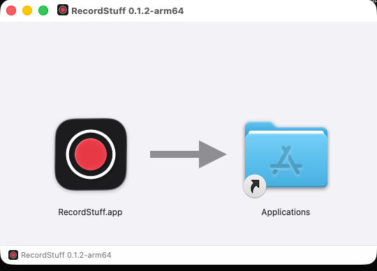

# macOS 0.1.2 release verification

[English](0.1.2.md) | [繁體中文](../../zh-TW/verification/releases/0.1.2.md)

2026-09-19: 013 complete. The simplified DMG was published from tag `v0.1.2` by the tag-triggered workflow; local build, functional acceptance, removal check and public release evidence are below. Published v0.1.0 and v0.1.1 assets are unchanged.

## Local candidate build

`pnpm dist:mac` on the development Mac (macOS 26, arm64, Node 24.21.0, pnpm 10.33.4, Electron 44.3, electron-builder 26.15.3) signed with the fixed identity `01B373511530BBF287CA35E54C10A5F017AAD637`, verified nine bundle identities and the designated requirement, then packaged the DMG. `node scripts/release.mts candidate v0.1.2 dist/local` (the output directory at that time; now `dist/`) passed: read-only mount, visible root exactly `Applications` and `RecordStuff.app`, `/Applications` link, packaged version 0.1.2, arm64, and App signature checks.

- File: `RecordStuff-0.1.2-arm64-selfsigned.dmg`
- Size: 126,059,078 bytes
- SHA-256: `7599a20bbf76c82e0e03379283e51a5fb77cfbe52b3fd3a12feeb74cc002723a`
- app.asar SHA-256: `07a537ed2b0433a6c0937796115dc97911fd803aa0994185f73b621bca683acc`

These hashes identify the local build from an uncommitted working tree whose recorded source commit is the previous `d690a9c`. They are not the release bytes: CI will rebuild from the committed 0.1.2 source and the release record will replace these values.

Hidden root entries were `.DS_Store`, `.VolumeIcon.icns` and `.background.tiff`, the ordinary Finder layout files; the gate now rejects any other hidden entry and any hidden directory or symlink, so no guide or document can pass in a hidden location or inside a hidden folder. The gate was rerun on the same DMG after this change and passed.

## Finder layout

The mounted image was opened in Finder on the built-in display. The window showed the App icon, the generated arrow and the Applications link at 128 points with no scrolling, clipping or additional icons:

This is a local screenshot on one display and one macOS version; the CI candidate must be mounted again during acceptance.

## Automated checks

`pnpm check` (typecheck, Vitest, build) and `git diff --check` results are recorded in the final implementation report for this change. The release tests now cover `assertDmgContents` (accepts only the App and Applications link plus Finder layout files; rejects visible guides, extra files, missing App, empty root, and hidden documents or folders such as `.INSTALL.md`, `.help/` or a `.background.tiff` directory containing a guide, using real temporary directories) and release notes containing Open Anyway, permission, manual update, removal and both guide links.

## Removal check on a disposable copy — passed

2026-09-19, installed 0.1.1 copy. A file list with sizes and modification times of `~/Library/Application Support/recordstuff`, `~/Library/Logs/recordstuff` and `~/Movies/RecordStuff` was hashed, `/Applications/RecordStuff.app` was copied to `/tmp/recordstuff-removal-test/`, the copy was deleted (the equivalent of Trash and empty), and the hash was recomputed: identical, so removing the App touches no recordings, settings or logs. The installed App was untouched and the temporary directory was removed. This checks the removal guide's data-retention claim; it does not test Finder's Trash UI itself.

## Local functional acceptance on the release source — 2026-09-19

`pnpm start:app` built, signed (nine bundle identities, pinned fingerprint) and opened `dist/mac-arm64/RecordStuff.app` 0.1.2 at commit d63bef3; the log shows `ready` and `permission: granted` with no new permission prompt, so the existing screen-recording grant applies to the rebuilt identity. The maintainer then recorded 16.7 seconds by clicking the menu bar icon. `pnpm verify --screen 1920x1080`: 1920×1080, 0.52% dropped frames, A/V duration difference −12 ms, 48 kHz two channels with −29 dB RMS in both, audio 194 kbps, full ffprobe decode without errors. The first verifier run reported **fail** on two 60 fps thresholds (57.55 fps against 60 ± 2 on non-moving material; 23.82 Mbps against a 16.2 Mbps target). The verifier was then restructured into integrity and performance tiers (see [tooling](../../system-design/tooling.md#measurement-pipeline-and-thresholds)): frame timing is judged only for continuously moving material and bitrate is a floor. Rerun on the same file, unchanged measurements, aggregate **pass**, with duration 16.7 s matching the log session length. Both outputs are kept in the [acceptance report](../measurements/2026-09-19T1727-computer-use/report.md). Playback in a player was not recorded. Computer use UI cases were blocked in this environment; see the [acceptance report](../measurements/2026-09-19T1727-computer-use/report.md).

## Public release — 2026-09-19

[Run 35437124200](https://github.com/EricTsai83/recordstuff/actions/runs/35437124200) started on the `v0.1.2` tag push at 10:20:18Z; the build job (preflight, `pnpm check`, fixed-identity signing, `pnpm dist:mac`, candidate gate) finished at 10:22:17Z and the publish job (private-key-free reverification, tag/commit check, `gh release create --latest`) at 10:23:05Z. Source commit `122a854fffb98d0ef2c9783af7d9d07329d5bb6c` on main. The [release](https://github.com/EricTsai83/recordstuff/releases/tag/v0.1.2) is public, not a draft, not a pre-release, and is the latest release.

- File: `RecordStuff-0.1.2-arm64-selfsigned.dmg`
- Size: 127,314,171 bytes
- SHA-256: `2de49bbd552e46934ef4573ca8c8b103e3a0b1334dd12b2022dee1f332f7fc7f`
- GitHub asset digests: DMG `sha256:2de49bbd552e46934ef4573ca8c8b103e3a0b1334dd12b2022dee1f332f7fc7f`, SHA256SUMS `sha256:5473857c…989ee`, release.json `sha256:8cec428e…d3d73`

The release notes carry the install, Open Anyway, permission, manual-update and removal text with guide links pinned to the source commit. The local candidate hashes above (uncommitted tree, 126,059,078 bytes) are superseded by these CI bytes.

## Pending

Playback confirmation by the maintainer in a player was not recorded (optional). The anonymous public-download verification (`verify-published` job, added after this release) has not yet passed against v0.1.2: the first dispatch ([run 35441201011](https://github.com/EricTsai83/recordstuff/actions/runs/35441201011)) downloaded the assets in seconds but failed because the job had checked out the tag, whose release.mts predates the `published` mode; the job now checks out the workflow ref and derives version and commit from the tag. Dispatch again and record the run here. A local re-download on 2026-09-19 was abandoned at about 55 KB/s and is not evidence. and its CI run (link, size, SHA-256), with an optional browser download checksum. No result is claimed for any of these.
