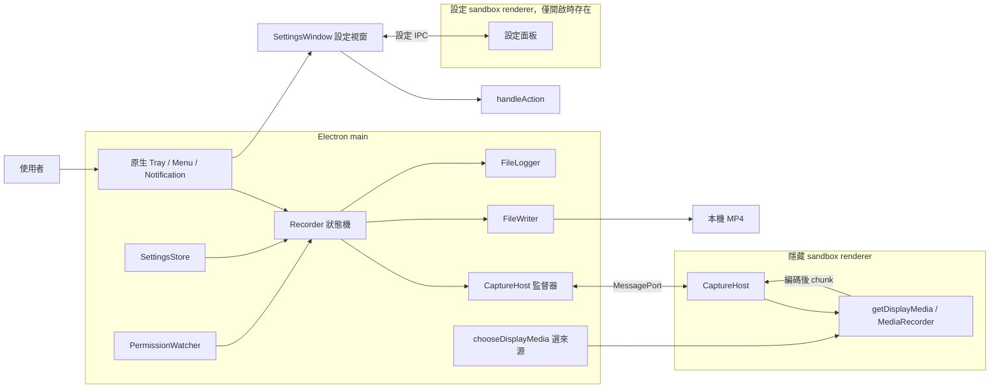

# 系統架構

[English](../../system-design/architecture.md) | [繁體中文](architecture.md)

Electron、Chromium、瀏覽器媒體 API 與內部 WebRTC 音訊處理的角色，見 [Electron、Chromium 與 WebRTC](webrtc.md)。

## 程序與責任

應用層分成 main、隱藏 capture renderer，以及只在設定視窗開啟期間存在的設定 renderer。Electron 自身還會建立 GPU／helper 等程序；層數不等於作業系統看到的 PID 數。

Tray、選單與通知全在 main，使用原生 Electron API。設定面板是使用者唯一看得到的 HTML 頁面：沒有框架、也沒有自己的狀態，只負責畫出 main 給的 view，並回傳使用者選到的選項 id。Capture renderer 取得 stream、套用品質並編碼；main 選取來源、決定錄製狀態、決定所有動作與寫檔。

## 模組邊界

| 模組 | 擁有的資料／資源 | 不負責的工作 |
| --- | --- | --- |
| `main/index.ts` | App 生命週期、依賴組裝、來源 handler、退出協調 | 不編碼、不自行追加影片 bytes |
| `main/recorder.ts` | 唯一 `RecordingState`、session id、順序與 timeout | 不 import Electron；不接觸 DOM |
| `main/capture-host.ts` | 隱藏 BrowserWindow、main port、ready／heartbeat | 不作檔案成功判定 |
| `renderer/capture-host.ts` | MediaStream、MediaRecorder、序號、Blob 傳送鏈 | 不讀設定檔、不選輸出路徑、不寫檔 |
| `preload/index.ts` | 轉交 main 提供的 MessagePort | 不暴露 Node API |
| `main/file-writer.ts` | 每個錄影 session 的影片 handle、寫入佇列 | 不決定 UI 狀態 |
| `main/settings.ts` | 已提交設定、序列化保存佇列 | 不修改正在錄製的設定快照 |
| `main/tray-model.ts` / `tray.ts` | Tray 扁平指令選單的純投影／原生圖示與通知 | 不放偏好設定，也不另建錄製狀態機 |
| `main/ui-model.ts` | 兩個介面共用的 action union、context 快照與設定鎖定規則 | 自己不做任何投影 |
| `main/settings-model.ts` | 所有偏好設定、穩定 id，以及面板請求的授權判定 | 不碰 Electron、IPC 或持久化 |
| `main/settings-window.ts` | 設定視窗、來源驗證與序列化保存 | 不定義任何設定的語意 |
| `renderer/settings.ts` / `preload/settings.ts` | 畫出 view 並回傳 id／read-choose-subscribe 橋接 | 不持有設定狀態、不產生 action、不碰 Node API |
| `main/permission.ts` | 螢幕授權驗證快取與輪詢 timer | 不認定系統音訊已授權 |
| `main/log.ts` | 同步寫入與輪替的文字 log | 不保存媒體 bytes |
| `main/session-log.ts` | 每次啟動的 run id，以及每個 capture 與結果行旁的有版本 session record | 不負責配對錄影與 session（那是開發用分析器的工作） |
| `shared/i18n.ts` | 英文文案 key、繁體中文模板、語言驗證 | 不控制 OS 原生提示或翻譯技術日誌 |
| `shared/*` | 狀態、訊息與品質型別／純函式 | 不依賴 Electron 或 DOM |

## 信任邊界與 IPC

兩個 renderer 都使用 `sandbox: true`、`contextIsolation: true`、`nodeIntegration: false`、`webSecurity: true`，並禁止新視窗與導覽；隱藏的擷取視窗另外停用 background throttling。打包版載入本機 HTML；開發版可載入 electron-vite URL。

設定面板有自己的 preload，只暴露三個呼叫。`settings:read` 與 `settings:choose` 會驗證來源必須是設定視窗的 main frame，否則拒絕。choose 請求帶的是群組 id 與選項 id，不是 action；main 依當下重新產生的模型解析這組 id，因此請求只能做到 App 當下提供、而且錄製狀態允許的事。保存依請求順序序列化，回應會告知實際提交的值。

| 方向 | 訊息 | 意義 |
| --- | --- | --- |
| 面板 → main | `settings:read` | 取得目前的 view |
| 面板 → main | `settings:choose { group, choice }` | 套用一個被提供的選項；回傳 view 與是否真的提交 |
| main → 面板 | `settings:changed` | 狀態或 context 改變，重新繪製 |

Main 建立 `MessageChannelMain`，透過 `capture-host-port` 將其中一端交給 preload；preload 用 `window.postMessage` 交給頁面。頁面檢查事件來源為自身 window 與固定標記，取得 port 後送 `ready`。Port 本身被 transfer，媒體 `ArrayBuffer` 用 structured clone 複製。

雙方在接收處執行 type guard。驗證是必要欄位的形狀檢查，不是嚴格拒絕所有額外欄位或完整資源配額限制。協定沒有版本協商，因為 main／preload／renderer 隨同一 App 一起更新。

| 方向 | 訊息 | 意義 |
| --- | --- | --- |
| main → host | `start { sessionId, quality }` | 本次不可變的品質快照 |
| main → host | `stop { sessionId }` | 停止或取消仍在等待的擷取 |
| main → host | `ping` | 確認 renderer 事件迴圈仍回應 |
| host → main | `ready` / `pong` | 通道就緒／心跳回應 |
| host → main | `started { sessionId, mimeType, capture }` | recorder 已啟動；尚不代表第一片資料已落盤 |
| host → main | `chunk { sessionId, seq, bytes }` | 從 0 起連續序號的編碼資料 |
| host → main | `stopped { sessionId }` | 最後 chunk 已送出；main 才能開始完成檔案 |
| host → main | `error { sessionId?, code, detail }` | 失敗；無 session id 時可作用於 main 當前 session |

沒有逐 chunk ACK 或背壓協定：renderer 序列化 Blob 轉換，FileWriter 序列化磁碟作業，但磁碟持續變慢時佇列可能增長。心跳偵測程序回應，不等於媒體持續到達；目前有首 chunk 期限，沒有錄製期間的每片 watchdog。

## 資料模型與持久化

| 資料 | 所在位置 | 生命週期 |
| --- | --- | --- |
| `RecordingState` | main 記憶體 | App 重啟重設；`lastSavedPath` 不持久化 |
| main `Session` | Recorder 記憶體 | 開始到成功／失敗；包含 writer、品質、nextSeq、timer |
| renderer `Session` | capture host 記憶體 | stream、recorder、seq、chain、stopRequested、finished |
| `settings.json` | `app.getPath('userData')` | 跨重啟保存；現有 App 名稱對應小寫 `recordstuff` |
| `.recording.mp4` | 使用者指定資料夾 | 錄製中的檔案，失敗時可保留 |
| `.mp4` | 同一資料夾 | 正常完成並改名後的檔案 |
| `recordstuff.log` | `app.getPath('logs')` | 5 MiB 輪替、3 個舊檔 |
| 量測 Markdown／JSON | `docs/verification/measurements/` | 本機開發證據；已 gitignore，不隨 App 發行 |

Main 持有影片 handle；設定與 log 模組也會寫自己的檔案，因此「單一 writer」僅指影片資料，不是整個 App 只能有一個檔案 handle。

## 啟動與關閉

Main 先建立 logger、註冊未捕捉錯誤處理並取得 single-instance lock。ready 後隱藏 Dock、載入設定、註冊 display-media handler、組裝 Recorder／host／權限 watcher／Tray、訂閱事件並開始權限輪詢。每次錄製嘗試都建立新的 capture renderer，嘗試結束時由 main 銷毀；錄製之間不保留 capture renderer，也沒有心跳 timer。

`window-all-closed` 不退出 App。忙碌時 `before-quit` 阻止直接結束，等 `Recorder.shutdown()` 後再次 quit；`will-quit` 停止權限輪詢並銷毀 host 與 Tray。已經 idle 的退出不額外等待 failure cleanup；硬斷電、main 強制終止、阻塞磁碟並不具有完整落盤保證。
