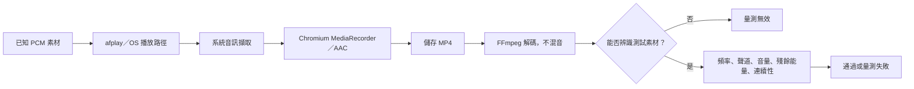

# 音質測試：我們測什麼，為什麼要測

[English](../../system-design/audio-quality.md) | [繁體中文](audio-quality.md)

本章說明開發用音質診斷系統，對應素材與報告第 2 版。目的是教讀者如何推理音訊問題，不代表所有錄音的音質已經正確。[工具文件](tooling.md#音質迴歸測試)提供指令，[驗證紀錄](../verification/README.md)保存實際結果，[錄製流程](recording.md)則說明正式程式如何擷取與儲存。

Electron、Chromium、瀏覽器媒體 API 與內部 WebRTC 音訊處理的角色，見 [Electron、Chromium 與 WebRTC](webrtc.md)。

## 1. 從問題出發：使用者說「聽起來悶」

「MP4 裡有音軌」回答不了這個問題。我們真正想知道的是，錄音有沒有保留原音的重要資訊：頻率之間的比例、左右聲道的獨立資訊、音量、波形，以及時間上的連續性。

因此測試是一個有已知輸入的實驗：產生可重現的聲音，透過系統播放，使用真正的程式錄製，解碼成品，再將量測值與素材原本的性質比較。有已知輸入，異常結果才有可以查證的依據。聽感測試仍有價值：合成訊號能隔離特定機制，語音與音樂則幫助我們判斷這些差異在實際內容中是否重要。

這個實驗量的是整條「播放 → 擷取 → 編碼」路徑。失敗本身無法指出是哪一段造成。定位原因時，應保留同一測試，每次只改一個環節，或在編碼前增加 PCM 觀察點。FFmpeg AAC 對照組通過，只能證明該對照編碼器保留了這份素材，不能證明 Chromium 的 AAC 編碼器表現相同。

## 2. 為什麼取樣率、聲道數與位元率不夠

| 看到的資訊 | 可以證明 | 不能證明 |
| --- | --- | --- |
| 48 kHz 取樣率 | 檔案使用的樣本時間格線 | 12 或 16 kHz 有沒有在擷取／濾波時消失 |
| 兩個聲道 | 每個音訊影格有兩個樣本值 | 左右是否真的保留不同資訊 |
| 較高 AAC 位元率 | 編碼儲存預算或實際資料率 | 來源品質良好、上游沒有低通濾波 |
| RMS 不為零 | 存在能量 | 是正確聲音、雜訊，還是失真 |
| 能成功解碼 | 串流可讀 | 編碼前是否已經掉樣本或改變聲音 |

48 kHz 的 Nyquist 上限是 24 kHz，但這只是理論上可表示的最高頻率。前面若有濾波器，仍可能把 10 kHz 以上全部移除。同樣地，把單聲道複製成左右兩份，就會得到標示 stereo 的檔案，卻沒有恢復立體聲資訊。提高位元率也無法重建編碼前已經遺失的資訊。

## 3. 三種「通過」不能混為一談

1. **偵測器正確：**正常對照通過，刻意破壞的對照會因為預期原因失敗。這屬於自動化測試。
2. **本機路徑品質符合門檻：**這個程式、OS 與裝置組合，能正確錄下測試素材。這需要實際錄製，不能靠假的媒體 API 證明。
3. **產品普遍可靠：**不同環境與代表性內容經過多次驗證，行為仍然良好。這需要更廣的證據與聽感確認，一台機器的一次成功並不足夠。

`pnpm check` 對已涵蓋案例支持第一種主張。`audio:quality record` 檢查第二種。兩者都不能單獨證明第三種。整個 repository 的測試總數，也不等於音質測試的涵蓋程度。

## 4. 第 2 版素材如何設計

素材是 48 kHz、雙聲道、PCM16 WAV，長度 12.1 秒。先用浮點樣本合成，再量化成 WAV。正常探測音保留振幅餘裕，工具不更改系統音量。

| 素材時間 | 內容 | 用途 |
| --- | --- | --- |
| 0–0.5 秒 | 靜音 | 留出擷取／播放啟動時間 |
| 0.5–1.0 秒 | 兩聲道的 1 kHz 標記 | 找到訊號，估計頻率比例 |
| 1.0–1.5 秒 | 靜音 | 排除無關的連續音，驗證對齊 |
| 從 1.5 秒開始，共十二個 0.8 秒區段 | 每段 0.6 秒聲音加 0.2 秒靜音 | 六個頻率先只放左邊，再只放右邊 |
| 11.1–11.6 秒 | 兩聲道的 2 kHz 標記 | 證明尾端素材存在，檢查結尾時間 |
| 11.6–12.1 秒 | 靜音 | 保留收尾餘裕 |

探測頻率是 250 Hz，以及 1、4、8、12、16 kHz，分別取樣低頻、中頻與逐漸升高的高頻。這些是診斷點，不是完整頻譜；如果兩點之間有很窄的頻率凹陷，仍可能漏掉。

每個探測區段都在有聲的聲道同時播放 1 kHz 參考音，稱為 pilot。pilot 與目標頻率的峰值振幅各為 0.125。1 kHz 區段只放一個正弦波，不放兩份相同的音。起訖標記振幅為 0.25。所有音調都有 10 ms 線性淡入淡出，避免素材邊界本身製造不必要的喀聲。

### 為什麼參考音必須同時存在

假設先播 1 kHz，之後才播 12 kHz。如果自動增益剛好在兩者之間下降，即使路徑的頻率響應完全平坦，依序比較也可能把音量下降誤認為「高頻流失」。

第 2 版比較的是**同一時間**存在的目標音與 1 kHz pilot。如果兩者同時乘上相同增益，比例中的增益會抵消。我們仍另外量 pilot 的音量，所以不會因為正規化而漏掉整段錄音變得很小聲。

這能減少不同探測區段之間的增益變化造成的誤判，但無法消除頻率選擇性處理，或一個區段內快速變動的增益。雙音素材本身也可能影響非線性／自適應處理的行為，因此結果描述的是這個受控刺激下的表現。

## 5. 時間對齊、時鐘，以及原本的誤報

擷取延遲會讓整個波形在時間上平移；時鐘不一致則會改變看到的頻率，並隨時間累積長度差異。這是兩種不同現象。

第 1 版拿樣本去匹配「精確等於指定頻率」的正弦波。例如乾淨的 16 kHz 音調偏移 10 ppm 後，實際是 16000.16 Hz。它的相位會逐漸偏離固定的參考波形。第 1 版把這個差異算成殘餘失真，即使輸入仍是乾淨正弦波。這個誤報已經實際重現，不只是理論上的可能。

第 2 版的流程是：

1. 以 10 ms 區塊尋找至少連續 300 ms 的穩定 1 kHz，忽略無關的啟動聲音。
2. 在有限頻率範圍內先粗搜，再局部細化，以最小化擬合殘差估計標記頻率。
3. 計算 `speed = 量得的標記頻率 / 1000`，以及 `clock_ppm = (speed - 1) × 1,000,000`。
4. 用 `觀察到的起點 + (素材時間 - 0.5) / speed` 將素材時間映射到解碼樣本。
5. 檢查應有長度、標記後的靜音，以及獨立的 2 kHz 結尾標記，比較實際結尾時間和預測時間。
6. 每個探測區段再估計當下的 1 kHz pilot，用相同的局部頻率比例擬合目標音，並另外回報頻率偏差。

搜尋範圍是指定頻率的 ±0.1%，最小半寬為 0.5 Hz；1 kHz pilot 搜尋 ±1 Hz。但通過門檻比較嚴格，為 ±200 ppm。搜尋可以超出通過門檻，才能把「過大的時鐘偏差」獨立列出，而不是叫作失真。這不是無限制地扭曲時間軸，也不是設法讓壞訊號通過。

起點格線是 10 ms，因此結尾時間允許 20 ms 誤差，邊界也保留餘裕。第 2 版驗證短錄音的時間一致性，不能證明長時間漂移穩定。[既有錄製驗證工具](tooling.md)負責 A/V 時間檢查；此 PCM 分析器不量容器時間戳的不連續。

## 6. 如何擬合正弦波與計算殘餘能量

補償時鐘後，一個有限分析視窗不一定包含整數個週期。如果只讀一個 FFT bin，或假設正弦與餘弦一定互相正交，就可能把真正的訊號能量漏算進殘差。

我們以最小平方法擬合：

`sample[n] ≈ DC + Σ(a[k] × sin(2πf[k]n/Fs) + b[k] × cos(2πf[k]n/Fs))`

Gram 矩陣將不同基底之間的重疊納入計算；正弦與餘弦係數允許任意相位。每個成分的功率是 `(a² + b²) / 2`。擬合出的 DC 成分會納入殘餘能量，而不是偷偷忽略。浮點運算相減造成的極小負殘差則夾回零。

一般區段包含 pilot 與目標兩個成分，1 kHz 區段只有一個。頻譜量測取中央 300 ms，避開淡入淡出與編碼邊界。殘餘能量代表模型無法解釋的部分，可能是雜訊、諧波、音量調變，或不均勻的時間變化。它是工程用殘差指標，**不是標準化 THD+N 儀器量測，也不是主觀音質分數**。

功率比例用 `10 × log10(Pout / Pref)`；振幅比例才用 `20 × log10(Aout / Aref)`。兩者混用會算錯 dB。−3 dB 功率比例約為一半，−20 dB 約為百分之一。內部下限讓 JSON 數值保持有限，因此接近下限的結果應理解為「幾乎沒有偵測到能量」，而不是精確的聲學靈敏度。

## 7. 每個門檻在防什麼問題

以下都是初始專案工程門檻，不是業界認證標準；每份報告都保存當次門檻。

| 檢查 | 初始門檻 | 為什麼要測／如何解讀失敗 |
| --- | --- | --- |
| 格式 | 48 kHz、恰好兩個聲道 | 在後處理可能掩蓋問題前，先拒絕錯誤格式 |
| 素材有效性 | 起始標記、安靜間隔、不同的結尾標記 | 避免量錯聲音或量錯時間區段 |
| 標記／局部 pilot 時鐘偏差 | ±200 ppm | 將時鐘偏差和波形損壞分開 |
| 結尾時間 | 頻率比例補償後 ±20 ms | 偵測較大的插入、刪除或對齊錯誤 |
| 目標／pilot 頻率響應 | ±3 dB | 偵測頻率失衡，包括可能造成悶聲的高頻流失 |
| pilot 增益 | 相對產生素材在 ±6 dB 內 | 補捉頻率比例刻意抵消掉的整體音量下降或放大 |
| 聲道分離 | ≥30 dB | 偵測串音與雙單聲道；比較擬合訊號的合計功率與另一聲道總功率 |
| 殘餘／訊號能量 | ≤−25 dB | 頻率擬合後，偵測中央視窗中無法解釋的雜訊／失真 |
| 成分最低音量 | 相對同成分中央視窗功率 ≥−15 dB | 在大部分有聲區段中偵測短暫消失或衰減 |
| 區塊最大削波比例 | 解碼振幅絕對值 ≥0.999 的樣本最多 0.1% | 找出短暫的數位滿刻度削波，避免被整個長檔案稀釋 |
| 後續靜音間隔 | 相對前段總功率 ≤−35 dB | 偵測混入其他聲音，或訊號溢入應該安靜的位置 |

聲道分離檢查只能發現資訊流失，不能重建立體聲。削波檢查也不能證明上游沒有類比削波，或低於滿刻度的限幅；殘差可能抓到其中一些效應。靜音間隔失敗可能是別的程式在發聲，要先檢查環境，再歸因於錄音程式。

## 8. 如何修掉原本的斷音漏報

第 1 版只看每段 600 ms 音調中央的 300 ms。即使把每段前後各刪掉 100 ms，測試仍會通過；三分之一的有聲內容已經不見，量測中心卻完好。

第 2 版以 10 ms 視窗、每次前進 5 ms，覆蓋每個探測音的 **20–580 ms**。外側各 20 ms 容納淡入淡出、起點量化與編碼邊界。每個區塊分別擬合 pilot 與目標，對照各自在中央視窗的功率，因此即使 pilot 還存在，也不能掩蓋高頻探測音消失。使用各成分擬合功率，也避免把雙音自然的拍頻包絡誤判成斷音。

相同區塊也檢查短暫削波；每個後續靜音間隔檢查中央 80 ms。這些是明確的涵蓋範圍選擇：

- 短到低於視窗靈敏度的損壞仍可能漏掉。
- 頭尾各 20 ms 保護區不在斷音檢查範圍內。
- 頻率響應、殘差與聲道分離仍是中央視窗的量測。
- 這套工具不宣稱驗證了任意內容中的每一個樣本。

## 9. pass、fail、invalid 與執行錯誤

| 結果 | 意義 | CLI 結束碼 |
| --- | --- | --- |
| `pass` | 成功辨識素材，所有必要檢查都通過 | 0 |
| `fail` | 量得的要求不符，包含格式錯誤或可辨識的長度截斷 | 1 |
| `invalid` | PCM、標記或間隔不足以支持可信分析，不輸出頻譜判定 | 2 |
| 執行錯誤 | 工具、輸入、權限、播放、逾時或檔案系統失敗 | 2 |

標記消失本身也可能是擷取路徑損壞造成。`invalid` 的意思是「無法支持頻率量測」，不是「程式沒有問題」。invalid 和 fail 都不能被當成驗證通過。原始報告保留之前完成的檢查；程序或輸入錯誤則記在 `error.json`。

## 10. 測試工具自己也必須被測試

分析器必須同時驗證敏感度與容忍度。只測壞素材，很容易做出一個什麼都判失敗的分析器；只測好素材，也很容易做出一個永遠通過的分析器。

| 對照案例 | 應有行為 | 原因 |
| --- | --- | --- |
| 正常 PCM、獨立合成的相位／時鐘對照 | 包含 ±10／20／100 ppm 都通過 | 容忍不應被叫作失真的量測差異 |
| 過大的時鐘偏差 | 時鐘失敗，乾淨波形的殘差仍通過 | 保留診斷項目的區別 |
| 真正的 FFmpeg AAC | 通過 | 加入實際量化／編碼行為，不只驗證理想數學 |
| 真正的低通、單聲道、44.1 kHz 檔案 | 對應項目失敗 | 驗證解碼路徑，不自動「修好」格式來掩蓋問題 |
| 只衰減目標頻率 | 頻率響應失敗 | 參考音存在不能掩蓋高頻流失 |
| 不同區段套用不同固定增益 | 增益仍在範圍內時，頻率響應通過 | 證明同時參考的設計目的 |
| 整段成分、或僅目標音的邊緣斷音 | 成分連續性失敗 | 重現並修復原本漏報 |
| 雙單聲道、交換／缺少聲道 | 不通過 | 聲道數不代表聲道資訊正確 |
| 諧波、短暫削波、靜音間隔污染 | 對應門檻失敗 | 覆蓋不同故障機制 |
| 結尾標記消失、無效／空 PCM | 不通過，不輸出無依據的頻譜結論 | 單靠長度可以被補靜音騙過 |
| 多次量測摘要 | 保留任何失敗，計算缺少／無效量測數 | 中位數不能掩蓋失敗的 run |
| CLI 錯誤、既有檔案／目錄 | 正確結束碼、保留既有證據 | 自動化不能假成功或覆寫舊結果 |

缺少 FFmpeg／ffprobe 時，整合測試會明確跳過。正式驗證環境應安裝這些工具並確認跳過數量；其餘單元測試不能取代整合覆蓋。

## 11. 重複量測與證據保存

`record <新目錄> --repeat 3` 會做三次獨立擷取，每次保存素材、log、報告與 MP4 路徑。`summary.json` 記錄 pass／fail／invalid 數量，以及各指標的最小值、中位數、最大值、有效量測數和缺少數。invalid run 不納入指標統計，但會明確計數。任何有效失敗都會保留 batch 的 fail；任何無效量測都讓 batch 成為 invalid。錄製中或尚未完成環境證據時，摘要維持 `incomplete`。如果執行中途失敗，預期／完成次數與 `error.json` 會指出尚未完成；部分 batch 不能宣稱通過。

工具在前後保存環境快照：OS／架構、Node／Electron／FFmpeg 版本、原始碼與素材雜湊，以及能讀取到的 macOS 音訊裝置資訊與音量設定。讀取失敗會標為未知。若觀察到裝置／音量改變，最終 batch 會標為 invalid。前後相同不代表中間完全沒變，也無法描述每個驅動程式或處理選項。

三次量測是重複性檢查，不是統計校準。要把一組資料提升為可比較的基準，應該：

1. 固定並記錄裝置、音量、程式／OS 版本與處理設定，暫停其他系統聲音。
2. 確認素材與解碼對照組通過。
3. 收集多次結果，同時看最差值和變動範圍，保留失敗。
4. 在同一路徑以代表性語音／音樂確認聽感。
5. 門檻變更應另外檢視、標示版本，保留舊結果原貌，不能為了某次失敗直接放寬。

我們不會從目前程式自動「學出」門檻，否則既有缺陷也會被學成正常音質。各指標範圍是觀察值，不是信賴區間，也不是自動與基準比較的功能。已知不好的資料是修正依據，不能成為通過基準。

## 12. 看到失敗後應如何推理

- **素材無效：**先查播放是否完成、其他聲音、格式、起訖標記與長度。缺少頻率響應欄位不是成功。
- **頻率響應失敗，但 pilot 音量穩定：**查路徑中的頻率選擇性流失，重複量測以區分自適應處理和穩定濾波。
- **增益失敗，但頻率響應平坦：**查音量控制與增益處理；此時沒有證據支持單純提高位元率。
- **聲道分離接近 0 dB：**查擷取前與擷取中的聲道混合。只要求兩個聲道，仍可能得到兩份相同單聲道。
- **頻率偏差很小但殘差失敗：**查雜訊、調變、失真與編碼器。指標本身不會唯一指出原因。
- **連續性或結尾時間失敗：**查掉樣本、資料交付間隔，以及既有容器／A/V 驗證結果。

每次只改一個變因，保留前後報告，並要求正常與劣化的偵測器對照仍然正確。不要只是加等化器讓數字變好看：它可能放大雜訊，也無法恢復已經消失的資訊。

## 13. 從 Cap 學到什麼

我們檢查了 Cap commit `17e17902691ca499de9e44b0dd7a19d8c4b630a8`，沒有執行它的測試套件。[語音 benchmark](https://github.com/CapSoftware/Cap/blob/17e17902691ca499de9e44b0dd7a19d8c4b630a8/scripts/benchmark-audio-intelligibility.py) 先對齊訊號，再評估 STOI／SI-SDR。[對齊測試](https://github.com/CapSoftware/Cap/blob/17e17902691ca499de9e44b0dd7a19d8c4b630a8/scripts/test-audio-intelligibility.py) 驗證聲音延後或提前，不應不公平地改變重疊語音的分數。這提醒我們量測方法本身也需要被驗證。

Cap 的[音訊整合測試](https://github.com/CapSoftware/Cap/blob/17e17902691ca499de9e44b0dd7a19d8c4b630a8/apps/media-server/src/__tests__/lib/audio-quality.integration.test.ts) 涵蓋音量／峰值、時間與邊界保留；[同步 workflow](https://github.com/CapSoftware/Cap/blob/17e17902691ca499de9e44b0dd7a19d8c4b630a8/.github/workflows/sync-tests.yml) 定義跨平台合成時間情境。我們採用的是分層對照、對齊驗證與明確保存證據的原則，不把另一個專案的測試數量當作品質保證。

它的語音 benchmark 會先轉成 16 kHz 單聲道，因此不能取代我們的立體聲與高頻檢查。STOI／SI-SDR、語音／音樂素材集、全頻掃描、長時間時鐘追蹤與更多裝置覆蓋，都是可能擴充的方向，**第 2 版尚未實作，也不宣稱具備**。新增時應先有明確問題，再用獨立的正常／劣化對照驗證。

## 14. 程式責任與不可破壞的條件

| 模組 | 責任 |
| --- | --- |
| [audio-quality.mts](../../../scripts/lib/audio-quality.mts) | 純素材產生、WAV 序列化、有限頻率估計、擬合與門檻 |
| [audio-quality-tools.mts](../../../scripts/lib/audio-quality-tools.mts) | 有界限的 FFprobe／FFmpeg 呼叫，啟動真正開發版程式與自有播放器 |
| [audio-quality-summary.mts](../../../scripts/lib/audio-quality-summary.mts) | 彙總多次量測，不隱藏失敗或缺少值 |
| [CLI](../../../scripts/audio-quality.mts) | 驗證參數、新目錄、環境快照、重跑迴圈、JSON 與結束碼 |
| [Tests](../../../scripts/lib/audio-quality.test.ts) | 正常／劣化對照、實際編碼器、CLI 契約與摘要行為 |

不可破壞的條件：不以混成立體聲或重新取樣掩蓋格式錯誤；只解碼前 60 秒，限制緩衝區與逾時；不修改正式音訊處理或使用者設定；不覆寫既有證據目錄；只終止自己啟動的子程序；保留歷史量測。第 1 版錄音不能拿來當第 2 版素材分析，應重新產生並錄製第 2 版，舊報告留作歷史證據。

## 15. 系統擷取修正：2026-09-14

正式擷取請求現在明確設定 `echoCancellation: false`、`noiseSuppression: false`、`autoGainControl: false`。保留 `restrictOwnAudio: true`、ideal 兩聲道與 AAC 256 kbps 目標，沒有新增等化器、錄後轉檔或另一套擷取引擎。

為什麼這些設定重要：回音消除、降噪與自動增益對即時語音擷取有用途，但錄音程式應保留數位系統混音，包括音樂的頻譜細節與動態。為語音設計的處理可能改變這些內容。Chromium 的[音訊處理配置](https://chromium.googlesource.com/chromium/src/+/refs/heads/main/third_party/blink/renderer/modules/mediastream/media_stream_audio_processing_layout.cc)中，有依回音消除設定決定是否啟用的 processed display capture 路徑，支持這個可能機制。不過本次實驗證明的是**同時關閉三個設定**的效果，沒有分別隔離每一項的貢獻，也沒有驗證每個 Chromium 版本。

| 效果 | 對語音通話的用途 | 系統錄音為什麼關閉 |
| --- | --- | --- |
| 回音消除 | 移除喇叭播放後又被麥克風收進去的聲音，避免遠端講話者聽到自己 | 此程式擷取數位混音，不是麥克風的聲學回授，因此不需要為此再做消除 |
| 降噪 | 讓有背景雜訊的麥克風輸入更容易聽清楚人聲 | 音樂細節、環境聲或殘響可能被當成不需要的內容；錄音程式的目標是保留來源 |
| 自動增益 | 讓忽大忽小的說話聲保持容易辨識 | 可能改變原本刻意安排的強弱；來源已有的處理不應再由錄音程式重做一次 |

這些功能優化的目標是「對話清楚」，和「忠實重現」不同。若會議程式本來就會處理麥克風，RecordStuff 錄的是它處理後播放出來的聲音；關閉這裡的處理，不會關掉會議程式自己的處理。[WebRTC Audio Processing API](https://webrtc.googlesource.com/src/+/refs/heads/main/api/audio/audio_processing.h)說明了其語音增強用途，以及 capture／reverse stream 模型。

對照使用同一份 v2 素材與分析門檻。先前有效的基準量到約 0 dB 聲道分離，16 kHz 相對響應約 −44 到 −47 dB。修改後，兩次有效重複量測的所有診斷門檻都通過：16 kHz 相對同時 pilot 的差異在 0.004 dB 內，聲道分離超過 30 dB 門檻。極大的聲道分離數字接近分析器數值下限，不應理解成經校準的類比動態範圍。

最後三次量測是 **2 pass、0 fail、1 invalid**，整批仍為 invalid。第 1 次標記間隔混入聲音（−18.81 dB，未達辨識要求的 −30 dB），因此沒有輸出頻譜判定。更早的單次試驗雖然高頻已恢復，開頭仍有部分雜訊／間隔失敗。這些都保留在[驗證紀錄](../verification/README.md)，沒有放寬門檻、濾掉參考素材、刪除失敗試驗，或把無效 batch 改稱通過。

若 `getSettings()` 明確回報任一要求關閉的效果仍為 true，擷取端會加入 warning。屬性缺少代表未知，不代表已證明關閉。迴歸測試確認明確的設定與 warning 行為；真正的探測錄音仍然必要，因為假的 constraint 斷言不能證明 OS 實際擷取了什麼。排除自身聲音繼續保留，因為不移除它就已經恢復了本機音質。

此修正只影響**使用重建版本之後的新錄音**，無法恢復舊檔已遺失的資訊。本機高頻與立體聲結果已改善；使用者原始內容的聽感比較，以及更多裝置／平台覆蓋，仍是另外需要的證據。
