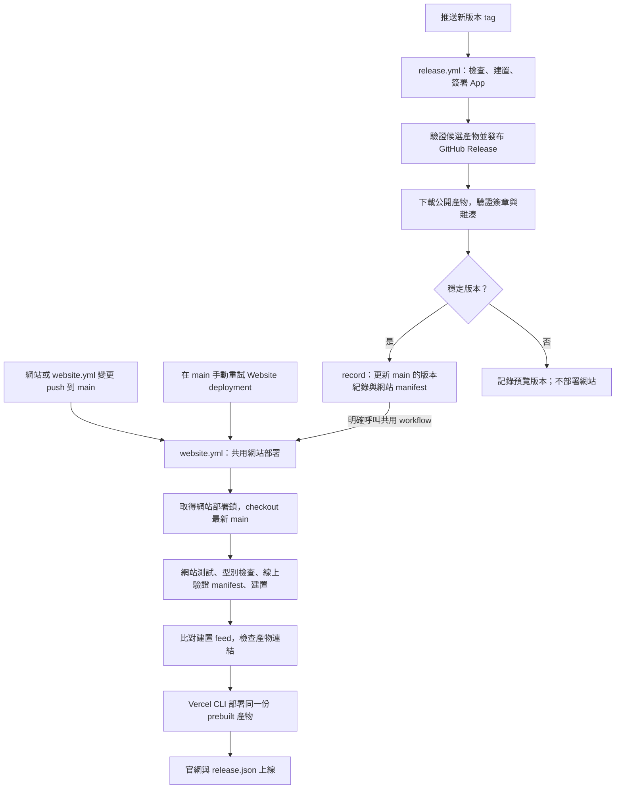
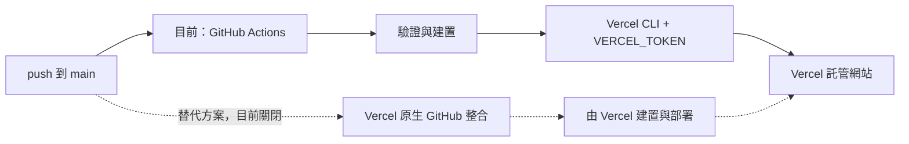
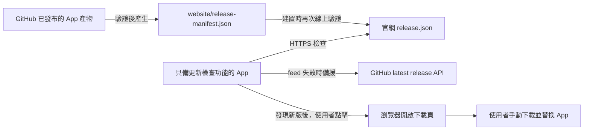

# 網站、App 與更新 feed 的交付設計

[English](../../system-design/delivery.md) | [繁體中文](delivery.md)

更新：2026-09-20。本文描述已實作的 CI/CD 設計；流程圖不代表每條線上路徑都已驗收。操作細節見[發布自動化](releases.md)，實際測試與限制見[驗證紀錄](../verification/README.md)。

## 兩種入口，共用網站部署

網站變更 push 到 main 就自動部署，不需要版本號。App 只有推送版本 tag 才發布；網站部署不會把 main 上尚未發版的 App 修改交給使用者。目前沒有排程發布。

網站入口只監聽 `website/**` 與 `.github/workflows/website.yml` 的 main push；一般文件或 App 原始碼變更不會單獨觸發網站部署。release 的 record job 使用 `GITHUB_TOKEN` 推送，這不會觸發另一個 push workflow，因此 release 必須明確呼叫共用網站 workflow。

所有網站入口共用部署鎖，不取消正在執行的部署；取得鎖後才讀取 main，避免較舊的排隊觸發部署舊 checkout。圖中的部署需要先通過 secrets 設定檢查；缺少設定會略過並提示。網站檢查失敗時不部署，前一版網站繼續服務；若 App 已發布，它不會因後續網站失敗而被撤回。

## Push 相同，部署負責者不同

`push` 是觸發事件，不決定由誰部署。目前由 Actions 負責，GitHub Repository Actions secrets 需要 `VERCEL_TOKEN`、`VERCEL_ORG_ID`、`VERCEL_PROJECT_ID`。token 提供 Vercel 授權；兩個 ID 指定團隊與專案。本機 CLI 的登入不會傳到 GitHub runner。

採用 Actions 的理由是共用驗證流程、明確接在 App 公開產物驗證之後，並部署同一份已檢查產物。代價是維護 workflow 與 token。Vercel 原生整合也可行，而且不需在 GitHub 保存部署 token，但切換時須搬移所有部署前驗證、驗證 bot 更新 manifest 能觸發交付，並移除重複部署入口。兩套部署機制不應同時接管正式網站。

## Feed 只描述已發布版本

例如：main 已有尚未發版的更新功能，但公開版本仍是 0.1.2，單獨部署網站後 feed 仍是 0.1.2。只有新穩定版 App 發布、公開產物驗證及 manifest 更新完成後，網站才會宣告新版本。已發布的 0.1.2 不會因網站更新而取得新的 App 功能。

## 維護與驗證邊界

- 網站部署失敗：修正設定或程式後 push；只有設定改動時，可在 main 手動重試 `Website deployment`，不用建立 App tag。
- App 發布：先完成本機驗收，再推送新的版本 tag；不可覆寫已發布產物。
- 部署 token：授權正確團隊並管理到期更新。403 表示需要查權限與設定，不能靠重跑假設已修復。
- 本機網站測試通過不等於線上部署成功；仍需確認正式 feed 的內容、快取與 App 的實際讀取。CI 不證明畫面或系統聲音錄製成功。

實作來源：[網站 workflow](../../../.github/workflows/website.yml)、[App release workflow](../../../.github/workflows/release.yml)、[Vercel 設定](../../../website/vercel.ts)、[feed 端點](../../../website/src/pages/release.json.ts)。
