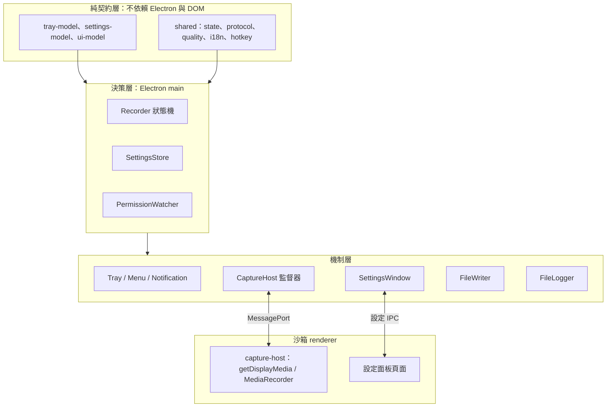

# 設計總覽

[English](../../system-design/design-overview.md) | [繁體中文](design-overview.md)

這份文件寫的是其餘設計文件預設你已經有的整體概念。[產品總覽](overview.md)說明這個 app 為使用者做什麼、拒絕做什麼；[系統架構](architecture.md)是程序、模組、IPC 與資料保存的結構參考；[設計決策](decisions.md)逐列記錄每個已接受的取捨。三者都沒有解釋「為什麼它們描述的是同一個形狀」，那是這份文件的工作。已有歸屬的細節，這裡只指出位置，不重寫一次。

## 一切設計的起點限制

RecordStuff 只有一顆選單列按鈕，沒有主視窗。使用者無法打開 app 檢查它：沒有工作階段清單、沒有進度面板，也沒有任何地方能讓錯誤的內部狀態被看見並修正。真正傳達到使用者的只有選單列圖示與標題、通知、輸出資料夾裡的檔案，以及需要被引導才會打開的 log。

由此推出兩條貫穿所有模組的結論。

**看得見的狀態必須為真，因為那是使用者唯一擁有的狀態。** 顯示 `REC` 卻什麼都沒寫入，比乾脆拒絕開始更糟，因此任何介面都不得在支撐它的事實出現之前回報成功。這是 [overview.md](overview.md#品質原則) 的第一條優先順序；程式碼中許多看似多餘的工作——量測實際影格而不信任 `getSettings`、驗證音訊軌而不假設請求成功、先完成改名再發出 `saved`——都是在支付這條優先順序的代價。

**每個介面都是同一份狀態的投影，而不是它的第二份副本。** 選單、設定面板、通知與 log 讀的是同一份權威狀態與 context。這正是 [`tray-model.ts`](../../../src/main/tray-model.ts) 是一個回傳扁平指令清單的純函式、[`settings-model.ts`](../../../src/main/settings-model.ts) 只宣告每個偏好設定一次、而 [`ui-model.ts`](../../../src/main/ui-model.ts) 持有兩個介面共用的 action union 與偏好鎖定規則的原因——而不是讓每個介面各自保有一份。

## 設計骨幹

### main 做決定，其餘都只是機制

[`main/recorder.ts`](../../../src/main/recorder.ts) 擁有權威的 `RecordingState`、session ID、順序與各項期限，而且不碰任何 Electron 或 DOM API。renderer 負責取得與編碼媒體、writer 負責搬移位元組、tray 負責繪製，沒有任何一方可以自行判定錄影成功。隱藏的 capture renderer 存在的唯一理由是 DOM 媒體 API 必須跑在 renderer，而不是因為擷取是對等的權威；它回報的 `started`、`chunk`、`stopped` 是關於它自己的事實，由 main 來解讀。

這也是兩個進入點能安全共存的原因：選單左鍵與全域快捷鍵都呼叫 `Recorder.toggle()`，因此只有一個決策點——idle 時開始、recording 時停止、`needsPermission` 時重發權限提示、starting 與 stopping 期間忽略。要加第三個進入點，做法是呼叫同一個函式，不是多開一條分支。

### 有觀察到的事實，才能做出宣告

每一句對使用者的宣告，都綁定在 app 真的觀察到的東西上。`saved` 只在暫存檔完成 drain、sync、close 與改名之後才發出。錄影品質以量測到的影格尺寸回報，只有在讀不到影格時才退回 track settings，因為 `getSettings` 曾在多螢幕環境回報錯誤的高度。音訊透過回傳的軌道驗證，那證明的是軌道存在且為 live，不是證明此刻真的有聲音在播放。`CaptureReport` 對不知道的欄位選擇省略，而不是填一個值上去。

反向的規則同樣重要：請求不等於保證。位元率係數、256 kbps 的 AAC 目標、關閉語音處理的音訊約束，以及 [recording.md](recording.md#期限與故障隔離) 裡的每一個期限，都是 app 提出的請求；只要文件裡出現數字，就會寫明這一點。

### 失敗是事件，資料夾才是紀錄

Recorder 沒有持久化的失敗擷取狀態。失敗會卸離 session、清除期限並停止 host，先讓擷取狀態回到 idle，再由失敗事件訂閱者保存資訊、呈現清理中，接著放棄 writer 並回報檔案結果。主程序將各筆失敗與確認狀態持久保存，跨重啟保留，透過選單列標記／筆數及設定中的「失敗紀錄」顯示。部分內容可能留在 `<stamp>.recording.mp4`；結果區分已確認的非空內容、沒有內容與無法確認，並提醒部分檔案可能無法播放。各筆未確認失敗獨立保留，已確認歷史保留最近 20 筆；移除紀錄不修復或刪除媒體。輸出資料夾與 log 仍提供詳細診斷；[`log.ts`](../../../src/main/log.ts) 採同步寫入以保留退出前的診斷事件，每個選單狀態都提供「顯示 log」。確認與復原行為見[錄影失敗結果](desktop.md#錄影失敗結果)。

## 分層

重點在方向：決策層讀取純函式並驅動機制，下層不做任何決定。兩個 renderer 都啟用沙箱與 context isolation、關閉 Node，因此 capture 頁面只持有串流、設定頁面只持有被交付的畫面——都不持有 app 依賴的狀態。可測試性由同一個方向推出：狀態機與所有 model 不需要 Electron 就能單元測試，這也是 `*.test.ts` 緊鄰它們擺放的原因。

## 一次錄影，從頭到尾

一次錄影的各階段分屬不同文件。以下是它們發生的順序，列的是跨層的轉折點而不是操作步驟：步驟、約束與各項期限由 [recording.md](recording.md#開始流程) 負責。

1. **意圖跨到決策。** 選單左鍵（[`tray.ts`](../../../src/main/tray.ts)）或全域快捷鍵（[`hotkey.ts`](../../../src/main/hotkey.ts)）呼叫 `Recorder.toggle()`；app 裡沒有第二個地方會開始錄影。
2. **決策跨到耐久落點。** writer 在請求擷取**之前**就開好 `.recording.mp4` 暫存檔，所以資料夾的問題會被回報為資料夾問題，而之後擷取到的東西也已經有地方可落。
3. **決策跨到機制。** host 透過 MessagePort 收到帶著品質快照的 `start { sessionId, quality }`，而顯示器由 main 以自己的 `chooseDisplayMedia` handler 選定——來源選擇不會移進沙箱。
4. **機制取得媒體。** renderer 先確認支援、拒絕缺少或已結束的音訊軌、量測實際影格，才回報 `started`；那是關於它自己的回報，不是「錄影成功」的判定。
5. **機制反覆跨回決策。** 每個 chunk 都要通過 session ID 與連續序號的把關，位元組才會進入唯一的 writer 佇列。
6. **提交。** 停止後完成 drain、sync、close 與改名；`saved` 只在改名之後才成為事實。
7. **決策跨到各投影。** 帶著 `lastSavedPath` 回到 idle，才使選單提供顯示檔案、通知自行排定——各介面是對狀態起反應，而不是被另外通知。

任何一步失敗都走同一條路徑：卸離 session、清除期限、停止 host、回到 idle、保留已寫入的位元組（[recording.md](recording.md#寫檔與失敗)）。權限變化只在 idle 或 `needsPermission` 時套用，所以輪詢不會打斷進行中的錄影。

## 跨切面不變式

以下每一條都橫跨多個模組，而且都已經有落實的位置與詳述的文件。

| 不變式 | 落實位置 | 詳述 |
| --- | --- | --- |
| 只有一份權威錄影狀態；失敗是事件而非狀態 | `main/recorder.ts` | [recording.md](recording.md#狀態與操作) |
| 每個使用者意圖只有一個決策點（`Recorder.toggle()`） | `main/tray.ts`、`main/hotkey.ts` | [desktop.md](desktop.md#錄影快捷鍵) |
| 每次錄影只有一個媒體 writer；先暫存檔、後改名 | `main/file-writer.ts` | [recording.md](recording.md#寫檔與失敗) |
| session ID 與連續 `seq` 把關每一則 host 訊息 | `main/recorder.ts` | [recording.md](recording.md#分片與停止順序) |
| 品質在每次工作階段快照，錄影中不重讀 | `main/recorder.ts`、`shared/quality.ts` | [recording.md](recording.md#品質與編碼) |
| 每個偏好設定只宣告一次，且具備穩定 id | `main/settings-model.ts` | [desktop.md](desktop.md#設定視窗) |
| starting、recording、stopping 鎖定語言以外的所有偏好設定 | `main/ui-model.ts`，並在 action handler 再檢查一次 | [desktop.md](desktop.md#設定視窗) |
| renderer 只送 id、不送 action；id 對照當場重建的 model 解析 | `main/settings-window.ts` | [architecture.md](architecture.md#信任邊界與-ipc) |
| 設定儲存序列化，且都由最後一次提交的值推導 | `main/settings.ts` | [desktop.md](desktop.md#設定與儲存位置) |
| 純模組不依賴任何 Electron 或 DOM API | `shared/*`、`*-model.ts` | [architecture.md](architecture.md#程序與責任) |
| 請求不等於保證，且文件寫明哪個是哪個 | 品質、音訊約束、各項期限 | [recording.md](recording.md#品質與編碼) |

## 接下來讀什麼

這組設計文件分成骨幹、專題與交付三線。照這個順序讀，比從索引由上往下讀快。

| 目的 | 文件 |
| --- | --- |
| 骨幹——要動這個 app 就讀這幾份 | [產品總覽](overview.md) → 本文件 → [系統架構](architecture.md) → [錄製管線](recording.md) → [桌面功能](desktop.md) |
| 專題——改動牽涉媒體時才讀 | [Electron、Chromium 與 WebRTC](webrtc.md)、[音質測試設計](audio-quality.md) |
| 交付——改動要出貨時才讀 | [交付](delivery.md)、[發布自動化](releases.md)、[簽署](signing.md)、[建置與工具](tooling.md)  |
| 參考——用查的，不用通讀 | [函式設計索引](functions.md)、[設計決策](decisions.md)、[本機驗證紀錄](../verification/README.md) |

範圍邊界——哪些沒有實作、哪些尚未驗證、哪些不在交付目標內——屬於 [overview.md](overview.md#平台與交付範圍)，未完成的工作屬於 [plans](../../../plans/README.zh-TW.md)。兩者都不在這裡重述。
