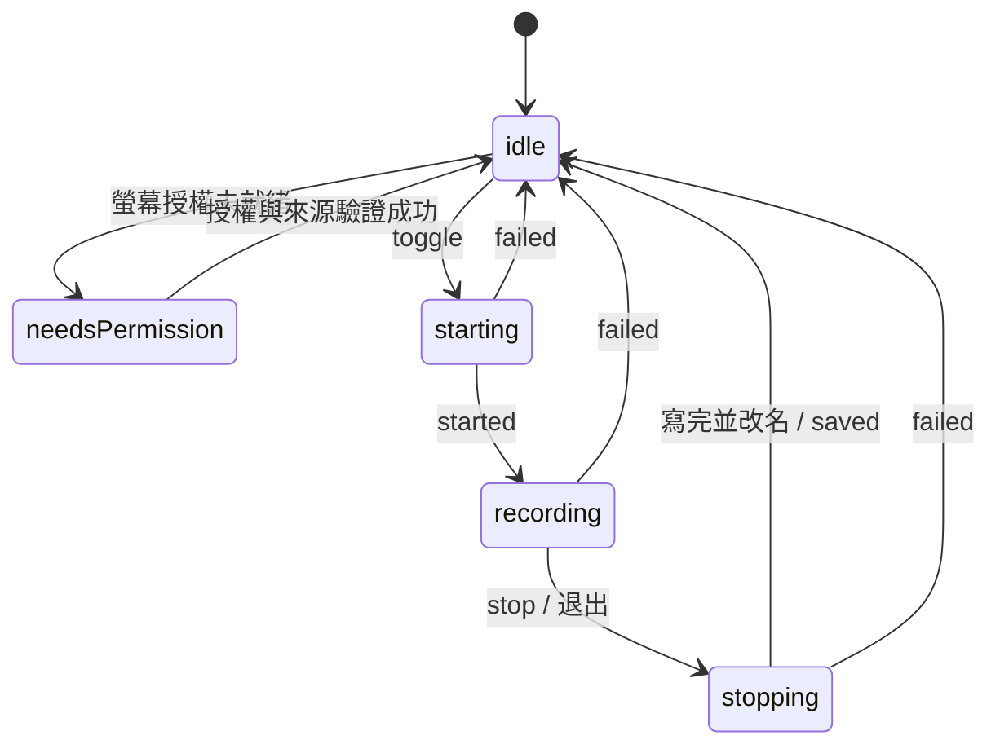
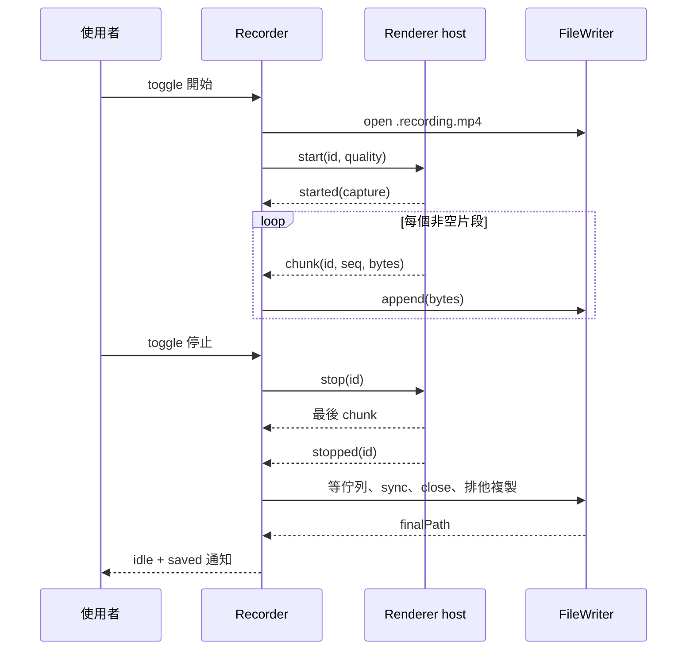

# 錄製管線與檔案設計

[English](../../system-design/recording.md) | [繁體中文](recording.md)

實作來源：[Recorder](../../../src/main/recorder.ts)、[renderer CaptureHost](../../../src/renderer/capture-host.ts)、[FileWriter](../../../src/main/file-writer.ts)、[健康門檻](../../../src/main/recording-health.ts)、[session sentinel](../../../src/main/session-sentinel.ts)、[品質函式](../../../src/shared/quality.ts)。

## 狀態與操作

`needsPermission` 帶 `needsRelaunch`，權限遺失期間存過檔時也帶 `lastSavedPath`；`idle` 可帶 `lastSavedPath` 或 `outputDirUnavailable`。最新權限狀態不是 granted 時，session 結束（saved 或 failed）會進入 needsPermission 而不是 idle（見[螢幕權限](desktop.md#螢幕權限)）；`recording` 帶 ISO `startedAt`。錯誤是 `failed` 事件，沒有持久的 `failed` 狀態。缺權限時點圖示只發 `permissionRequested`；starting／stopping 期間點擊無作用。

## 開始流程

1. `Recorder.start()` 確認 idle、沒有 session，執行 OS preflight；建立 session id、品質快照與 starting 狀態。
2. `ensureWritableDir()` 建立資料夾、實際写入並刪除 probe。不可用就報錯，不換到其他資料夾。
3. 先寫入該 session 的中斷 sentinel 並記下暫存檔路徑，再以本地時間 `YYYY-MM-DD HH-mm-ss` 開啟 `.recording.mp4`。`wx` 防止同名暫存檔覆蓋；遇 EEXIST 時改寫 sentinel 並改試 `-2` 至 `-10`。
4. 等待 host ready 並送 start。Main 依保存的螢幕偏好選來源；預設仍匹配主螢幕 id，找不到時使用第一個來源。指定螢幕只允許唯一的精確 id 配對，並搭配 `audio: "loopback"`。
5. Renderer 檢查 MP4 MIME、要求畫面與音訊；沒有音軌或音軌已 ended 就釋放 stream 並回錯誤。
6. 量測影格、套用品質，再檢查所有軌仍存活；建立 MediaRecorder、掛事件、開始並回 started。
7. Main 進 recording；第一片非空 bytes 必須在首片期限內到達，才清除該 timer；空 chunk 不算數。

## 期限與故障隔離

| 保護 | 預設值 | 失敗處理 |
| --- | --- | --- |
| 輸出資料夾／開檔階段 | 8 秒 | output_open_failed；late writer 回來後 abandon |
| host ready | 8 秒 | start 失敗，下次可重建 |
| 來源／系統授權請求 | 120 秒 | capture_start_failed；停止該 session |
| started 後首個非空 chunk | 8 秒 | capture_start_failed，保留已寫入資料 |
| 媒體開始後的下一個非空 chunk | 10 秒記錄一次警告，30 秒判定失敗；每個非空 chunk 重新計時，收到 stopped 或失敗時解除 | capture_failed，detail 註明停滯；保留部分檔 |
| 輸出資料夾可用空間 | 從 started 到停止前每 5 秒查詢；低於 1 GiB 記錄一次 | 低於 200 MiB 時只要求一次正常停止；以「磁碟即將滿」原因存檔，不算失敗 |
| Writer 積壓（已接受、未寫入的 bytes） | 64 MiB | output_write_failed，detail 註明積壓；保留已寫入的前段 |
| 判定泛用啟動失敗前排空 writer | 2 秒 | 已保留的磁碟錯誤沿用原代碼；否則 capture_start_failed |
| stop 回應 | 10 秒 | stop_timeout |
| Renderer 終止交接 | 終止開始後 5 秒 | 缺少 stop／最後 Blob 交接時回報失敗，忽略後續交接 |
| 退出等待 | 每次嘗試 13 秒（停止期限另加 3 秒） | 尚有工作時延後退出並顯示在地化提示，不截斷存檔 |
| 心跳 | session 進行中每 5 秒檢查／送 ping | 檢查時已有 2 次未回 pong 就 teardown、回 unresponsive |

這些是專案的等待上限，不是 OS 標準或精準的全流程耗時保證。磁碟 I/O 不能因此被真正取消。健康檢查各列（停滯、可用空間、積壓、啟動排空）是初始目標，集中在 [recording-health.ts](../../../src/main/recording-health.ts)；只有書面證據支持時才調整。心跳只證明 renderer 仍會回應；停滯保護才證明媒體仍在送達。可用空間查詢失敗只記錄一次，永不因此停止錄影。`powerMonitor` 的 suspend 與 resume 會連同進行中的 session id 寫入 log，讓之後的失敗能對照睡眠判讀；睡眠本身不會停止錄影。

## 終止責任與正常退出

CaptureHost 在等待 Blob 轉換之前固定第一個終止原因。後續使用者停止不能蓋掉軌道中斷或 encoder error；清理軌道事件也不能把較早的正常停止變成失敗。Encoder error 會等待最後 `dataavailable` 與 `stop`，再排空交接鏈後送出唯一終止訊息。5 秒後仍未完成就回報失敗並停止後續交接；無法恢復硬當機或卡住轉換所遺失的 bytes。

Recorder 接受 `stopped` 後由 finalizer 獨占該次收尾。遲到的 host crash／error、重複 stop 或螢幕移除不能 abandon 正在發布的檔案；磁碟錯誤仍進入失敗清理。所有開檔、存檔、清理工作在同步 subscriber 執行前登記。開檔逾時立即讓 UI 回到 idle，但結果保持 pending，直到遲到的開檔與關閉完成。多次失敗各自保留清理工作的責任。

所有 `before-quit`（包含 idle）共用 `installQuitCoordinator`。重複退出加入同一嘗試，退出判定期間拒絕開始新錄影，並自動停止擷取。已在啟動中的 session 保留停止意圖，即使退出延期，擷取一開始也會立即停止並收尾。必須沒有 session 與未完成工作，包含遲到開檔、先前失敗清理與失敗結果查核／發布，才允許退出。退出期限只延後退出；擷取失敗仍由既有啟動請求與停止回應 timer 判定。未完成的磁碟／結果發布工作仍被持有，App 保持開啟，使用者可重試退出。不為滿足退出期限摧毀 host 或宣稱未確認的保留路徑。強制退出、程序終止與斷電不受此保證保護；沒有當機復原或放棄媒體的破壞性退出選項。下次啟動會透過中斷 sentinel 回報這類 session（見[寫檔與失敗](#寫檔與失敗)）。只有在此媒體階段完成後，退出才嘗試保存失敗歷史；其明確的「只放棄提醒」退出永遠不會放棄媒體工作（見[桌面設計](desktop.md#延後退出)）。

## 品質與編碼

| 設定 | 實作規則 |
| --- | --- |
| 影像等級 | economy 0.07、standard 0.13、high 0.24 bits / pixel / frame |
| 位元率 | width × height × requested fps × 係數，四捨五入至 100 kbps，限制 1.5–60 Mbps |
| 解析度 | source 不縮放；1080p／1440p／4K 上限按來源方向交換長短邊，不放大，縮小時取偶數 |
| 幀率 | 30／60；目前只有 darwin 開放 60；其他平台有效值為 30，不覆寫使用者檔案。擷取要求 30.3／62.5 才能錄到設定值（[幀率要求](#幀率要求)） |
| 音訊 | 固定要求 256,000 bps；請求 ideal 2 聲道、restrictOwnAudio true；echoCancellation／noiseSuppression／autoGainControl false |
| 格式 | `video/mp4;codecs=avc1,mp4a.40.2`；不支援時失敗，不偷偷切 WebM |
| 分片 | timeslice 與 `videoKeyFrameIntervalDuration` 均設 1000 ms；實際出片不保證一秒 |

`measureFrameSize()` 用 muted video 的 intrinsic size，預設等最多 3 秒。因多螢幕曾出現 `getSettings()` 錯報高度，以實際影格優先；量不到才用 track 設定。套限制時重新附上幀率，並等最多 1.5 秒再量。約束被拒絕就保留來源尺寸並警告；無法重測時暫以目標尺寸回報並警告；完全沒有尺寸則以 1920×1080 計算編碼目標，不假稱量到尺寸。

系統音訊明確要求關閉語音處理：本機基準曾量到高頻失衡與聲道混合，同時關閉 EC／NS／AGC 後，v2 探測恢復正常；排除自身聲音仍啟用。這些是要求，不是所有平台的保證。若音軌明確回報任一效果仍為 true，會加入 warning；未回報維持未知。詳見[音質設計的修正對照](audio-quality.md#15-系統擷取修正2026-09-14)。

`CaptureReport` 包含可知的 width／height／frameRate／sampleRate／channelCount、目標位元率與 warnings。未知值不填；這是啟動時的觀察與要求，成品仍需 ffprobe 量測。只有要求 60 且 track 明確回報 ≤30 時發降級通知，靜態畫面少產生影格不當成這種降級。

### 幀率要求

擷取要求的幀率略高於設定：30 fps 要求 30.3，60 fps 要求 62.5（`src/shared/quality.ts` 的 `CAPTURE_FRAME_RATE`），以 `{ ideal, max }` 放進 `getDisplayMedia`，套解析度上限的 `applyConstraints` 也再附上一次。Chromium 152（Electron 44.3）以 ScreenCaptureKit 擷取螢幕，這個要求會變成它的[最小影格間隔](https://chromium.googlesource.com/chromium/src/+/refs/tags/152.0.7977.78/content/browser/media/capture/screen_capture_kit_device_mac.mm#239)，是下限而非週期。Plan 041 的診斷（`pnpm diagnose:cadence`，見[工具](tooling.md#影格節奏診斷)）確認偏差出在這一層：影格送到 video track 時就已經晚了，每個間隔都是下限再加上交付延遲；track 丟棄的影格最多 0.45%，檔案時間戳與送達時一致。因此照設定值要求時，實際只錄到約 29.4 與 57.5 fps，且沒有掉格；CPU 負載也沒有讓偏差變大。只給 `ideal` 沒有效果，因為 Chromium 的裝置幀率與 track 的限速器都由它決定。把週期無條件捨去到整數毫秒（33 與 16 ms）後，錄到 29.9 與 59.8 fps，間隔中位數在週期的 1% 內，沒有重複影格，也沒有增加掉格；32.7 ms 下限（30.6）同樣達到幀率，但 30 fps 的中位數剛好落在 1% 邊界。

- 只有要求值改變。位元率目標、log 裡的 requested fps、驗證（標稱週期與容許差）和降級規則都仍以設定值為準。track 回報的是要求值（`getSettings().frameRate` 為 30.3 或 62.5），log 會把它顯示為 track fps：60 fps 錄影的 track 回報 62.5 或 60 不算降級，回報 30 以下仍算。
- track 自己的限速器採用同一個值，只丟棄遠快於它的影格，所以會保留每個送達的影格。60 fps 錄影不會超過螢幕更新率：在 60 Hz 螢幕上量到 59.8 fps，沒有重複影格。更高更新率的螢幕上，16 ms 下限可能略高於 60；這種情況、其他 Mac，以及解析度上限的 `applyConstraints` 路徑（只有來源大於上限時才會執行）都沒有量測。
- 先前照設定值要求的結果保留在[驗證歷史](../verification/history-2026-09.md#plan-041-結案--2026-09-26)。

## 分片與停止順序

Renderer 把 Blob 轉 ArrayBuffer 的 Promise 串成 chain，避免非同步轉換使順序顛倒；忽略空 Blob。Main 檢查 session id 與連續 seq，錯序就失敗。過期 session 的 started／chunk 會觸發 stop，避免超時後仍暗中擷取。

停止 pending start 會從 pending 移至 cancelled；OS 請求回來後釋放 stream。正常 stop 令 MediaRecorder flush 最後 dataavailable；`finish()` 一次性等待傳送 chain 完成後才送 stopped。來源自行 ended 或 recorder error 回 failed，不當成正常 stop。

## 寫檔與失敗

FileWriter 的 append、週期 sync 與 finish 都排在同一佇列。每次 append 只補寫剩餘緩衝區直到完整，並立即累計每次確認寫入的位元組；各段之間不會插入後續 chunk 或 sync。空 chunk 不呼叫 write。零、負數、非整數、非有限值或超出剩餘長度的進度以 output_write_failed 失敗；拋出的錯誤不重試。每 5 秒嘗試 fsync；首次 I/O 錯誤被記住，之後佇列作業回同一錯誤。ENOSPC 映射為 disk_full，其他寫入錯誤為 output_write_failed。

成功 finish 等待佇列、sync、close，再以 `COPYFILE_EXCL` 把暫存檔複製成 `.mp4`；正式檔撞名時依序嘗試 `-2`、`-3` 等尾碼。`COPYFILE_FICLONE` 在支援時使用寫入時複製，其他檔案系統可能需要完整複製的額外時間與空間。完成檔 sync 後才盡力刪除暫存檔，之後 Recorder 以實際存檔路徑發 saved。清理失敗會留下暫存副本，但不影響已成功儲存的影片。失敗時先清除 session、stop host、立刻回 idle，再 abandon writer；已有計數 bytes 就保留 `.recording.mp4`，零 bytes 盡力刪除。部分檔案沒有自動修復或重新封裝；曾實測可播不代表所有中斷都可復原。

成功必須有非空媒體。唯一的發布步驟 FileWriter.finish 就是關卡：排空佇列後檢查實際確認寫入的位元組數，不採用要求寫入的 chunk 長度。已保留的 append 或背景 sync 錯誤優先以原代碼回報（例如 disk_full），即使一個位元組都沒寫入。否則零位元組（不論是在任何 chunk 之前停止，或只收到空 chunk）會讓 finish 釋放 handle 與 sync timer、刪除空暫存檔，並以 `capture_start_failed` 與 detail `capture ended without media; no bytes were written` 拒絕，與首片期限使用同一代碼。Recorder 把這個拒絕導入單一失敗流程，因此不發 saved、不設定 lastSavedPath，也不產生 `.mp4`；結果為 empty，可立即重試。Abandon 具冪等性，失敗流程稍後的清理不會刪掉在同一秒內重用該檔名的重試錄影。Recorder 不自行預先檢查位元組數：佇列排空前看不到排隊中或執行中的 sync 失敗，會把磁碟錯誤誤報為沒有媒體。沒有最短錄製秒數；非常短但非空的錄影照常儲存。

非空只是必要的最低門檻，不代表檔案可播放。Cap 的 AVFoundation writer [在沒有最後影格時拒絕 finish](https://github.com/CapSoftware/Cap/blob/ce785e705e79652adba4b8bf752669c4093499e0/crates/enc-avfoundation/src/mp4.rs#L961-L990)（該 revision 的靜態檢視），但 RecordStuff 收到的是編碼後 chunk 而非影格時間戳，不解析 MP4，也不確認含可解碼影格。可播放性只由驗收時的媒體檢查（如 ffprobe 與完整解碼）確立，執行期不檢查。

排他建立同時保護暫存檔與正式檔名，包括錄影途中才出現的同名正式檔；短寫取得進展後失敗時，保留確認寫入量與非空部分檔；後續 append 與 finish 拒絕且不產生完成檔，abandon 關閉 handle 並停止 sync。背景 sync 的 rejection 會被接住，首次失敗仍被保留。完整寫入與 fsync 耐久性是不同保證，不承諾所有 crash、斷電或檔案系統故障都可復原。更完整的耐久性需求應先建測試，再改實作。

FileWriter 限制已接受但尚未確認寫入的位元組數（`backlogBytes`，停滯與低空間警告也會記錄，並保留給 Plan 037 的准入量測）。會超過 64 MiB 的 append 立即被拒絕且不排入佇列，之後的 append 也一律拒絕，因此檔案不會出現缺口；拒絕前已接受的 bytes 仍會寫入，finish 會拒絕，Recorder 以 output_write_failed 與積壓 detail 結束該 session；若先前已保留磁碟錯誤，則沿用該錯誤。不暫停、不丟棄、不重試：MediaRecorder 無法節流，此上限讓緩慢或離線的儲存裝置以保留部分檔結束錄影，而不是無限制占用記憶體。因此持續低於位元率的磁碟吞吐量仍會結束錄影。沒有磁碟空間預留、切換資料夾、降低品質或無限長錄製承諾。

可用空間保護讀取輸出資料夾的 `fs.statfs`。低於停止門檻時要求正常停止，讓檔案在仍有空間時排空、sync 並發布；saved 事件帶有 `stoppedEarly: "lowDisk"`，log 會註明，存檔通知顯示「已儲存 {file}。磁碟空間即將用盡，已提前停止錄製」。這類錄影屬於成功，不進入失敗紀錄。若發布仍失敗，沿用一般失敗流程與部分檔保留。

Writer 在擷取請求前開啟，而擷取請求可能為了權限提示等待最多 120 秒，期間每 5 秒 sync。若該次嘗試隨後以泛用的 `capture_start_failed` 結束（首片期限、擷取請求逾時、host start 被拒，或 host 回報 capture_start_failed），失敗流程會先排空 writer 最多 2 秒；若 writer 已保留寫入或 sync 錯誤，就以該代碼（disk_full 或 output_write_failed）回報，沿用既有的資料夾／磁碟指引，detail 同時列出兩個原因。代碼在發布 pending 結果前決定，因此通知與紀錄一致。權限或缺少音訊等具體 host 原因維持原代碼；乾淨的 writer 維持 `capture_start_failed`。排空未能在上限內完成時也維持 `capture_start_failed`。

中斷證據是每個 session 一個 sentinel 檔，位於 `userData/recording-sessions/`，檔名為 session id，內容為 session id、開始時間與暫存檔路徑。它在建立暫存檔之前以原子寫入完成，因此當機不會留下沒有任何 sentinel 記錄的暫存檔；寫入失敗只記錄一次，不阻擋錄影。每個終止結果在發布結果後移除該 session 自己的 sentinel，正常退出會等待移除完成。啟動時、在紀錄還原前，先前程序留下的每個 sentinel 都會成為一筆 `app_terminated` 失敗紀錄（「RecordStuff 在錄製期間未正常結束」），其路徑是查找線索，以還原部分檔的相同方式重新檢查：只有該處存在非空檔案時才是 partial，否則為 unknown。紀錄時間為該 session 的開始時間。只有該紀錄已寫入磁碟（包含之後歷史自動重試成功）後，才移除 sentinel，讓失敗紀錄先接手證據，已確認並移除的紀錄也不會再出現；紀錄 ID 由 session 推導，因此紀錄始終未能保存時，下次啟動會重試而不重複新增。單一執行個體鎖與本程序自己的 session 清單確保被回報的 sentinel 都屬於已結束的程序。中斷的 sentinel 寫入或無效內容沒有指向任何媒體，會直接捨棄；啟動時暫時無法讀取的 sentinel 則保留到之後的啟動。不掃描輸出資料夾中的其他檔案，也不復原、重新封裝或修復任何內容。

## 錯誤分類

| 類型 | code | 對使用者的結果 |
| --- | --- | --- |
| 權限／環境 | permission_denied、permission_needs_relaunch、unsupported_os_version | 引導系統設定／重啟或說明版本 |
| 來源／編碼 | no_display、display_unavailable、no_audio_track、mp4_unsupported | 不開始錄製，說明缺少能力 |
| 擷取 | capture_start_failed、capture_failed、capture_host_crashed、capture_host_unresponsive | 回 idle；有部分檔則提供位置 |
| 檔案 | output_open_failed、output_write_failed、disk_full | 說明位置／磁碟問題，盡力保留 bytes |
| 停止 | stop_timeout | 停止等待擷取回覆並盡力保留部分檔 |
| 先前程序 | app_terminated | 只在啟動時依中斷 sentinel 回報；說明 App 未正常結束、檔案可能不完整；擷取 host 永遠不會送出 |

Main 的來源 handler 可記錄具體拒絕原因，取代 renderer 的泛用 AbortError；只覆寫可由來源拒絕解釋的錯誤。`permission_needs_relaunch` 是協定支援碼，常態授權引導主要由 PermissionWatcher 狀態處理。

## 螢幕選擇

`display-source.ts` 分開處理 Screen API 的目前目標與錄製來源配對。指定螢幕保存 `{ kind: "display", id, label }`，名稱只供顯示。目標缺失或 id 重複立即拒絕；來源缺失／重複或配置變更每隔 150 ms 重試，最多列舉三次。列舉例外保留 macOS 的 permission-denied／其他平台的 no-display 對應。掛住的列舉仍受 recorder 的開始逾時限制；作業結束或被新作業取代會取消 callback 與重試計時器，延遲結果不能授予錄製或覆寫診斷。`display-media.ts` 保存跨作業的狀態：偏好快照、用來解釋下一個 host 錯誤的拒絕原因、監看是否被移除的使用中螢幕，以及螢幕診斷。

`display_unavailable` 表示無法安全解析精確目標，另以 `target_missing`、`source_missing` 或 `topology_changed` 區分原因。不按名稱、尺寸或位置配對，也不自動改寫 id；id 被重用並不能證明同一實體硬體。移除錄製中的螢幕會走 recorder 的冪等 `capture_failed` 路徑，保留可救回的部分內容而不切換來源。螢幕資料是 DIP 邏輯尺寸與縮放比例；輸出像素仍依實際 track 和解析度上限決定。

主程序在作業結束時銷毀 capture host，下一次使用新 frame；media request 必須同時匹配目前 frame 與 session，避免舊請求在新作業期間才抵達。Video track 非預期結束會透過結構化 `displayFailure: "track_ended"` 回報，先保留診斷再回 idle；audio track 結束不會誤標為螢幕問題。正常停止後已進入檔案 finalize 階段的螢幕移除不產生失敗診斷。

失敗呈現獨立於終止事件：failureStatus 立即回報 pending，清理後回報 partial／empty／unknown；saved／failed 仍為終止契約。close 失敗會設定 preservationUncertain，不得顯示為已確認保留。見[錄影失敗結果](desktop.md#錄影失敗結果)。

失敗 ID 使用跨 Recorder 實例的 UUID。清理中事件在已知時帶入 writer 候選路徑；完成事件在沒有內容時移除候選資訊，無法確認時保留為查找線索，只有確認保留才提供部分檔案路徑。保存的各筆結果在重啟後將中斷清理呈現為無法確認，不會一直處理中或宣稱儲存成功。
