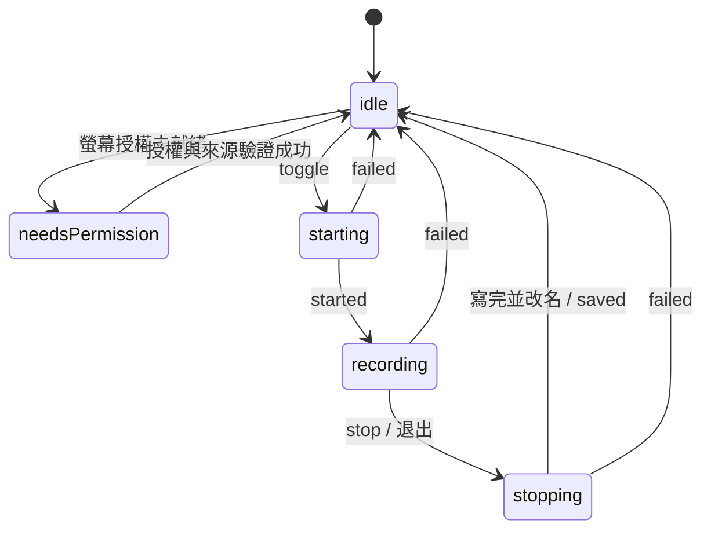
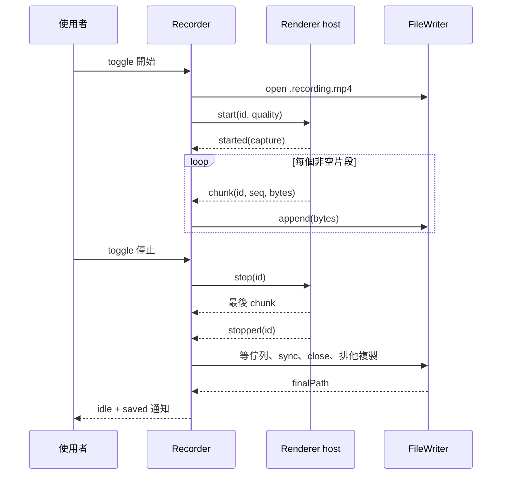

# 錄製管線與檔案設計

[English](../../system-design/recording.md) | [繁體中文](recording.md)

實作來源：[Recorder](../../../src/main/recorder.ts)、[renderer CaptureHost](../../../src/renderer/capture-host.ts)、[FileWriter](../../../src/main/file-writer.ts)、[品質函式](../../../src/shared/quality.ts)。

## 狀態與操作

`needsPermission` 帶 `needsRelaunch`；`idle` 可帶 `lastSavedPath` 或 `outputDirUnavailable`；`recording` 帶 ISO `startedAt`。錯誤是 `failed` 事件，沒有持久的 `failed` 狀態。缺權限時點圖示只發 `permissionRequested`；starting／stopping 期間點擊無作用。

## 開始流程

1. `Recorder.start()` 確認 idle、沒有 session，執行 OS preflight；建立 session id、品質快照與 starting 狀態。
2. `ensureWritableDir()` 建立資料夾、實際写入並刪除 probe。不可用就報錯，不換到其他資料夾。
3. 以本地時間 `YYYY-MM-DD HH-mm-ss` 開啟 `.recording.mp4`。`wx` 防止同名暫存檔覆蓋；遇 EEXIST 改試 `-2` 至 `-10`。
4. 等待 host ready 並送 start。Main 依保存的螢幕偏好選來源；預設仍匹配主螢幕 id，找不到時使用第一個來源。指定螢幕只允許唯一的精確 id 配對，並搭配 `audio: "loopback"`。
5. Renderer 檢查 MP4 MIME、要求畫面與音訊；沒有音軌或音軌已 ended 就釋放 stream 並回錯誤。
6. 量測影格、套用品質，再檢查所有軌仍存活；建立 MediaRecorder、掛事件、開始並回 started。
7. Main 進 recording；第一片 bytes 必須在首片期限內到達，才清除該 timer。

## 期限與故障隔離

| 保護 | 預設值 | 失敗處理 |
| --- | --- | --- |
| 輸出資料夾／開檔階段 | 8 秒 | output_open_failed；late writer 回來後 abandon |
| host ready | 8 秒 | start 失敗，下次可重建 |
| 來源／系統授權請求 | 120 秒 | capture_start_failed；停止該 session |
| started 後首 chunk | 8 秒 | capture_start_failed，保留已寫入資料 |
| stop 回應 | 10 秒 | stop_timeout |
| 退出等待 | 10 秒，失敗收尾另給最多 3 秒 | 未完成 capture 時盡力 close／保留；已 finalizing 不誤報失敗 |
| 心跳 | session 進行中每 5 秒檢查／送 ping | 檢查時已有 2 次未回 pong 就 teardown、回 unresponsive |

這些是專案的等待上限，不是 OS 標準或精準的全流程耗時保證。磁碟 I/O 不能因此被真正取消。

## 品質與編碼

| 設定 | 實作規則 |
| --- | --- |
| 影像等級 | economy 0.07、standard 0.13、high 0.24 bits / pixel / frame |
| 位元率 | width × height × requested fps × 係數，四捨五入至 100 kbps，限制 1.5–60 Mbps |
| 解析度 | source 不縮放；1080p／1440p／4K 上限按來源方向交換長短邊，不放大，縮小時取偶數 |
| 幀率 | 30／60；目前只有 darwin 開放 60；其他平台有效值為 30，不覆寫使用者檔案 |
| 音訊 | 固定要求 256,000 bps；請求 ideal 2 聲道、restrictOwnAudio true；echoCancellation／noiseSuppression／autoGainControl false |
| 格式 | `video/mp4;codecs=avc1,mp4a.40.2`；不支援時失敗，不偷偷切 WebM |
| 分片 | timeslice 與 `videoKeyFrameIntervalDuration` 均設 1000 ms；實際出片不保證一秒 |

`measureFrameSize()` 用 muted video 的 intrinsic size，預設等最多 3 秒。因多螢幕曾出現 `getSettings()` 錯報高度，以實際影格優先；量不到才用 track 設定。套限制時重新附上幀率，並等最多 1.5 秒再量。約束被拒絕就保留來源尺寸並警告；無法重測時暫以目標尺寸回報並警告；完全沒有尺寸則以 1920×1080 計算編碼目標，不假稱量到尺寸。

系統音訊明確要求關閉語音處理：本機基準曾量到高頻失衡與聲道混合，同時關閉 EC／NS／AGC 後，v2 探測恢復正常；排除自身聲音仍啟用。這些是要求，不是所有平台的保證。若音軌明確回報任一效果仍為 true，會加入 warning；未回報維持未知。詳見[音質設計的修正對照](audio-quality.md#15-系統擷取修正2026-09-14)。

`CaptureReport` 包含可知的 width／height／frameRate／sampleRate／channelCount、目標位元率與 warnings。未知值不填；這是啟動時的觀察與要求，成品仍需 ffprobe 量測。只有要求 60 且 track 明確回報 ≤30 時發降級通知，靜態畫面少產生影格不當成這種降級。

## 分片與停止順序

Renderer 把 Blob 轉 ArrayBuffer 的 Promise 串成 chain，避免非同步轉換使順序顛倒；忽略空 Blob。Main 檢查 session id 與連續 seq，錯序就失敗。過期 session 的 started／chunk 會觸發 stop，避免超時後仍暗中擷取。

停止 pending start 會從 pending 移至 cancelled；OS 請求回來後釋放 stream。正常 stop 令 MediaRecorder flush 最後 dataavailable；`finish()` 一次性等待傳送 chain 完成後才送 stopped。來源自行 ended 或 recorder error 回 failed，不當成正常 stop。

## 寫檔與失敗

FileWriter 的 append、週期 sync 與 finish 都排在同一佇列。每次 append 只補寫剩餘緩衝區直到完整，並立即累計每次確認寫入的位元組；各段之間不會插入後續 chunk 或 sync。空 chunk 不呼叫 write。零、負數、非整數、非有限值或超出剩餘長度的進度以 output_write_failed 失敗；拋出的錯誤不重試。每 5 秒嘗試 fsync；首次 I/O 錯誤被記住，之後佇列作業回同一錯誤。ENOSPC 映射為 disk_full，其他寫入錯誤為 output_write_failed。

成功 finish 等待佇列、sync、close，再以 `COPYFILE_EXCL` 把暫存檔複製成 `.mp4`；正式檔撞名時依序嘗試 `-2`、`-3` 等尾碼。`COPYFILE_FICLONE` 在支援時使用寫入時複製，其他檔案系統可能需要完整複製的額外時間與空間。完成檔 sync 後才盡力刪除暫存檔，之後 Recorder 以實際存檔路徑發 saved。清理失敗會留下暫存副本，但不影響已成功儲存的影片。失敗時先清除 session、stop host、立刻回 idle，再 abandon writer；已有計數 bytes 就保留 `.recording.mp4`，零 bytes 盡力刪除。部分檔案沒有自動修復或重新封裝；曾實測可播不代表所有中斷都可復原。

排他建立同時保護暫存檔與正式檔名，包括錄影途中才出現的同名正式檔；短寫取得進展後失敗時，保留確認寫入量與非空部分檔；後續 append 與 finish 拒絕且不產生完成檔，abandon 關閉 handle 並停止 sync。背景 sync 的 rejection 會被接住，首次失敗仍被保留。完整寫入與 fsync 耐久性是不同保證，不承諾所有 crash、斷電或檔案系統故障都可復原。沒有磁碟空間預留、無限長錄製承諾或有界背壓。更完整的耐久性需求應先建測試，再改實作。

## 錯誤分類

| 類型 | code | 對使用者的結果 |
| --- | --- | --- |
| 權限／環境 | permission_denied、permission_needs_relaunch、unsupported_os_version | 引導系統設定／重啟或說明版本 |
| 來源／編碼 | no_display、display_unavailable、no_audio_track、mp4_unsupported | 不開始錄製，說明缺少能力 |
| 擷取 | capture_start_failed、capture_failed、capture_host_crashed、capture_host_unresponsive | 回 idle；有部分檔則提供位置 |
| 檔案 | output_open_failed、output_write_failed、disk_full | 說明位置／磁碟問題，盡力保留 bytes |
| 停止 | stop_timeout | 停止等待擷取回覆並盡力保留部分檔 |

Main 的來源 handler 可記錄具體拒絕原因，取代 renderer 的泛用 AbortError；只覆寫可由來源拒絕解釋的錯誤。`permission_needs_relaunch` 是協定支援碼，常態授權引導主要由 PermissionWatcher 狀態處理。

## 螢幕選擇

`display-source.ts` 分開處理 Screen API 的目前目標與錄製來源配對。指定螢幕保存 `{ kind: "display", id, label }`，名稱只供顯示。目標缺失或 id 重複立即拒絕；來源缺失／重複或配置變更每隔 150 ms 重試，最多列舉三次。列舉例外保留 macOS 的 permission-denied／其他平台的 no-display 對應。掛住的列舉仍受 recorder 的開始逾時限制；作業結束或被新作業取代會取消 callback 與重試計時器，延遲結果不能授予錄製或覆寫診斷。

`display_unavailable` 表示無法安全解析精確目標，另以 `target_missing`、`source_missing` 或 `topology_changed` 區分原因。不按名稱、尺寸或位置配對，也不自動改寫 id；id 被重用並不能證明同一實體硬體。移除錄製中的螢幕會走 recorder 的冪等 `capture_failed` 路徑，保留可救回的部分內容而不切換來源。螢幕資料是 DIP 邏輯尺寸與縮放比例；輸出像素仍依實際 track 和解析度上限決定。

主程序在作業結束時銷毀 capture host，下一次使用新 frame；media request 必須同時匹配目前 frame 與 session，避免舊請求在新作業期間才抵達。Video track 非預期結束會透過結構化 `displayFailure: "track_ended"` 回報，先保留診斷再回 idle；audio track 結束不會誤標為螢幕問題。正常停止後已進入檔案 finalize 階段的螢幕移除不產生失敗診斷。

失敗呈現獨立於終止事件：failureStatus 立即回報 pending，清理後回報 partial／empty／unknown；saved／failed 仍為終止契約。close 失敗會設定 preservationUncertain，不得顯示為已確認保留。見[錄影失敗結果](desktop.md#錄影失敗結果)。

失敗 ID 使用跨 Recorder 實例的 UUID。清理中事件在已知時帶入 writer 候選路徑；完成事件在沒有內容時移除候選資訊，無法確認時保留為查找線索，只有確認保留才提供部分檔案路徑。保存的各筆結果在重啟後將中斷清理呈現為無法確認，不會一直處理中或宣稱儲存成功。
