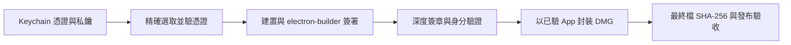

# macOS 簽署身分與自簽設計

[English](../../system-design/signing.md) | [繁體中文](signing.md)

更新：2026-09-15。本文說明目前自簽實作、開發者操作方式，以及 011 的 CI 身分配置。CI 實作與實際驗證進度見 [發布自動化](releases.md)。

## 設計目的與名詞

recordstuff 沿用固定自簽身分，讓本機與後續版本有一致的簽署來源，並驗證 App 簽署後的內容完整性。這條路不需要 Apple Developer ID 或付費會員；但不提供 Apple 認可的開發者身分，也不提供公證後的首次安裝體驗。

| 名詞 | 在本專案的角色 |
| --- | --- |
| 私鑰 | 簽署 App 的秘密材料，只由建置者保管 |
| 憑證 | 包含公開金鑰與用途等資訊，隨 App 簽章提供驗證 |
| 簽署身分 | 憑證與對應私鑰的組合；只有公開憑證無法簽署 |
| 自簽 | 憑證由自己的私鑰簽發，沒有 Apple 為開發者身分背書 |
| SHA-1 指紋 | 辨識特定公開憑證；不是 DMG 的完整性 checksum，也不是私鑰 |
| SHA-256 checksum | 比對最終下載檔 bytes 是否與發布紀錄一致 |
| Developer ID Application | Apple 核發、用於 Mac App Store 外發行的 App 簽署憑證 |
| 公證（notarization） | Apple 對提交軟體進行檢查的服務，與簽章不同 |

簽署不要求憑證必須由 Apple 簽發，但自簽無法證明發布者的真實組織身分。Apple 的封存指南不建議用自簽對外發行；本專案明確接受這項發行限制，並保留逐 App 的首次開啟指引。[Apple 簽署指南](https://developer.apple.com/library/archive/documentation/Security/Conceptual/CodeSigningGuide/Procedures/Procedures.html)

若未來要求 Apple 認可的對外發行體驗，需要另行設計 Developer ID Application 簽署與公證流程。只有換憑證不等於完成公證。[Developer ID](https://developer.apple.com/help/account/certificates/create-developer-id-certificates)、[公證要求](https://developer.apple.com/documentation/security/resolving-common-notarization-issues)

## 簽署的意義、差異與自動化

簽署時，工具使用私鑰對程式內容的密碼學摘要等簽章資料產生數位簽章；驗證端使用公開金鑰檢查。修改受簽章保護的內容會讓驗證失敗。簽章不會加密 App、隱藏程式碼，也不保證程式沒有 bug 或惡意行為。

| 能力 | 固定自簽 | Developer ID Application | Developer ID Application ＋ Apple 公證 |
| --- | --- | --- | --- |
| 驗證受簽章保護的內容完整性 | 可以 | 可以 | 可以 |
| 驗證由對應私鑰簽署 | 可以 | 可以 | 可以 |
| Apple 背書的開發者身分 | 沒有 | 有 | 有 |
| Apple 公證服務檢查此提交軟體 | 沒有 | 尚未 | 有 |
| 一般下載後的 Gatekeeper 體驗 | 可能需手動例外，受管理環境可能禁止 | 單有 Developer ID 仍不足以保證放行 | 標準對外發行路徑，仍受系統政策及安全檢查影響 |
| 可在 CI 自動簽署 | 可以 | 可以 | 可以，另含公證提交／結果檢查 |

這裡的「Apple 驗證」可能指 Developer ID 的身分背書，或 notarization 的軟體檢查，兩者是不同步驟。公證也不是 App Store 審查或絕對安全保證。參考 [Apple 公證說明](https://developer.apple.com/documentation/security/notarizing-macos-software-before-distribution)。

| 工作 | 能否自動化 | 本專案現況 |
| --- | --- | --- |
| 產生私鑰與自簽憑證 | 可以用憑證工具／腳本處理 | `pnpm signing:create` 已可產生加密身分檔；鑰匙圈匯入／信任另行處理 |
| 每次用既有身分簽 App | 可以 | `pnpm start:app`、`pnpm dist:mac` 已實作；首次私鑰存取可能有系統提示 |
| CI 匯入、解鎖與使用既有身分 | 可以 | 已實作於發布 workflow；實際結果見發布自動化紀錄 |
| Apple 公證提交與查詢 | 可以 | 不在目前實作範圍 |

自動建立自簽身分應是一次性的環境初始化或明確遷移，不應放在每次發布的步驟。CI 每次建立新的「暫存 keychain」沒有問題，只要裡面匯入的是同一份憑證與私鑰。Apple Developer ID 則需要 Apple 核發資格與流程，不能由本機自行產生一張自簽憑證取代。

## 固定身分與更新

[v0.1.0 發布紀錄](../../verification/releases/0.1.0.json) 使用：

```text
名稱：RecordStuff Dev
公開憑證 SHA-1：01B373511530BBF287CA35E54C10A5F017AAD637
App identifier：com.ericts.record
```

2026-09-15 本機唯讀檢查也找到相同指紋的有效身分。此指紋是既有發行的基準，不是所有新開發者都能自行產生的值。

程式要求的最外層 designated requirement（macOS 用來辨認這份程式的條件）為：

```text
identifier "com.ericts.record" and certificate leaf = H"01b373511530bbf287ca35e54c10a5f017aad637"
```

identifier 的說明見下節。

## Bundle identifier

Bundle identifier（`CFBundleIdentifier`，由 `electron-builder.yml` 的 `appId` 決定，`src/main/index.ts` 的 `APP_ID` 與 `scripts/start-app.mjs` 的 identifier 檢查與之一致）是 `com.ericts.record`：維護者的網域 `ericts.com` 反過來寫，再加產品名。Apple 的慣例是反向網域（reverse-DNS），本專案把它當作規則，原因如下：

- **沒有註冊機構卻要唯一。** 沒有人負責分配 bundle identifier；macOS、App Store 與各種工具都直接假設它唯一。把自己控制的網域反過來寫，是唯一能讓這個假設成立的方法，因為網域所有權本身就是全球唯一的。以專案並不擁有的網域自創名稱，可能和真正的擁有者撞名。
- **它就是 App 在權限系統裡的身分。** TCC 以 bundle identifier 加簽章身分記錄螢幕錄製與系統音訊授權；通知歸屬與 `app.setAppUserModelId` 用它；designated requirement 把它燒進簽章。一改，macOS 就把結果視為另一個 App：使用者要重新允許螢幕錄製，原地覆蓋更新也不再繼承舊授權。所以 identifier 是「選一次、之後不動」。
- **命名空間。** Helper 與相關產品掛在同一前綴下（Electron helper bundle 是 `com.ericts.record.helper`），其他工具（Computer Use 核准、`defaults`、`lsappinfo`、Launch Services）也以同一字串為 key，穩定且自有的前綴讓所有引用一致。

規則：全小寫、以點分隔、不含版本號或建置變體（beta 之類的通道另加後綴，如 `com.google.Chrome.beta`），且不可把同一 identifier 拿給不同產品重用。`pnpm dev` 對 macOS 而言不是 RecordStuff：它執行的是 Electron 自己的 bundle（`com.github.Electron`），這也是開發模式權限行為與封裝版不同的原因之一。

因此重新建立名為 `RecordStuff Dev` 的憑證仍會改變身分。腳本預設依名稱選取，亦接受 `RECORDSTUFF_SIGN_IDENTITY` 指紋；它核對成品與「此次選中的憑證」一致，並未把歷史發布指紋寫死。CI 必須另外固定並核對預期指紋，才不會默默換身分。

[既有驗證](../../verification/README.md) 記錄同身分、同 Applications 路徑更新後保留螢幕權限並成功錄音。這是本機證據，不能保證所有 macOS 的 TCC（隱私權限系統）都保留授權。版本更新應先停止錄影、結束 App，再原位替換；設定檔保存與簽署身分是不同機制。

## 第一次建立自簽憑證

既有發布維護者應沿用上面的憑證；換電腦請走下一節的匯入流程。以下適用於尚無身分的獨立開發環境，或經規劃的身分遷移。

1. 用 Spotlight 開啟「鑰匙圈存取」（Keychain Access）。
2. 選「憑證輔助程式 → 製作憑證」（Certificate Assistant → Create a Certificate）。
3. 使用唯一名稱。全新環境可用預設 `RecordStuff Dev`；已有同名項目時，不要再建立第二張同名憑證。
4. Identity Type 選 `Self Signed Root`，Certificate Type 選 `Code Signing`。需要調整有效期時勾選 `Let me override defaults`，記錄到期日；RSA 金鑰至少 2048 bits。
5. 完成精靈並存入登入鑰匙圈，在「我的憑證」確認憑證下方有對應私鑰。
6. 若簽署有效身分清單沒有它，先檢查有效期、私鑰與鑰匙圈是否解鎖；必要時在該憑證的 Trust 中，僅將 Code Signing 設為 Always Trust，依系統提示驗證。這是建置機設定，收件者不用安裝或信任此憑證。

介面名稱依 macOS 語言／版本而異。建立入口與金鑰限制見 [Apple 自簽操作](https://support.apple.com/en-ie/guide/keychain-access/kyca8916/mac)，類型選擇見 [Apple 簽署指南](https://developer.apple.com/library/archive/documentation/Security/Conceptual/CodeSigningGuide/Procedures/Procedures.html)。

檢查可用身分（不匯出私鑰）：

```bash
security find-identity -v -p codesigning
```

既有發布環境應找到上面的 SHA-1；新建立的獨立身分會有不同指紋。有效清單只是前置檢查，真正能否簽署仍需實際打包驗證。

## 自動建立身分檔

`pnpm signing:create` 會先唯讀搜尋鑰匙圈；已有符合名稱的憑證時直接保留，不新建檔案，包含過期或缺私鑰的憑證也不會被默默替換。新建時需要明確指定 repository 外、尚不存在的輸出目錄，以及至少 16 字元的 `RECORDSTUFF_P12_PASSWORD`。父目錄必須已存在。

以下在 zsh 以隱藏輸入提供密碼，避免直接寫入命令歷史：

```zsh
read -rs 'RECORDSTUFF_P12_PASSWORD?P12 password: '
export RECORDSTUFF_P12_PASSWORD
pnpm signing:create --name "RecordStuff Personal Dev" --output "$HOME/recordstuff-personal-identity"
unset RECORDSTUFF_P12_PASSWORD
```

產出 `identity.p12`（加密憑證與私鑰）、`certificate.pem`（公開憑證）、`identity.json`（名稱、指紋、有效期）。使用系統 OpenSSL、RSA 3072 bits、SHA-256、自簽 Code Signing leaf，預設有效期 3650 天。輸出目錄權限為 0700；中間私鑰檔亦加密，成功後移除，失敗時清理此次新建目錄；已存在的目錄不覆寫。強制終止程序仍可能留下受保護的中間檔，需自行清理。

此命令只建立身分檔，不匯入鑰匙圈、不設定信任、不設定 GitHub secrets。匯入步驟見下一節；匯入自訂名稱後，用 `RECORDSTUFF_SIGN_IDENTITY` 選取它。已用真實 OpenSSL 驗證加密封裝、密碼拒絕、憑證／私鑰配對與覆寫保護；尚未以新產生的身分驗證 macOS 匯入及 App 簽署。現有發布憑證維持不變。

## 備份、換機與匯出

在「我的憑證」選取完整身分，匯出為有強密碼保護的 Personal Information Exchange（`.p12`）。確認包含私鑰；只有 `.cer` 或無法選 `.p12` 時，先檢查是否選到完整身分。密碼與備份分開安全保存，不放進 repository、DMG、對話或公開 artifact。

新 Mac 匯入 `.p12` 並輸入匯出密碼，再檢查私鑰、Code Signing 信任與相同指紋。`.p12` 不代表原機的信任設定或工具存取權限也會完整移轉。具體匯出／匯入介面見 [Apple 鑰匙圈文件](https://support.apple.com/guide/keychain-access/import-and-export-keychain-items-kyca35961/mac)。

遺失私鑰無法從已發布 App 的公開憑證還原。憑證過期、私鑰遺失或外洩時，需規劃新身分、更新發布基準並重新驗證安裝與權限；不可只重建同名憑證當作原身分復原。

## 本機建置與驗證契約

先依 [建置工具](tooling.md) 安裝依賴，停止錄影並結束 RecordStuff／本專案 Electron。以下命令均在專案根目錄執行：

```bash
# 檢查程式；不簽署或發布
pnpm check

# 建置、簽署、驗證並啟動開發 App
pnpm start:app

# 僅驗證並開啟既有開發 App
pnpm open:app

# 發布候選 DMG；預設使用 RecordStuff Dev
pnpm dist:mac

# 既有發布身分的明確選取範例
RECORDSTUFF_SIGN_IDENTITY=01B373511530BBF287CA35E54C10A5F017AAD637 pnpm dist:mac
```

以上是依需求選用的命令，不是連續執行清單；`start:app` 啟動後，下一次重建前須先結束 App。



最後的 checksum 與發布驗收是交付步驟，並非 `dist:mac` 全部自動完成。[start-app.mjs](../../../scripts/start-app.mjs) 的實作契約：

- 缺少身分、名稱不唯一、過期、尚未生效、非自簽或公開憑證指紋不符時停止。同名憑證即使用 SHA-1 選取也會拒絕，因下游簽署工具仍會按名稱使用身分。
- 子程序移除 `CSC_*`、`WIN_CSC_*`、`APPLE_*` 發行變數，停用自動尋找身分並強制簽署。因此只設定 `CSC_LINK` 不會讓目前入口自動匯入 CI 憑證。
- 以 `codesign --verify --deep --strict` 驗完整簽章，逐一核對外層 App 與巢狀 `.app`／`.framework` 的公開憑證、有效期與 identifier，並檢查 App 的 hardened runtime；遍歷不追 symlink。
- 核對外層 designated requirement 與選中憑證一致，驗證失敗即停止，不能退回 ad-hoc 或略過核對。
- 通過後才將既有 App 封成 DMG；不匯入私鑰、不公證、不發布、不重置系統權限。

[local 封裝設定](../../../electron-builder.local.yml) 關閉 timestamp、公證、DMG 簽章及更新 metadata。**App 有簽章，DMG 是未簽章容器**。arm64 輸出為 `dist/RecordStuff-<version>-arm64-selfsigned.dmg`；目前僅 arm64 有交付驗證。

唯讀手動檢查範例：

```bash
codesign --verify --deep --strict "dist/mac-arm64/RecordStuff.app"
codesign -d --verbose=4 "dist/mac-arm64/RecordStuff.app"
codesign -d -r- "dist/mac-arm64/RecordStuff.app"
# 換成實際版本檔名
shasum -a 256 "dist/RecordStuff-0.1.0-arm64-selfsigned.dmg"
```

這些命令不取代腳本的完整身分核對、掛載 DMG 後的內容檢查或人工錄影／播放驗收。已發布版本的實際證據見 [v0.1.0](../../verification/releases/0.1.0.md)。

## CI 如何沿用同一身分

[發布自動化](releases.md) 的「先解決簽署身分」是將既有憑證與私鑰安全提供給乾淨 runner；不需要重新申請 Apple 憑證。下列配置已實作；tag 觸發的發布流程見 [發布自動化](releases.md)：

| 配置 | 建議儲存位置 | 用途 |
| --- | --- | --- |
| `BUILD_CERTIFICATE_BASE64` | release environment secret | 加密 `.p12` 的 Base64 內容；Base64 本身不是加密 |
| `P12_PASSWORD` | release environment secret | 解開 `.p12` |
| 暫存 keychain 密碼 | job 內隨機產生且遮蔽，或專用 secret | 解鎖該次建置的鑰匙圈，不是本機登入密碼 |
| `RECORDSTUFF_SIGN_IDENTITY` | workflow／environment variable | 固定為既有公開 SHA-1，並核對實際匯入結果 |

Workflow 順序：

1. 僅受信任發布工作可取用 secrets，不能提供給不受信任 PR；先固定要建置的來源與版本。
2. 在 runner 暫存目錄還原 `.p12`，建立並解鎖暫存 keychain、匯入完整身分，設定簽署工具所需的私鑰存取權限。
3. 將 keychain 納入搜尋範圍；在隔離建置環境配置此自簽憑證的 Code Signing 信任，驗證能非互動簽署。GitHub 的 Apple 憑證範例不是已驗的自簽配置，須另外確認信任設定。
4. 確認有效身分指紋等於既有發布基準，再沿用 `pnpm check`、`pnpm dist:mac` 與完整成品驗證。
5. 對最終 DMG 計算 checksum，保存版本、source commit、平台與大小。只上傳候選成品及公開 metadata，不上傳 keychain／`.p12`。
6. 成功或失敗都清理私鑰材料與暫存 keychain；若修改持久 runner 的搜尋清單或信任設定，也須還原。優先使用隔離的暫時 runner。

Secrets、暫存 keychain 與清理模式參考 [GitHub 官方流程](https://docs.github.com/en/actions/how-tos/deploy/deploy-to-third-party-platforms/sign-xcode-applications)。本專案自簽流程不使用該 Xcode 範例的 provisioning profile。

簽署配置的完成標準是乾淨 runner 能以**相同指紋**簽出 App、通過既有驗證，缺少／錯誤身分會停止，且失敗後沒有殘留秘密。011 已在 [v0.1.1](../verification/releases/0.1.1.md) 完成真實發布、下載 checksum 核對與人工安裝驗收。無法安全提供私鑰時，保留本機建置，只自動化候選包檢查與上傳，明確記為部分自動化。

## 常見問題與處理

| 現象 | 檢查與處理 |
| --- | --- |
| 找不到有效身分 | 檢查私鑰、有效期、Code Signing 信任、keychain 解鎖與搜尋範圍 |
| 身分名稱重複 | 確認正確憑證與備份後整理重複項目；不要用新同名憑證取代發布身分 |
| CI 等待鑰匙圈提示／無法存取私鑰 | 檢查暫存 keychain 解鎖及工具存取權限，不改成無簽章建置 |
| 非自簽憑證被拒絕 | 目前入口刻意只接受自簽；Developer ID 遷移需修改並驗證整個發行契約 |
| App 簽章有效但首次開啟被擋 | 簽章完整性不等於 Gatekeeper 認可；依逐 App 安裝指引處理 |
| 更新後再次詢問錄影權限 | 核對憑證、identifier、安裝路徑及系統狀態，再依權限指引重新授權 |

收件者只需安裝 App，不需要 Node、pnpm、憑證或私鑰。首次開啟依 [安裝指南](../../../resources/INSTALL.zh-TW.md) 與 [Apple 說明](https://support.apple.com/102445) 使用「仍要打開」；不要求停用全域 Gatekeeper。受管理 Mac 可能禁止例外。

## T3 Code 參考

2026-09-15 查閱上游 commit `47ace94962a714a561d7cfbdbaa4c721ef6b0598`：[release-desktop.yml](https://github.com/pingdotgg/t3code/blob/47ace94962a714a561d7cfbdbaa4c721ef6b0598/.github/workflows/release-desktop.yml) 從 secrets 取得既有 `CSC_LINK`／`CSC_KEY_PASSWORD` 與 Apple API 憑證，再啟用桌面簽署／公證；CLI 流程明確匯入 `.p12` 到暫存 keychain 並尋找 Developer ID Application。這些流程未包含產生自簽身分。可借用憑證配置與建置分工，但不沿用缺少 secrets 時允許未簽署建置的分支，因 011 要求缺身分即停止。
