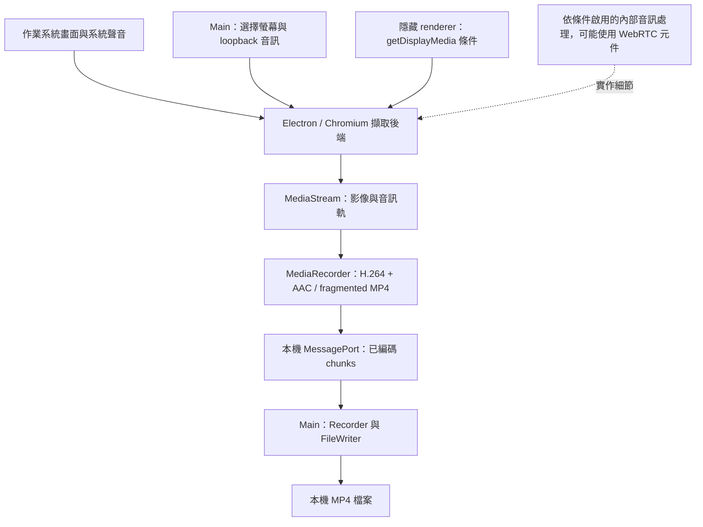

# Electron、Chromium 與 WebRTC 在 RecordStuff 的角色

[English](../../system-design/webrtc.md) | [繁體中文](webrtc.md)

更新：2026-09-14。

## WebRTC 在產品裡負責什麼？

RecordStuff 使用 Electron 內建 Chromium 提供的媒體 API，在本機完成錄製，目前沒有建立 WebRTC peer connection。WebRTC 與我們有關，是因為 Chromium 的擷取路徑可以重用 WebRTC 的原生音訊處理元件；即使沒有透過網路傳送聲音，也可能用到這些元件。

這裡要分清楚三種意思：

| 名稱 | 在這份設計中的意義 |
| --- | --- |
| 瀏覽器媒體 API | `getDisplayMedia` 取得畫面與系統音訊軌；`MediaStream` 承載軌道；`MediaRecorder` 編碼成可寫入檔案的資料。通話產品也能使用這些 API。 |
| WebRTC 通訊 | `RTCPeerConnection`、連線協商、ICE／STUN／TURN 與網路媒體傳輸。目前 RecordStuff 的錄製流程沒有實作這些功能。 |
| 原生 WebRTC 元件 | Chromium 內部使用的實作，例如 Audio Processing Module（APM，音訊處理模組）。是否使用取決於擷取路徑與設定；我們沒有直接引入或設定它的 C++ 模組。 |

`getDisplayMedia` 屬於 [Screen Capture 規格](https://www.w3.org/TR/screen-capture/)；`MediaRecorder` 屬於 [MediaStream Recording 規格](https://www.w3.org/TR/mediastream-recording/)。呼叫這些 API 本身不會建立 peer connection，也不會把錄影上傳。

## 實際資料流與責任分工

| 層級 | 負責什麼 | 為什麼這個邊界重要 |
| --- | --- | --- |
| 作業系統 | 畫面、音訊來源與擷取權限 | 權限不足或音訊路由不同，不能靠提高編碼 bitrate 解決。 |
| Electron main | 選主螢幕、要求 `audio: "loopback"`，管理生命週期與寫檔 | 來源選擇與檔案存取不交給 sandbox 中的 capture renderer。 |
| Chromium 媒體引擎 | 實作擷取、軌道設定、內部處理與錄製支援 | 即使應用程式碼沒改，升級 Electron／Chromium 也可能改變行為。 |
| 隱藏 capture renderer | 提出擷取條件、讀取軌道設定、操作 `MediaRecorder`、送出 chunks | 我們在這裡表達音質政策，並取得執行時證據。 |
| 本機 IPC 與 writer | 跨程序搬運編碼資料、保存檔案 | MessagePort 是本機 IPC，不是 `RTCDataChannel`；寫檔錯誤與擷取失真是不同問題。 |

Renderer 要求 `video/mp4;codecs=avc1,mp4a.40.2` 並檢查支援度。AAC 是選定的錄製編碼，不能據此推論有 WebRTC 網路連線。FFmpeg 用於開發驗證工具，正式產品沒有啟動 FFmpeg 子程序錄影。停止、失敗與檔案保存行為見[錄製管線](recording.md)及[系統架構](architecture.md)。

## 為什麼本機錄音也會受到語音處理影響？

[WebRTC APM 介面](https://webrtc.googlesource.com/src/+/refs/heads/main/api/audio/audio_processing.h)說明其用途是即時語音通訊：回音消除處理播放聲音再次進入麥克風的問題；降噪減少不需要的背景聲；自動增益調整語音音量。這些目標對通話有用。目前我們擷取的來源是已混合好的數位系統聲音，沒有麥克風軌；音樂、左右聲道差異與小聲細節都是希望保留的內容。

Chromium 的[螢幕擷取音訊處理路徑](https://chromium.googlesource.com/chromium/src/+/refs/heads/main/third_party/blink/renderer/modules/mediastream/media_stream_audio_processing_layout.cc)顯示，是否啟用回音消除會影響處理路徑的選擇。這是 upstream `main` 的實作背景，不是我們所用 Electron build 內部實際走哪條路徑的直接證據。使用這類處理不以建立網路通話為前提。

目前政策要求 `echoCancellation: false`、`noiseSuppression: false`、`autoGainControl: false`，保留 `restrictOwnAudio: true` 及理想雙聲道要求。這是在調整擷取政策，Chromium 媒體引擎仍然負責擷取與編碼。排除自身音訊是另一項要求，也不代表保證排除所有原生應用程式聲音。

證據有三個層次，不能互相替代：

1. **要求的 constraints**：證明我們向引擎要求了什麼，不代表所有實作都遵守。
2. **軌道回報的 settings**：顯示執行環境願意揭露的設定。明確回報效果仍開啟時發出警告；沒有回報代表未知。
3. **解碼後的輸出量測**：證明訊號通過完整管線後保留了什麼，能找出設定值或合法 MP4 看不出來的損失。

本機對照中，三個效果一起關閉後，兩次有效量測恢復高頻響應與左右聲道分離；另一次未通過測試訊號辨識，屬於 invalid，因此整批三次不是 pass。這支持在該環境使用這組政策，不能隔離證明是哪一個效果造成先前損失，也不能保證所有裝置。詳細理由與數據保留在[音質測試設計](audio-quality.md)。

## 我們測什麼，為什麼要測？

| 檢查 | 能揭露的失敗 | 不能證明的事 |
| --- | --- | --- |
| Constraints 與警告的單元測試 | 改程式時重新打開效果，或忽略明確回報的不一致 | 真實瀏覽器的音訊處理結果與保真度 |
| 測試訊號辨識與時間對齊 | 錄錯來源、標記缺失、輸入不適合比較 | 未辨識訊號的音質 |
| 頻率響應 | 與聲音悶相關的高頻損失 | 任意語音／音樂的所有聽感問題 |
| 聲道分離度 | 名義雙聲道實際接近相同訊號 | 每種 OS／音訊路由都正確 |
| 削波、掉音與音量檢查 | 飽和、訊號中斷或非預期音量變化 | 所有主觀聆聽偏好 |
| 重複實錄與環境快照 | 偶發失敗及對執行環境、路由的依賴 | 以單一機器保證全面相容 |

因此，「設定的單元測試通過」不能直接等同「音質已修好」。Electron、Chromium、擷取條件、codec 或音訊路由變更後，要重做實錄並保存原始報告；先確認測試訊號有效，再解讀品質指標。門檻、偵測器測試與 pass／fail／invalid 定義見[音質測試設計](audio-quality.md)。

## 目前邊界與未來擴充

目前實作的錄製媒體路徑沒有 signaling service、peer 傳輸、STUN／TURN 依賴或雲端上傳。這個結論限定於該路徑，不是對所有開發工具或 Electron 網路行為做過全面稽核。

若未來加入即時分享，需要另外設計傳輸架構，明確決定連線協商、peer／server、連通性、驗證與媒體隱私。若加入麥克風旁白，也需要獨立音訊政策：回音消除可能有用，但不應自動把語音處理套到系統音訊軌。目前設計尚無這兩項功能。

## 程式碼對照

- [Main 入口](../../../src/main/index.ts)：display-media handler 與 loopback 來源選擇。
- [Capture renderer](../../../src/renderer/capture-host.ts)：constraints、settings、`MediaRecorder` 與 chunks。
- [共用協定](../../../src/shared/protocol.ts)：MIME type 與本機訊息。
- [品質政策](../../../src/shared/quality.ts)：要求的編碼品質。
- [系統架構](architecture.md)：程序責任與 IPC 信任邊界。
- [音質測試設計](audio-quality.md)：實測保真度、限制與回歸策略。
